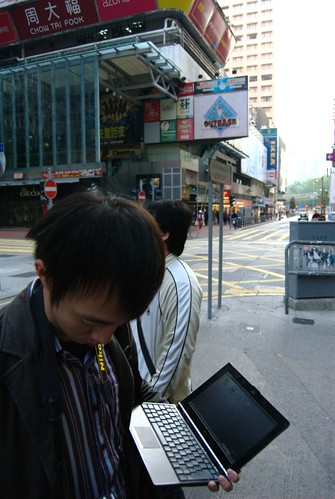
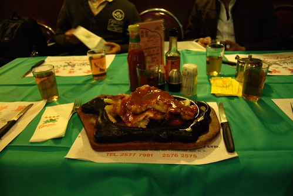
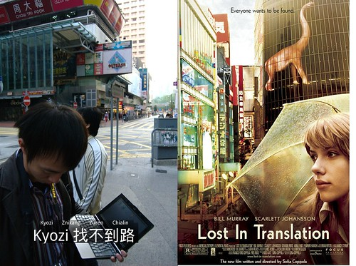

『我們迷路了。』  
  
  
  
其實說迷路有點不太準確，因為我們是找不到住的地方。  
  
因為我們第一天是晚上才到香港，所以一入境就直接坐機場快捷到香港站，再轉車到銅鑼灣去。我們這次住的旅館是 Wang Fat [Hostel](http://zh.wikipedia.org/w/index.php?title=%E9%9D%92%E5%B9%B4%E6%97%85%E8%88%8D&variant=zh-tw)，上面的地址寫在百德大廈 C 棟三樓，但是我們到那時，是一個有門禁、看起來像住宅區的大樓，上面貼著此處為私人住宅，禁止設置賓館。  
  
初到香港人生地不熟，我們就在附近繞了很久很久。後來在 B 棟問了一個英文超標準的老伯伯，他說我們可以試著到星巴克，那邊應該有提供免費無線網路。後來 Kyozi、znikang 跟輝哥去星巴克，我跟 chialin 去銅鑼灣站裡面的客務中心詢問（這邊英文比較通，普通話常會有溝通困難），客服人員跟我們說可以到某個地點，有 free internet access。經過了許多波折，我們才找到確實的地點 - 就是那個寫禁止設置賓館的百德大廈 C 棟！差點被氣死。  
  
所以 check in 時，其實我們已經餓到快掛了。後來我們就迅速的決定要去銅鑼灣附近，電影《 [2046](http://zh.wikipedia.org/wiki/2046)》 裡面出現的[金雀餐廳](http://hk.bwt.com.tw/index_star1_1.html)吃飯。這時候發生了第二個不太算悲劇的悲劇，旅遊指南上面寫金雀餐廳平均消費是 80 元港幣，我們進去看到 menu 後發現最便宜的是 110 港。所以下次出國時大家別忘囉，要買有持續更新版本的旅遊指南唷。  
  
不過金雀餐廳的餐點 C/P 還是蠻高的。牛排（香港話是**牛扒**）主餐是兩塊厚厚的牛排，雞扒是兩塊超大塊排，基本上應該是平常台灣排餐館的兩倍大。  
  
  
  
香港迷航記到此…沒有結束。其實這四天都有持續的小迷路。不過我們總算結束這很累的一天。  
  
不過，Day 1 卻是這幾天最輕鬆的一天阿…。  
  
To be continue...  
  
後記：容我嘴砲一下，Kyozi 那張打電腦的圖看起來跟[迷失東京](http://yurenju.blogspot.com/search?q=%E6%84%9B%E6%83%85%E4%B8%8D%E7%94%A8%E7%BF%BB%E8%AD%AF) (愛情不用翻譯，Lost In Translation) 有異曲同工之妙阿，只是我們是 Lost In Hong Kong 就是了…。不信的可以看下面的比較圖。  
  
