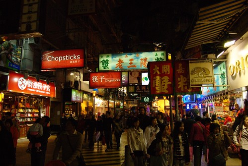

  
  
香港，就是一個充滿各式人種與招牌的地方。這邊處處充滿強烈對比，香港有摩天大樓與混亂的巷弄，有很多老人看報紙的飲茶餐廳與燈光好氣氛佳的西式排餐店，有著極為方便的交通，但是還是走到要死的香港街道。  
  
而且要恭喜我們完成了黃金傳說，我們搭遍了所有香港的交通工具：飛機、地鐵、雙層巴士、小巴、纜車、叮叮車、的士，當然還有布輪。  
  
香港之旅是個在腳酸、快門聲跟肚子餓之間循環的旅行。我相信四天內跑的點已經充實到爆，沒辦法再塞更多點進去了。  
  
[看看我們跑了什麼點吧。](http://maps.google.com.hk/maps/ms?ie=UTF8&hl=zh-TW&msa=0&msid=102940795217138094975.00045fd07e828f4d0a3d6&ll=22.355791,114.073105&spn=0.444527,0.583649&z=10&source=embed)  
  
對了，這次的**香港走到掛旅行**參加人員有我、[kyozi](http://kyozi.blogspot.com/)、[znikang](http://znikang.blogspot.com/)、輝哥、chialin。  
  
  
[檢視較大的地圖](http://maps.google.com.hk/maps/ms?ie=UTF8&hl=zh-TW&msa=0&msid=102940795217138094975.00045fd07e828f4d0a3d6&ll=22.355791,114.073105&spn=0.444527,0.583649&z=10&source=embed)