Kyozi：『早餐就吃飲茶會不會太超過？』  
  
我想，這個問題就由香港鄉民來回答你吧。  
  
  
  
[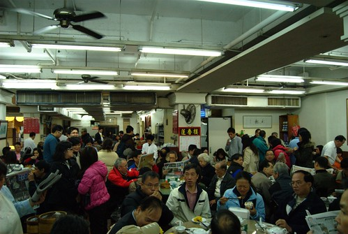](http://www.flickr.com/photos/yurenju/3176217133/ "Flickr 上 yurenju 的 蓮香樓人聲鼎沸")  
  
早上七點起床就想跟愛看報的香港老伯拼？門都沒有！  
  
第一天因為迷路的關係很晚才睡覺，所以第二天原本預計六點起床的行程改到七點起床、七點半出發。儘管如此，我還是累的要命。背著輕便的裝備，我們坐地鐵到中環站，準備到便宜又有名的蓮香樓港式飲茶吃早餐。  
  
往蓮香樓的路上行人只有小貓兩三隻，到處都表示著這個城市還沒甦醒的氣氛。  
  
[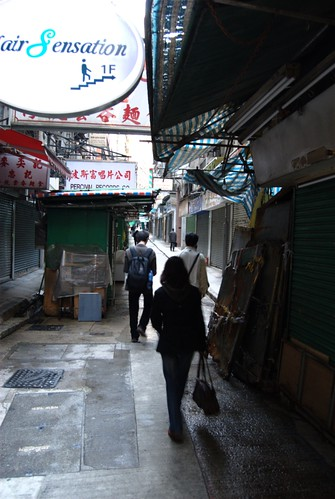](http://www.flickr.com/photos/yurenju/3177084874/ "Flickr 上 yurenju 的 往蓮香樓的路上")  
  
一直到蓮香的樓下，我們還是完全沒想到裡面的人竟然這麼多。一上樓就馬上傻眼了，整個餐廳全部都坐滿了人，還有很多人站著等其他人用完餐。我們大概站了半個小時左右，才有位置可以坐。  
  
跟我們同桌的是一個香港的老伯伯，跟幾個韓國人。香港老伯真的好威阿，看報紙跟沏茶都超級沉穩的，感覺就像從香港電影裡面走出來的一樣。  
  
[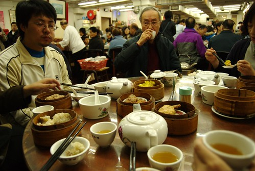](http://www.flickr.com/photos/yurenju/3176300661/ "Flickr 上 yurenju 的 蓮香樓吃飯")  
  
點了不少東西像是燒賣、腸粉跟叉燒包都吃到了，沒想到吃下來還蠻便宜的。這是我們香港行當中感覺最便宜又最滿足的一餐。如果要去香港的朋友可以考慮到蓮香樓來吃，我覺得既好吃又划算阿。  
  
吃飽飯後，我們就一路從蓮香樓走到西港城，順便走走路看看香港的一切。其實稍微逛一下香港街道就會發現，這邊真的到處都有很強烈的對比。  
  
  
  
這三尊石像就出現在街道旁邊，遠處卻是高樓大廈。也有那種樹根交錯的街道旁，突然出現一個老舊家庭式理髮廳的情況，香港真是一個很奇妙的地方。  
  
還有，這邊的燒臘可是什麼都可以拿下去『燒』喔。  
  
[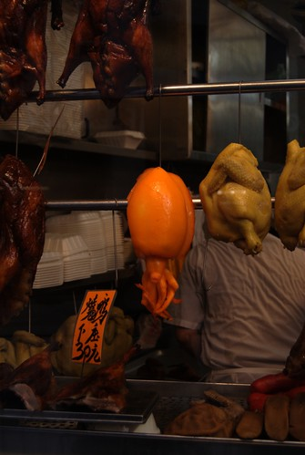](http://www.flickr.com/photos/yurenju/3176447419/ "Flickr 上 yurenju 的 燒臘章魚")  
章魚燒臘，夠猛吧。  
  
一路走到西港城後，我們就坐叮叮車一路到北角去。其實香港的建築真的很多彩多姿，不論是高樓大廈或是一般民房、建築，常常會看到在台灣看不到的設計或配色。  
  
[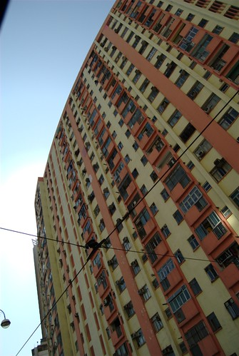](http://www.flickr.com/photos/yurenju/3179188611/ "Flickr 上 yurenju 的 香港街景 - 建築")  
上面交叉的線路，就是叮叮車用的電線。香港有種又細又高的輕軌電車，通常都叫它叮叮車。  
  
坐叮叮車過了很久的時間，到處看看香港的街景後，我們到了叮叮車的北角總站，再轉渡輪去紅磡。  
  
[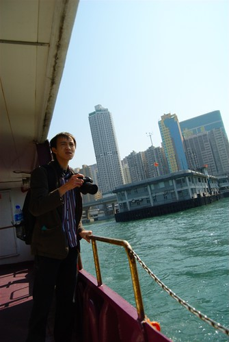](http://www.flickr.com/photos/yurenju/3179239227/ "Flickr 上 yurenju 的 往紅磡的船上")  
Kyozi  
  
去了紅磡之後發現這裡果然不是一般遊客逛的地方，因為很多地方都是禮儀社。香港的都市規劃做的還不錯，每個區域的功能都很集中。  
  
我們在紅磡吃了一間也是 Kyozi 在網路上看到的一間茶餐廳 - 時新茶餐廳。而且我今天才知道茶餐廳原來就是類似快餐店的地方，吃的東西通常就是一些你在早餐店會看到的東西。點了一個豬扒麵來吃，原來是這樣的東西：  
  
[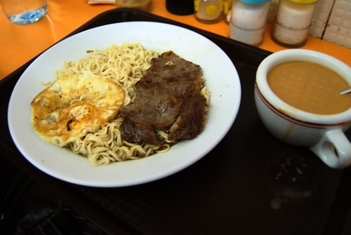](http://www.flickr.com/photos/yurenju/3180134374/ "Flickr 上 yurenju 的 茶餐廳：豬扒麵")  
請原諒我還在跟我的相機磨合…。  
  
吃完飯後就前往原本預定的行程，到深水埗附近的石硤尾看舊建築。走了一大段路，到了石硤尾才知道…原來已經翻新了阿。請大家千萬要買有在更新的旅遊指南！！！  
  
不過走這趟也不是完全沒收穫。在回程的小巷子中，有個理髮師傅竟然正在拉小提琴。我們停下來看看拍照後，師傅愈拉愈開心，還站出來讓我們拍 XD  
  
[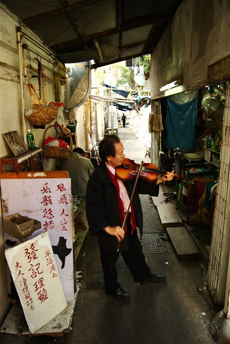](http://www.flickr.com/photos/yurenju/3184514116/ "Flickr 上 yurenju 的 拉小提琴的剪髮師傅")  
小提琴拉得很開心的理髮師傅  
  
走回地鐵後就往旺角出發。我們先在廟街吃煲仔飯。不過那間煲仔飯還蠻難吃的（不是最有名的那間），而且態度又很差。之後就去了今晚的預定行程：HKPUG 參加聚會，順便拿衣服給香港朋友。  
  
[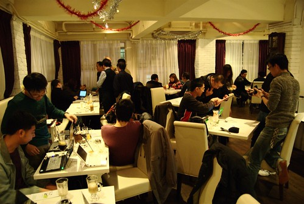](http://www.flickr.com/photos/yurenju/3184541734/ "Flickr 上 yurenju 的 HKPUG 聚會情況")  
  
HKPUG 聚會好多人阿，沒想到香港還有這麼多 PDA 愛好者。不過這次的主題是 Netbook，所以大部分出現的都是 Netbook，像是台灣很少看到三星 Netbook 也有出現。  
  
最後去了維多利亞港看夜景，最後則是坐船回中環！很拼的第二天行程就這樣結束了。  
[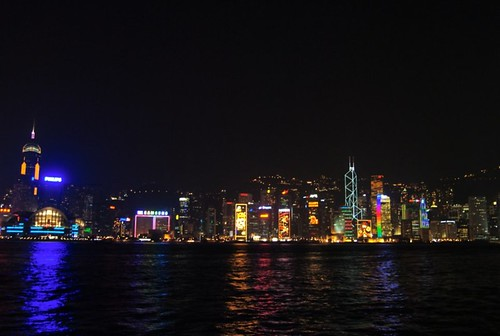](http://www.flickr.com/photos/yurenju/3184595364/ "Flickr 上 yurenju 的 維多利亞港")  
[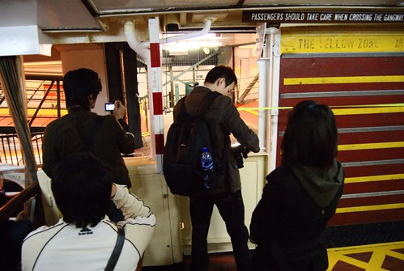](http://www.flickr.com/photos/yurenju/3184590584/ "Flickr 上 yurenju 的 下船嚕")