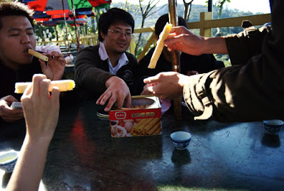

繼香港行之後，下一週又是個豐富的週末。  
  
禮拜六我早上先衝去 101 找 [PowerOp](http://blog.roodo.com/ystuan/) 小聊，後來去買了評價不錯的 [Snow Travel Ski-Dri 雙層手套](http://www.mobile01.com/topicdetail.php?f=181&t=476200&p=1&img=1)。接著又馬上衝去光華商場買 CF 卡、讀卡機、GPS Logger。接近下午的時候去善導寺的生態綠喝個咖啡。  
  
這次的耶加雪非是偏甜的耶。不過喝到後來有點悶，問了老闆說放十天了，真是怪哉。  
  
在生態綠打擾很久後，晚上則跟 Chialin 去看開春第一炮的漢字寓言 罰 X 亂。本次的漢字寓言是兩個字兩段的方始表演，總表演時間長一個小時，在台北市華山文化園區上演。罰與亂的調性差非常多，罰是走平易近人，以小時候不合理的體罰配合上小朋友對於嚴厲老師痛恨及嘲笑的角度出發。罰的演員只有一個，不過分飾的角色則有四五人，卻可以在各個角色中快速的切換，真的還蠻厲害的 XD  
  
最厲害的應該是演校長吧，太傳神了…。  
  
而《亂》感覺起來就抽象多了。表演者有一個演員、一個提琴手跟吉他手（王榆鈞）。不過實在是太抽象了，比較難懂表演者要表達什麼。不過音樂倒是幫了不少忙，隨著音樂可以感受到整齣戲緊張，混亂的氣氛。而且那個提琴手也是狠角色，一把提琴可以弄出來的音效還真不少阿…。雖然不太懂在演什麼，不過音樂上還是很精彩的。  
  
隔天則又跟香港那擋人 + OD 去吃 outback。這次吃了燒烤肋眼牛排，又偷吃了 chialin 的腓力。  
  
我果然還是比較喜歡腓力阿！  
  
吃完牛排就靠著 Nokia Map 上了貓空。看到 Nokia Map 用的是 Navteq 圖資還真為我們擔心，不知道可不可以上的了貓空。還好 Nokia Map 除了剛開始在市區重新規劃路線太頻繁以外，後來看起來都還蠻正常的，也把我們帶上貓空了。  
  
到了貓空就邊泡茶，邊把香港的戰利品：德成號蛋捲一磅給嗑啦！果然蛋捲這種東西做的在怎麼好吃，也沒辦法從嘴巴裡發光、背上冒出一條龍。我吃起來跟福益軒差不了多少。但是在香港的時候所有蛋捲都訂購一空，如果要買只能過年後才能買。最後跟他們說我們是台灣來的，他才賣給我們一磅。結果也沒好吃到冒出龍來。  
  
後來就是邊打屁邊吐嘈的度過了一個下午囉。  
  
