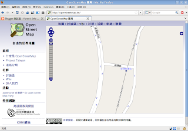

最近買了 Holux m-241 GPS logger 後，就開始畫 openstreetmap 的地圖。經過一個禮拜後，自己畫過的地圖就逐漸浮上來了阿…。像是下面這條劍潭路以前是沒有的，這次就把他補了上去。  
  

之前有聽過幾個 openstreetmap 的前輩講過如何畫地圖，不過因為一次講的東西實在太多，很難一次全部吸收。自己來畫過地圖後，覺得其實並沒有那麼難。  
  
改天有時間再來寫教學文件吧 :P