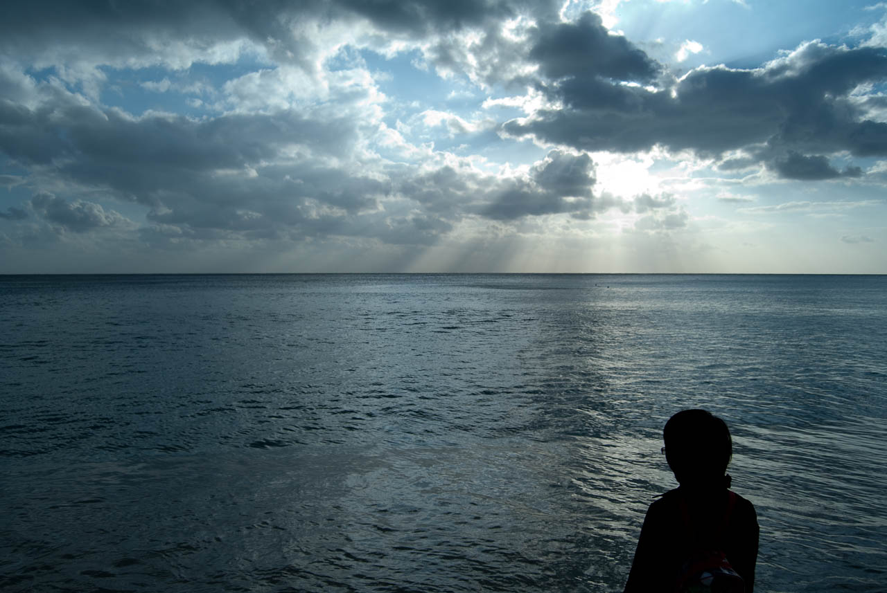
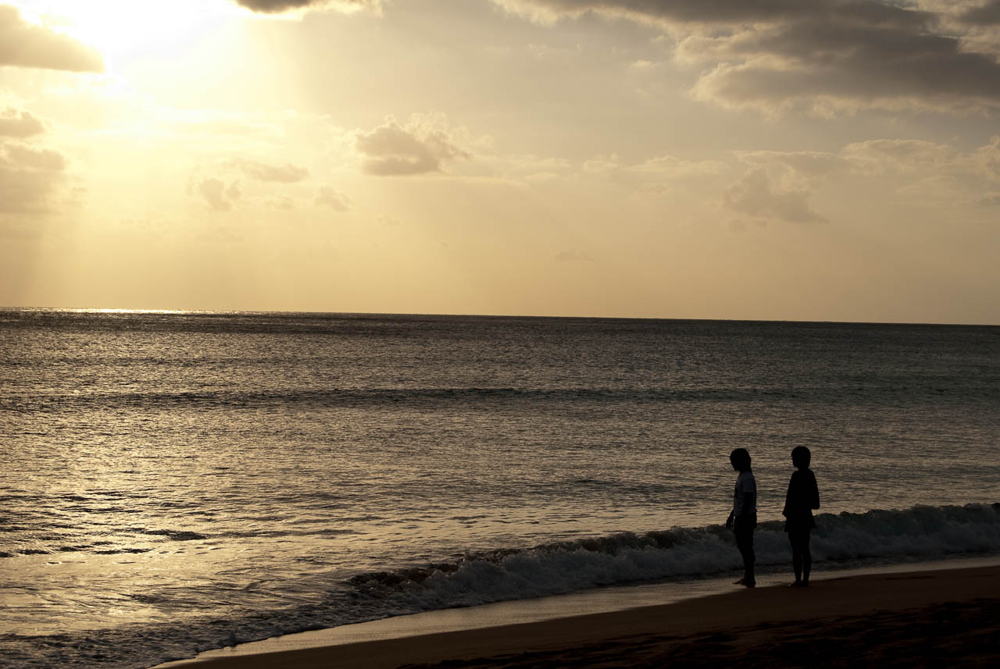
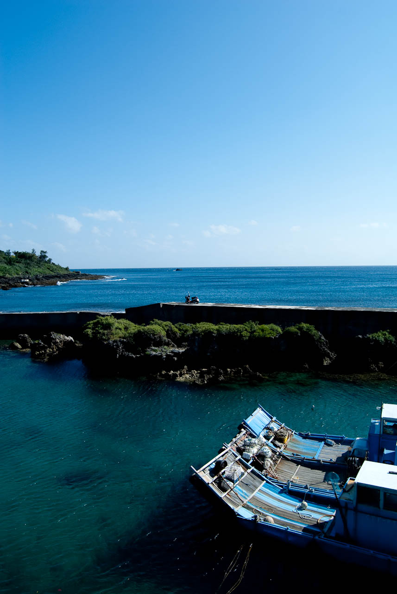
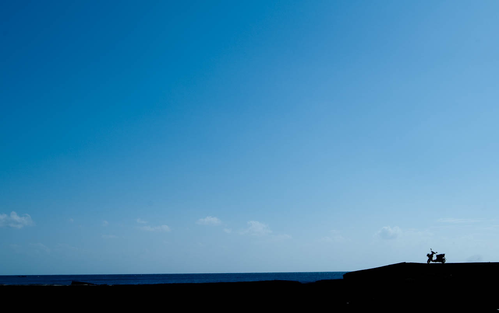

  
墾丁的海很多變。有時昏昏沉沉的，從鑲邊的雲透出陽光。  
  
  
  
有時候夕陽撒在海邊，幾個人走在海邊，浪打上腳邊。浪花的聲音讓畫面變得安靜。  
  
  
  
有時則藍天白雲的充滿朝氣，配上個在沙灘上亂跳的小朋友。  
  
  
  
也有幾隻船靜靜的停在小港口，微風濺起漣漪的海邊。  
  
  
機車停在小港口的堤岸上，藍天、大海、幾片白雲。在我們即將離開墾丁時，才淡淡地印在腦海裡。