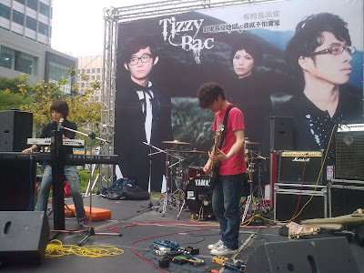
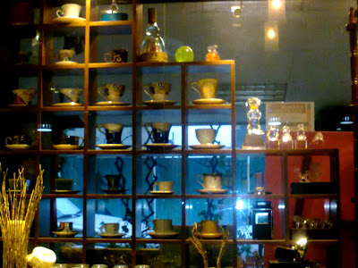

  
  
去年情人節因為到處都定不到位置，所以我們去吃了麻辣火鍋。今年學到教訓早了幾天訂餐廳…但是還是太晚了。所以就前人節前一天去吃了 hychen 掛保證的[小銅板牛排](http://www.piecettes.com.tw/) 。因為今天要專心吃飯所以就沒拍照了 :P  
  
不過這間真的好吃，剛看到只有兩個牛排類的餐時還覺得不太妙，不過他們牛排跟牛小排都很好吃。牛小排比較香，牛排則比較嫩。副餐也都有維持一定水準。不像某間排餐餐廳牛排很好吃，副餐很糟糕。  
  
在情人節前夕吃完飯後，原本情人節要宅在家裡一整天，不出去被閃也不去閃別人的。不過在逛 ptt Tizzy Bac 版的時候，發現今天在信義區有他們的簽唱會！！那那那…就衝啦！依照我龜毛的個性，我們到的時候大概是簽唱會開始前一個小時，這時候 Tizzy Bac 已經在彩排了。  
  
  
  
我原本以為大概也是穿這樣演出，沒想到正式開始的時候換了很帥的服裝！  
  
  
  
哲毓還擺了一個一模一樣的姿勢，哈…。不過新專輯的歌真的很好聽。而比起簡單生活節的大舞台，我們這次站在第二排聽，果然爽度增加超多的阿。可以近距離看到 Tizzy Bac 表演實在太幸福了…。可惜今天沒有很應景的唱婚禮歌手，嘿嘿。  
  
錄了一小段安可曲前源的 solo。非常的讚。（連到 YouTube 有高畫質的可以看）  
  
  
  
  
聽完之後我們又去了附近很久以前就想去的原豆空間咖啡館。上次在流浪觀點喝到以後就一直很想來，今天終於有機會了。點了杯耶加雪夫。咖啡的顏色很淺，看起來就會對我的胃口。這杯剛喝就有散布在舌頭的甜味，喝完之後鼻子一直有淡淡地香味，讚阿。不過這跟生態綠中焙的耶加的甜是不太一樣的。生態綠中焙耶加的甜比較直接不囉唆，這邊的則是淡淡地蔓延在舌頭上。  
  
  
  
還好有來造訪原豆空間，喝了杯好咖啡，順便帶了1/4磅回去（也只剩1/4磅）。  
  
回來最後再看了理查吉爾的《來跳舞吧》結束了今年的情人節。  
  
情人節快樂！