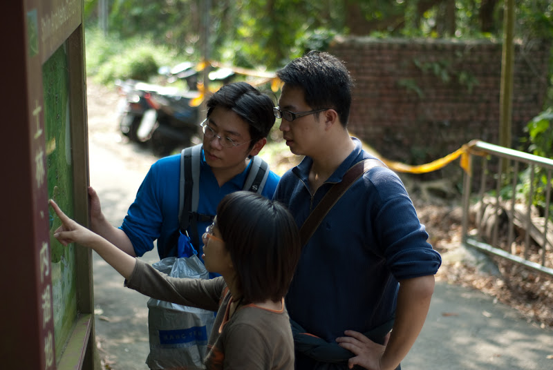
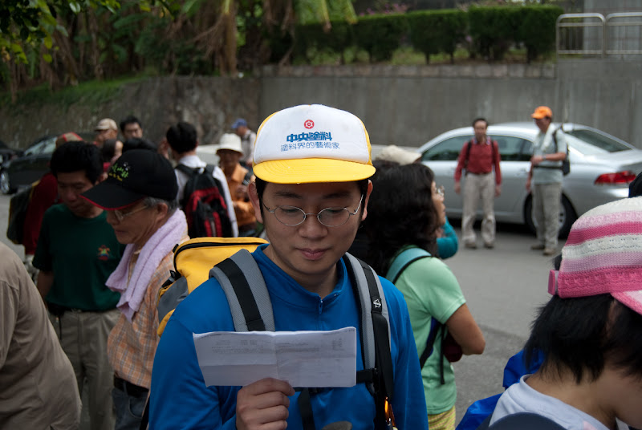
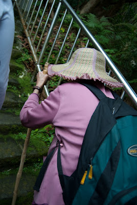
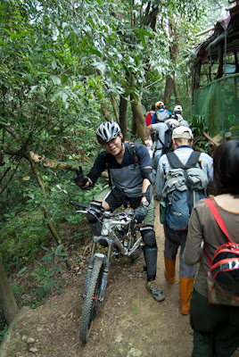
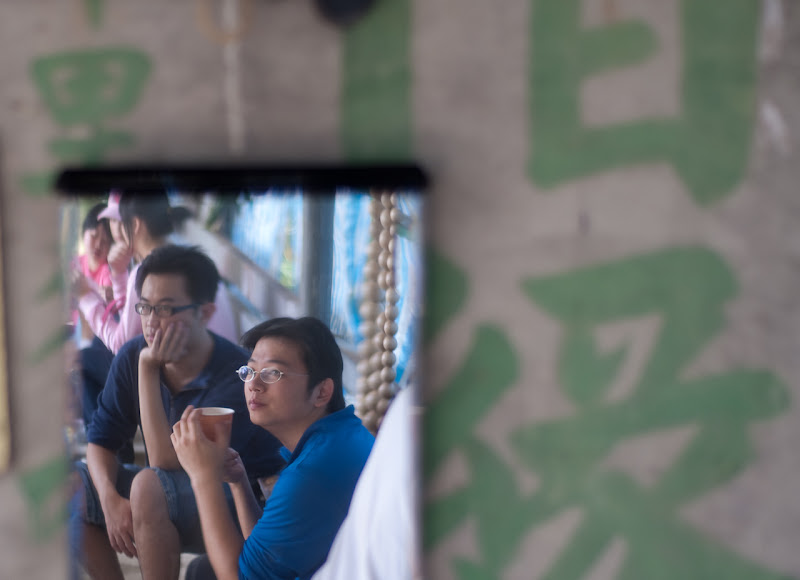

  
  
這幾天，發生了一件很有意義的事情。  
  
  
  
這件事情就是，上面這個人騙我們來爬山。他說這是座兩百公尺的小山，是最簡單的一座山。  
  
  
  
但是你卻可以看到有人在敲著鐵腿。  
  
這次行程除了以上兩位跟我以外，還有另外一個人也被騙來了。  
  
  
  
就是 hychen 先生。  
  
呵以上是純屬消遣啦。這次 Payton 帶著我們來爬屬於中高年齡層可以爬的山，是故宮附近的相思林步道。不過我一直以為會只有我們四個人來爬山，到那邊之後才知道 Payton 也是跟團的，所以我們是跟著一群中高齡的老杯杯、老太太們一起爬山。  
  
不過老杯杯你們怎麼爬得這麼快勒…我腳都快斷了  
  
不過這次來爬山還遇到不少神奇跟有趣的事情。  
  
一、這次竟然也有七十歲的老太太跟團。  
  
  
  
老奶奶該不會是看 PTT 山友版來跟團的吧。  
  
二、原來騎腳踏車也可以爬山。  
  
  
  
我還真沒想到這種羊腸小徑還可以騎單車爬山。  
  
三、山上有人在玩真人 CS！  
  
  
  
而且這群人跟我們登山團的人數有得拼。  
  
沒想到爬個兩百公尺的山也會遇到這麼多有的沒的事情。  
  
這次爬山還蠻有趣的，大部分的時間我們都是邊爬邊聊天邊拍照，除了某些要耗費大量體力的路段大家都默默的走以外，其他時間還聊得蠻開得。累是累不過也還好（比去香港輕鬆）。  
  
  
  
大致上的行程就是八點半從故宮出發，約十二點多到頂，一點左右到山腰上吃午餐。  
  
  
[檢視較大的地圖](http://maps.google.com.tw/maps/ms?ie=UTF8&hl=zh-TW&t=h&brcurrent=3,0x3442ae17715a4b9f:0xbaeaecff55cfad73&msa=0&msid=102940795217138094975.00046398c18addd5d6e83&ll=25.098502,121.563978&spn=0.046636,0.068665&z=14&source=embed)  
  
  
基本上還不賴，不過如果下次挑的點景可以再漂亮一點就更好了。另外跟團還有個壞處就是要照 schedule 走，其實還蠻趕的。看到什麼想拍的其實也沒什麼時間停下來好好的拍，不然很容易就脫隊了。  
  
剩下的照片在[這兒](http://picasaweb.google.com/yurenju/20090222)，就隨意看看吧。  
  
《END》  
  
  
\[UPDATE\]  
照片改放到 Picasa 上面了。