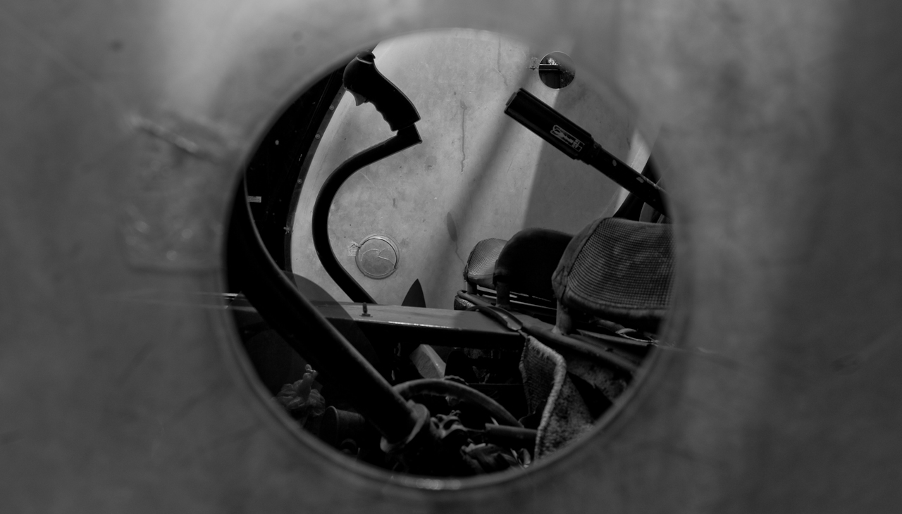
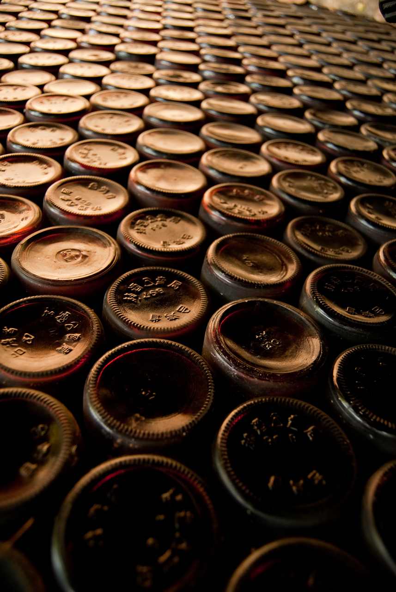
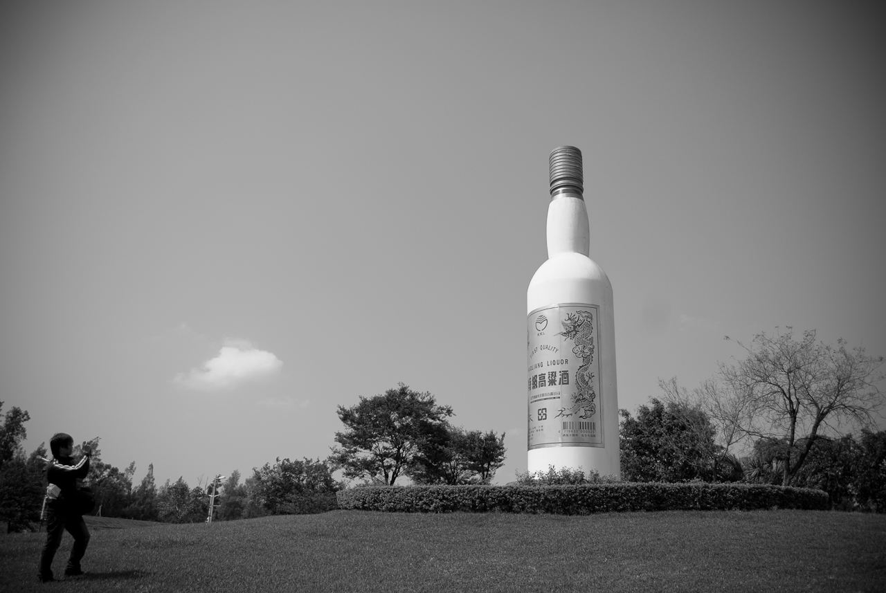
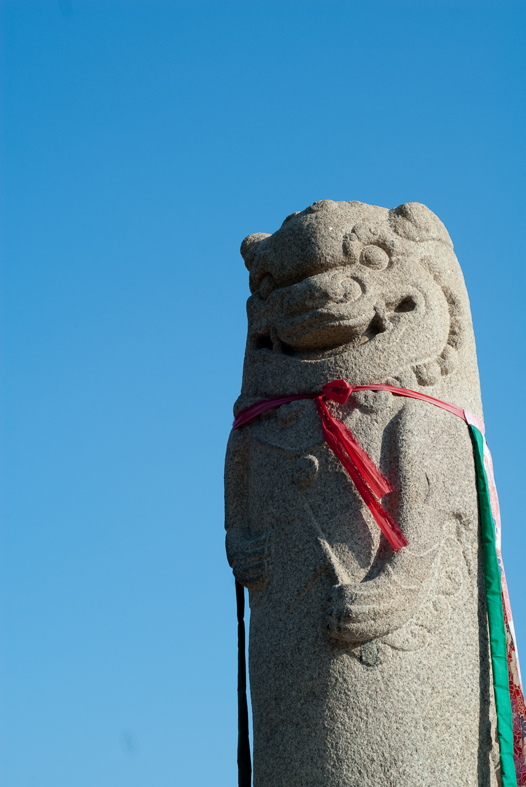
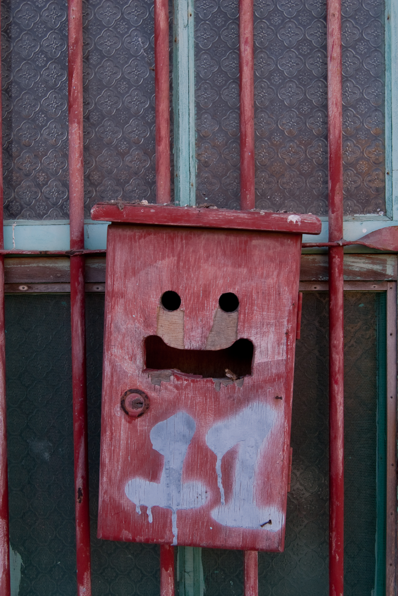
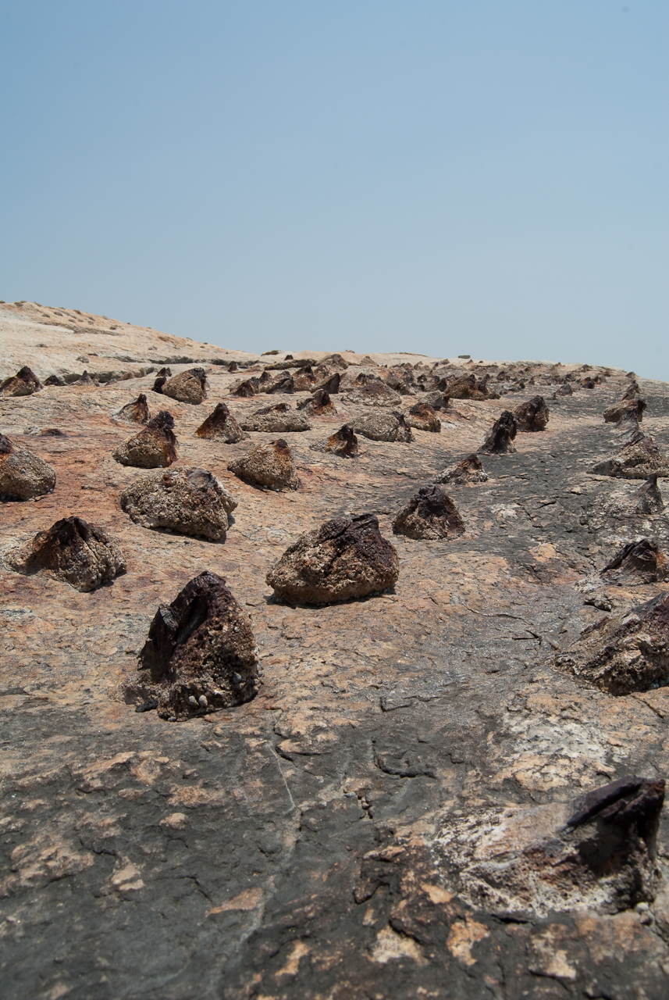

  
這是從直昇機窗戶的洞往內拍的樣子。  
  
  
金門到處都有些大大小小的擺設，姑且用『裝置藝術』來形容。從小酒瓶、大酒瓶到直昇機都有。這些當地特產、軍事設備倒是添增了不少金門特色。  
  
  
  
  
  
當然也有風師爺囉。  
  
  
在瓊林坑道附近散步時，還看到一個挖了洞的郵筒，一整個就是可愛。  
  
  
而岩岸上的點綴，則是被填補起來的破酒瓶。猜想應該是之前拿來當反登陸用的防禦工事。  
