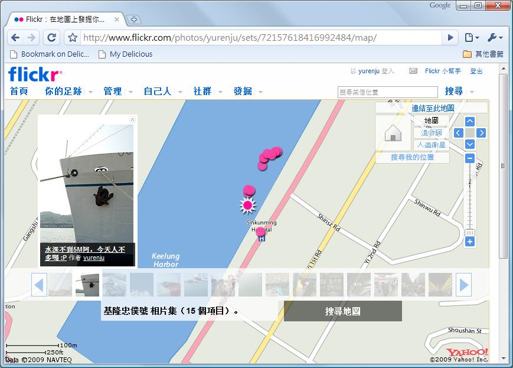
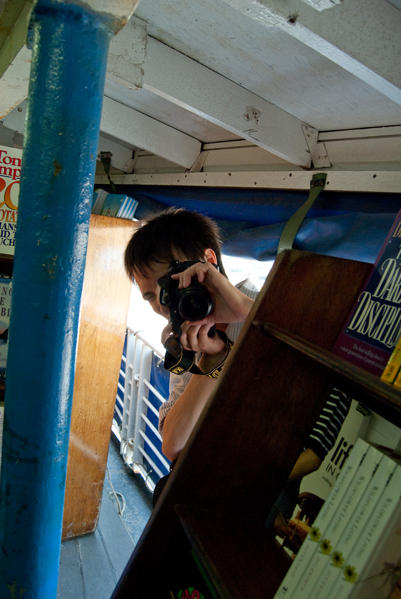
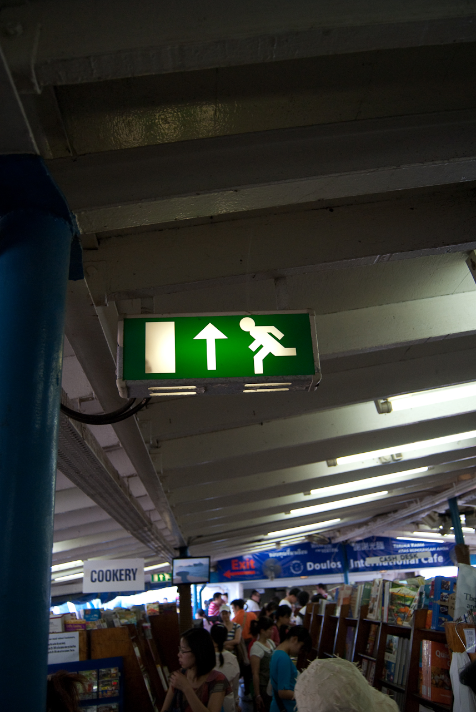

奇怪，時間怎麼永遠不夠用阿………。  
  
這個週六跟著固定班底去基隆忠僕號。[忠僕號是被金式世界紀錄認可最老可航行的郵輪](http://zh.wikipedia.org/wiki/%E5%BF%A0%E5%83%95%E8%99%9F)。這麼大的年紀，[航行停泊紀錄](http://www.doulos.org/index.php?option=com_content&task=view&id=705&Itemid=255)也是嚇死人。而這次到基隆是他到除役前最後一次到台灣了。kyozi 桑看到消息後就開了團，我們就衝去基隆了。  
  
  
在較大的地圖上查看[基隆忠僕號](http://maps.google.com.tw/maps/ms?ie=UTF8&hl=zh-TW&brcurrent=3,0x346ef3065c07572f:0xe711f004bf9c5469&msa=0&msid=102940795217138094975.00046a319be168864ce43&ll=25.131162,121.744695&spn=0.008742,0.017166&t=h&z=16&source=embed)  
  
這次 GPS Logger 維修回來了，順便測試一下，感覺還OK。  
  
  
忠僕號比較有意思的是他是一艘裝滿書的郵輪。  
  
  
  
而且為了要因應各個國家不同的貨幣需求，這邊的書價是用『單位』來計算，應該是可以稱作為『忠僕幣』的東西，牆上貼了一張各國貨幣的換算表，讓忠僕號到每個國家都可以賣書。  
  
  
  
不過基本上忠僕號並不大，而且船上許多地方都不能去，只有固定時間的導覽才可以跟著水手一起進去忠僕號內部，不然平常就只能在甲板上面的書店晃。  
  
  
  
  
  
在忠僕號上閒晃到近晚餐時間後，我們又去了基隆廟口 - 基本上就是跟台北市的士林夜市差不多的地方，當人多到一種境界後基本上看起來都一樣的啦…。  
  
  
  
所以我們到處吃一吃，最後再來個『喝咖啡日本料理』就結束了（迷：這間店到底是賣日本料理還是咖啡？）基本上打發掉一個晴天的週六還算不錯。  
  
[剩下的照片](http://www.flickr.com/photos/yurenju//sets/72157618416992484)在 Flickr, 有興趣的自己去看阿。