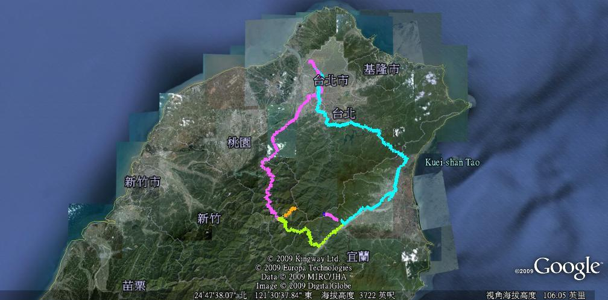

  
在較大的地圖上查看[松蘿湖+拉拉山](http://maps.google.com.tw/maps/ms?ie=UTF8&hl=zh-TW&oe=UTF8&num=200&t=h&brcurrent=3,0x0:0x0&msa=0&msid=102940795217138094975.00046b2130e088a63a180&ll=24.907613,121.431885&spn=0.597866,1.098633&z=10&source=embed)  
  
回來囉。  
  
這次行程不算緊湊，慢慢走。不過原本的五天四夜縮短成四天三夜就是了。一來覺得桃園的點還沒有準備好，不知道該怎麼玩。另外一方面摔了車還是早點回來休息的好，哈。  
  
如果需要 gpx 檔案來定位照片的可以在這邊下載：[松蘿湖+拉拉山路線 (GPX file)](http://www.box.net/shared/mzyivxtvub)