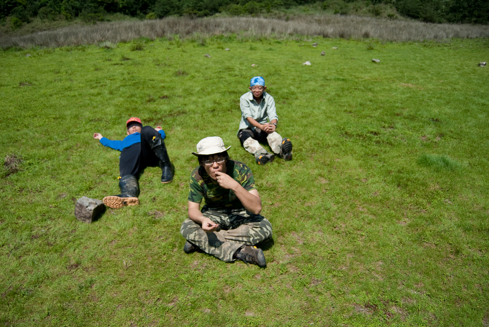

這次松蘿湖露營，是個充滿挑戰但又有趣的旅程。  
  
之前小時後跟爸媽出去露營，大多數裝備都是老爸在背。當自己要背裝備上山露營，而且路程又是五個小時左右的泥寧路又有些險路，對一個剛開始爬山的人來說實在是太累了。山上湖邊的低溫、需要到水源地取水對我來說都是些挑戰。  
  
感謝這次有許多有經驗的爬山前輩 Payton、友聖大哥、大誠、權誠、Wing、宗達等人幫忙，讓這趟行程輕鬆不少。  
  
爬完覺得還蠻好玩的，不過下次來個輕鬆一點的山吧 XDD  
  
