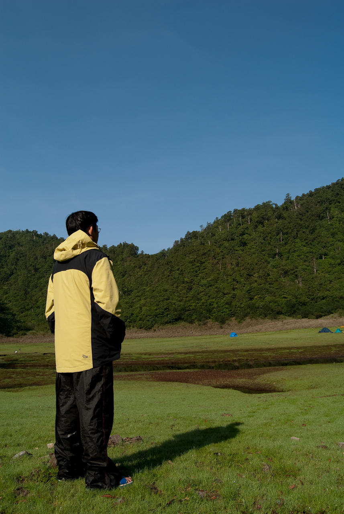
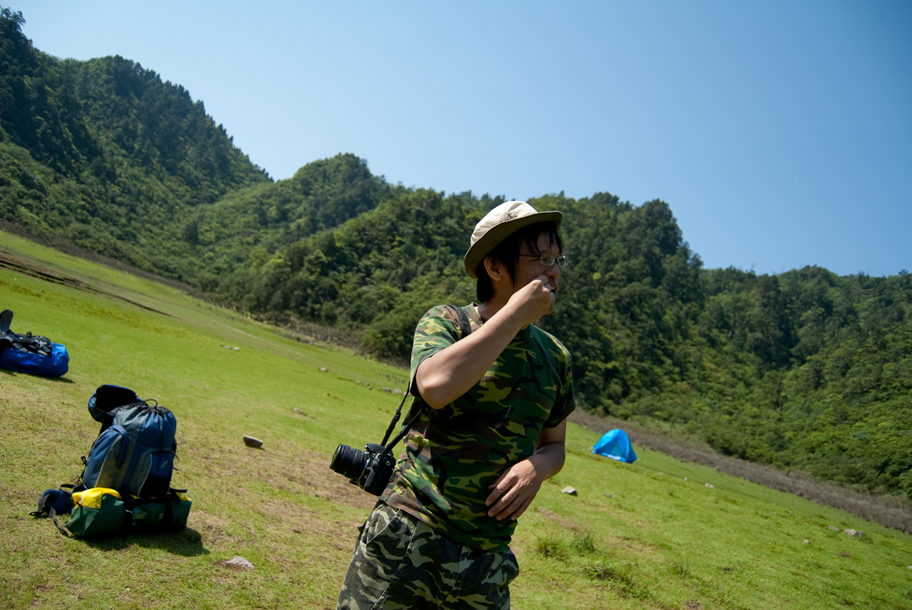
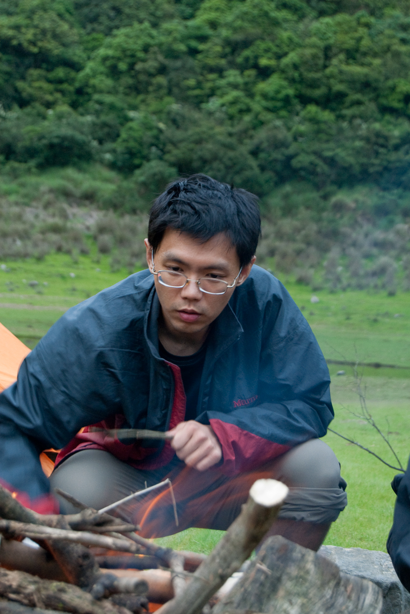
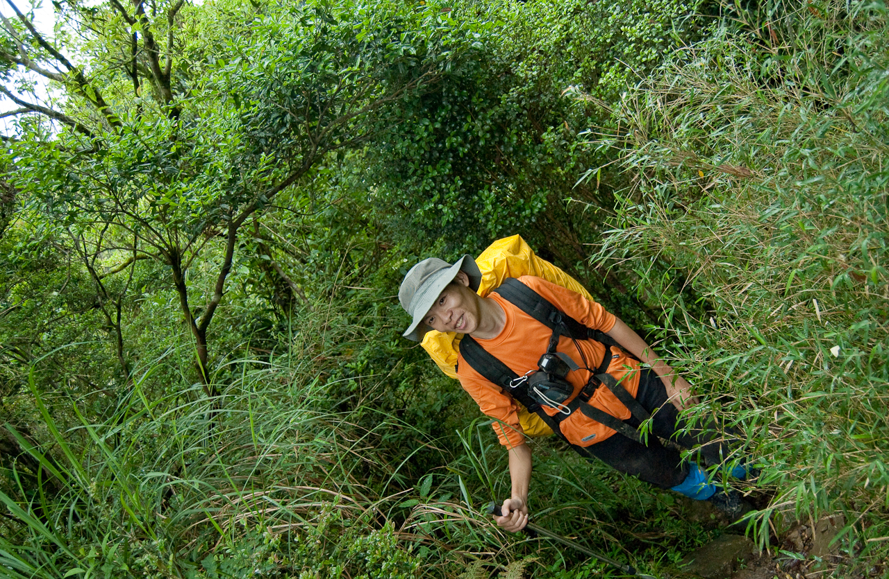
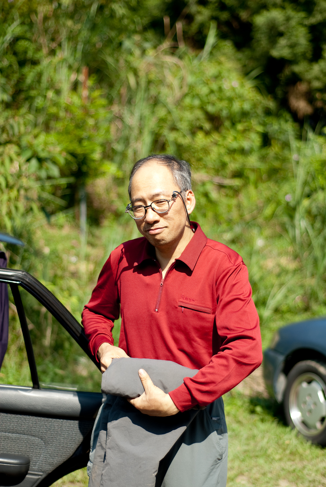
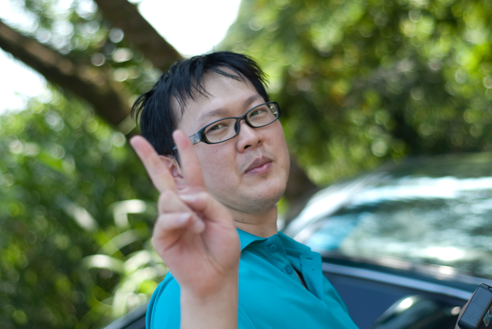
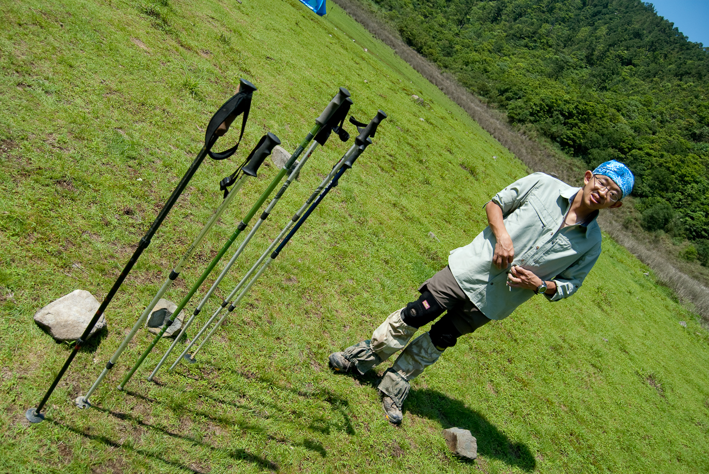

  
在較大的地圖上查看[松蘿湖+拉拉山](http://maps.google.com.tw/maps/ms?ie=UTF8&hl=zh-TW&oe=UTF8&num=200&brcurrent=3,0x0:0x0&source=embed&msa=0&msid=102940795217138094975.00046b2130e088a63a180&ll=24.918822,121.681137&spn=0.298907,0.549316&z=11)  
  
這次的旅程由禮拜三下午開始。我跟 Znikang 一路從永和、新店走北宜公路騎到了宜蘭。北宜公路這條九彎十八拐的省道因為雪山隧道的開通，以前因為會車造成的危險現在也很少見了。畢竟開車的都從雪山隧道過去，加上北宜公路拓寬整修，現在北宜公路走起來的感覺…  
  
就是一整個風光明媚阿。  
  
但是風景最讓人讚嘆的還是出北宜公路後那片蘭陽平原的美景。當越過左彎右拐的北宜後，突然出現的是整片的蘭陽平原，連接著平原尾端的是高聳的山脈，而另外一邊就直接連接太平洋。感覺非常壯闊，更何況騎在北宜公路上感覺人都要跟機車黏在一起了，突然殺出來的美景感覺更是深刻。  
  
簡單在宜蘭市吃個晚飯後，我們就騎到今天要住的玉蘭去。我們住的民宿叫做『玉蘭茶莊』，好笑的是我們找半天都找不到這個『玉蘭茶莊』。第一次我們沿著玉蘭茶莊的路牌走，沒想到最後的目的地竟然是幾間鐵皮屋，重點是連一個人都沒有，那個時候天色已經全黑了，所以根本就不知道這是啥…。不過後來發現這是露營區。後來我們又到玉蘭比較熱鬧的地方，問了幾個人終於找到了『玉蘭茶莊』。不過這間玉蘭茶莊還是沒開 XDDD  
  
打電話去問，沒想到他跟我們說今天沒有人訂房間，真是一整個搞笑～還好交叉比對後，原來是在宜蘭市負責訂房的人收了訂金後，忘了跟玉蘭這邊的人講說今天有人要來住，所以才導致這個羅生門。  
  
後來人陸陸續續的到民宿後，我才慢慢看到要一起爬山的人的真面目 - 沒錯，這次爬山約的人除了 Payton 跟 Znikang 以外，其他我都不認識 XD, Wing Hung 更厲害，他連一個人都不認識，哈。當然爬完山大家就都熟啦。  
  
而第一天晚上的工作就是確認好所有裝備。我以為雨鞋塞拖鞋這件事情是只要塞進去就好了，其實還是要修邊的…所以雨鞋搞了很久。  
  

  
後來又把裝備確認、重整了一次，才安心的去睡。  
  
  
  
不過這才剛開始阿 XD  
  
隔天早上起來吃了泡麵後，我們就開始松蘿湖露營之旅了。  
  
  
  
  
  
在這邊順便介紹一下成員。  
  
Payton, 這應該是所有認識的人的源頭。本次活動的召集人，而且出發前他還騙我說松蘿湖很簡單。  
  
  
Znikang, 這不用介紹了吧～我的二技同學  
  
  
宗達，Payton 的朋友，正在單攻研究所  
  
  
權誠，宗達的朋友，職業是 MIS  
  
  
友聖大哥，宗達的朋友，很神奇的認識 yungyuc, thinker 的人，以前寫 Python。  
  
  
大誠，也是宗達的朋友，在一間跟敝公司很有關係的公司工作  
  
  
Wing Hung, Hychen 的朋友，但是 Hychen 沒有來～感謝他的帳篷，讓我跟 Znikang 窩了一晚。  
