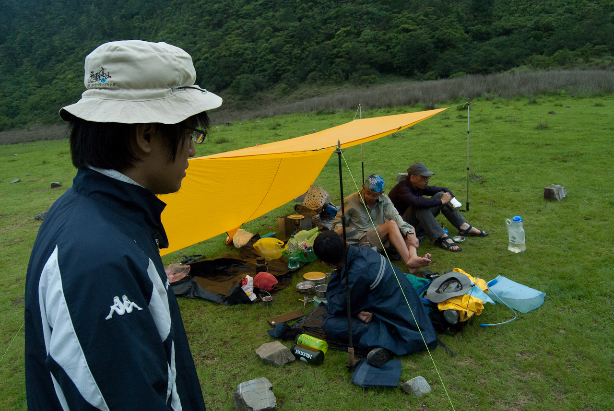
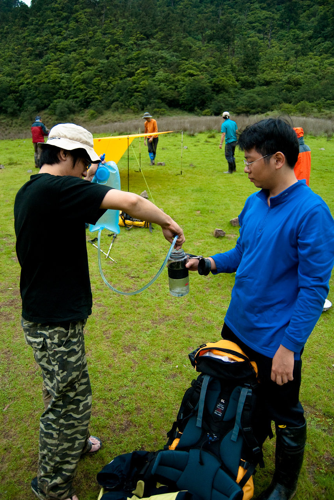
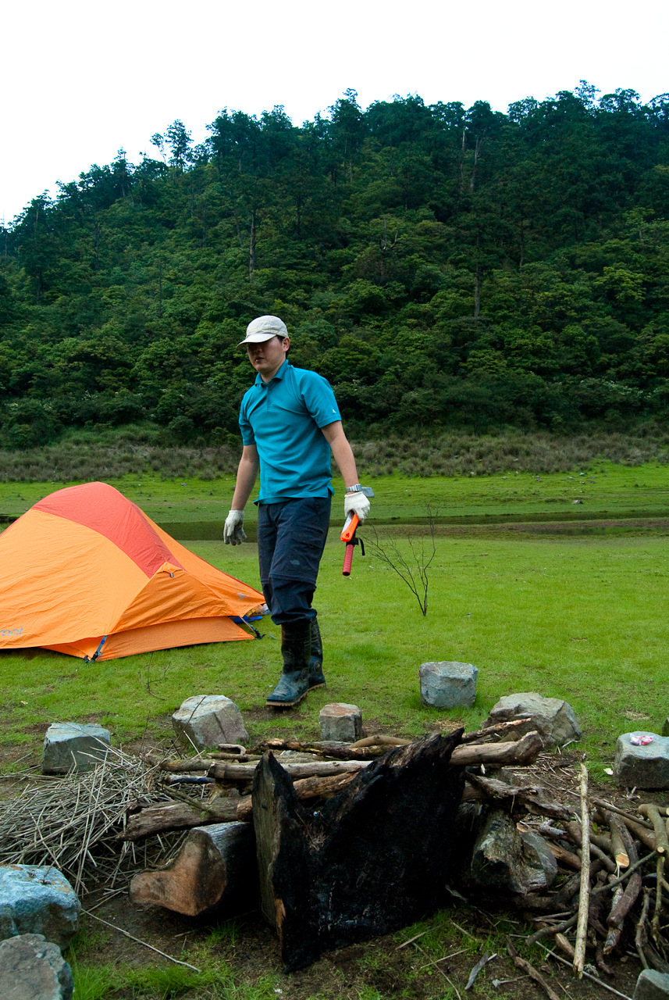
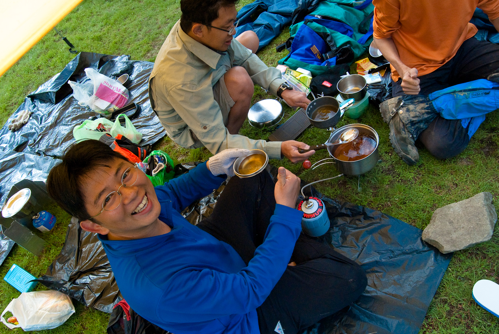
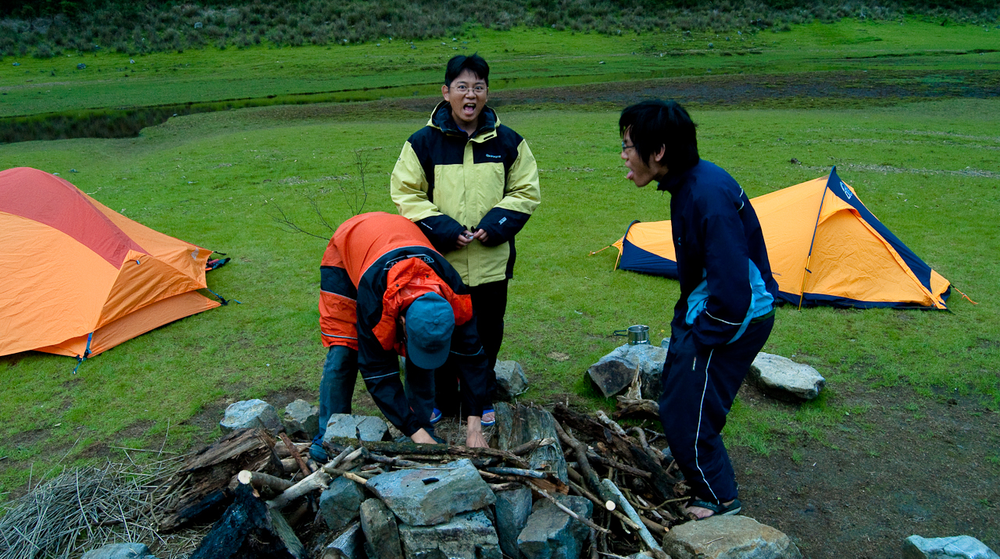
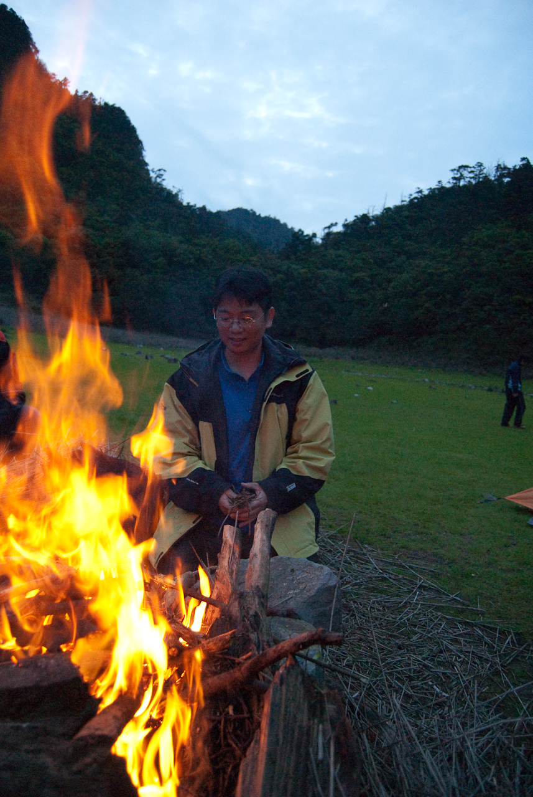

根據 GPS Logger，我們從七點半到登山口，十二點五十分到松蘿湖，約花五個小時半的路程。到那邊的時候，整個松蘿湖扣掉我們這團的人，不超過十個人在上面。  
  
把重裝行李放下來稍微休息一下後，專業的登山高手馬上開始搭了炊事帳。  
  
  
  
炊事帳的功能是防風、還有讓大家有可以吃飯的地方。而且黑色大塑膠袋立刻派上用場，墊在底下可以有效阻隔水汽，才不會讓屁屁著涼。有了炊事帳之後大家就拿出爐頭來開始燒水煮東西吃，這時大家的水大概全部都拿去煮泡麵吃了。  
  
這個時候最要緊的就是補充飲用水。這次我們上山只帶了行進時所需的水，所以到山上的時候水已經耗盡了。友聖大哥說這附近有南勢溪的上游，約離松蘿湖 20 分鐘，我們一行人就出發去取水了。  
  
出發前補給一下飲用水  
  
  
  
在較大的地圖上查看[松蘿湖+拉拉山](http://maps.google.com.tw/maps/ms?ie=UTF8&hl=zh-TW&t=p&brcurrent=3,0x3442ae741e686aa5:0xcf503259afe25a05&msa=0&msid=102940795217138094975.00046b2130e088a63a180&ll=24.692801,121.532264&spn=0.018716,0.034332&z=15&source=embed)  
  
其實這二十分鐘還蠻漫長的。走了五個小時之後，其實體力已經消耗的差不多。在沒有確實取得飲用水之前，我也不敢一次就喝掉太多水，而其實這個時候我已經很渴了。我們走了一段時間後，一直都沒看到水源，兩旁的青苔漫佈讓人感到很重的濕氣，但卻一直沒有看到水源。  
  
『是這邊嗎？』心中的疑惑逐漸的打擊著士氣。  
  
不過當友聖大哥停下來看地圖，說再走一段沒有就回頭時，Znikang 突然說：『有水聲，』這個時候心中差點熄滅的希望才轟然之間的又點燃。  
  
當真的看到溪流時，心中的感動真是無法比擬。果然平常隨處可取的東西，在快失去時才知道珍貴阿。  
  
所以，我又可以大口喝水啦。  
  
  
…而在我們去取水時，其他的人則開始準備劈柴生營火。  
  
  
回來後水源充足後，Payton 拿出冬瓜糖來開始煮冬瓜茶。  
  
來來回回歷經疲憊，山上湖旁的溫度又低，一杯可以補充糖份又溫暖的冬瓜茶入肚，我只能說這是我這輩子喝過最好喝的冬瓜茶阿…。  
  
  
  
而這個下午最耗我們時間的，就是營火了。  
  
不知道為什麼，生火的人都很有喜感。  
  
  
  
湖旁邊的柴大部分都是濕的，所以要生營火還真的有點難度，還好旁邊有不少細的乾柴，燃燒許久後木柴烤乾營火還是升起來了 :P  
