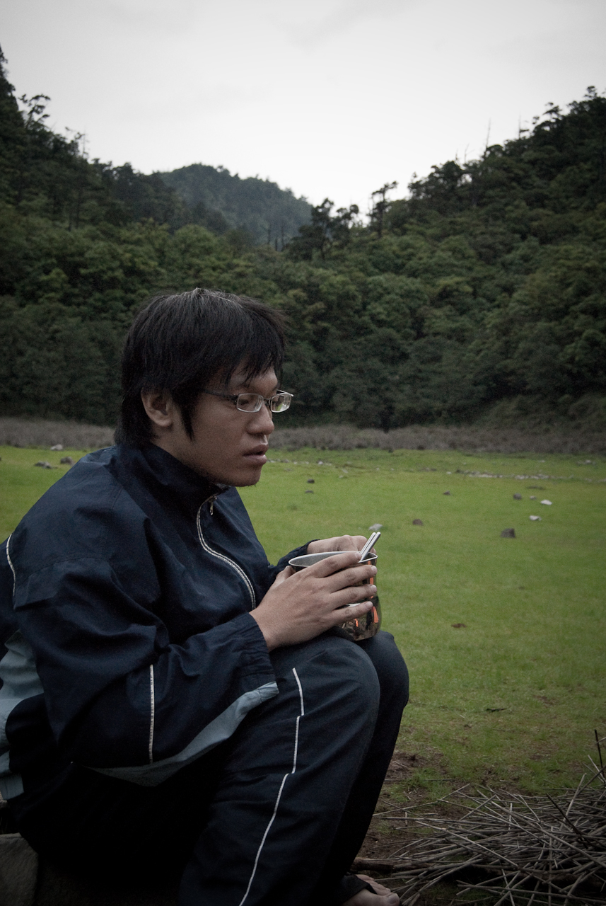

來個照片補遺吧 :P  
  
Wing 也帶了他的單眼相機來，是 Olympus 的。到營地之後就輕鬆不少，大家也拿出相機開始到處拍拍了。  
  
Wing 喜歡叫他的單眼叫做小老婆，有次他把相機放在石頭上，權誠看到了就說誰的相機擺這裡阿，很容易就濕了。這時候就有人大叫：『Wing，你的小老婆要濕了…』  
  
  
友聖大哥很喜歡一個人找地方坐著。不知道是在想些什麼呢？每次他靜靜的坐在旁邊，感覺起來都有股沈思的感覺，看起來充滿智慧阿。  
  
  
這是不良示範阿 XD  
山上這樣睡著很冷的。  
  
  
當我們生營火有點遇到困難時，慷慨大方的 Payton 拿出了他的大蠟燭，說：『用這個蠟燭燒吧，這個火很大的』。於是他就點燃了蠟燭 - 它的火力真的跟一般的蠟燭沒什麼兩樣…。  
  
  
Znikang 累了阿…。