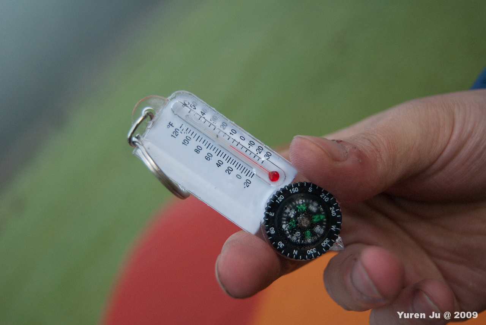
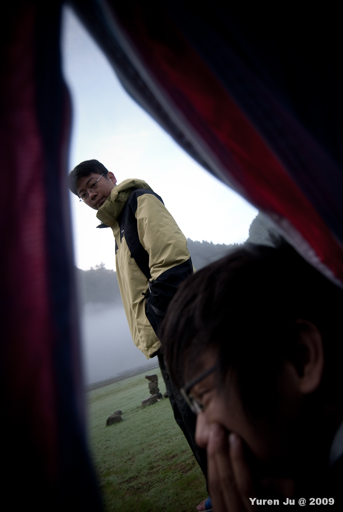
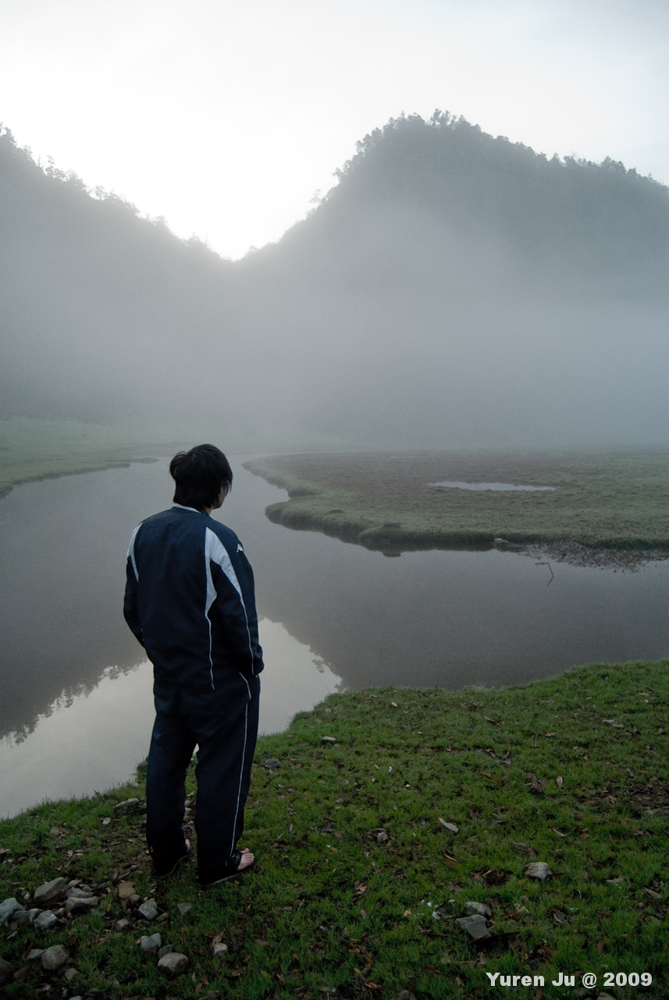
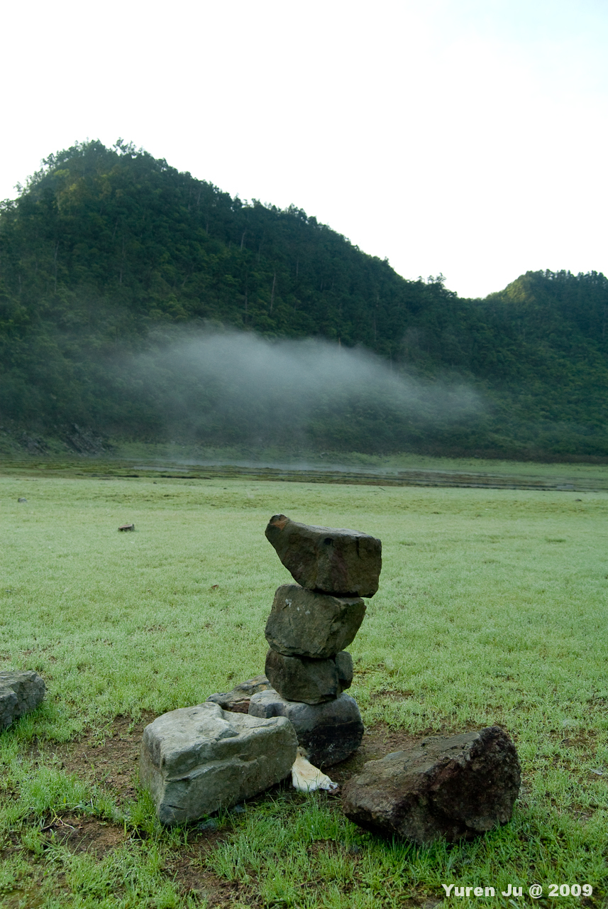
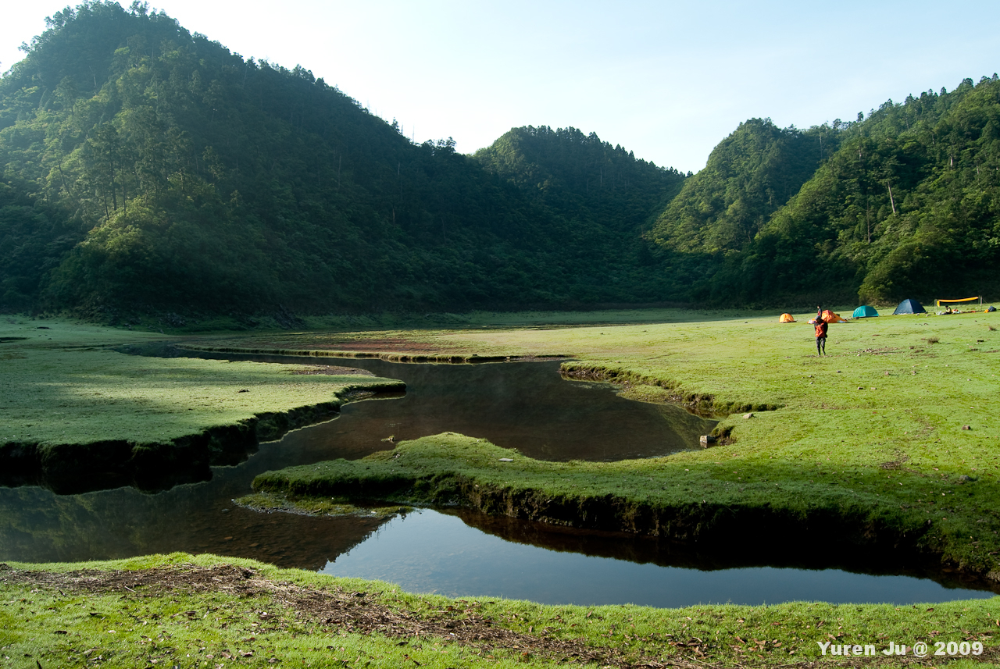
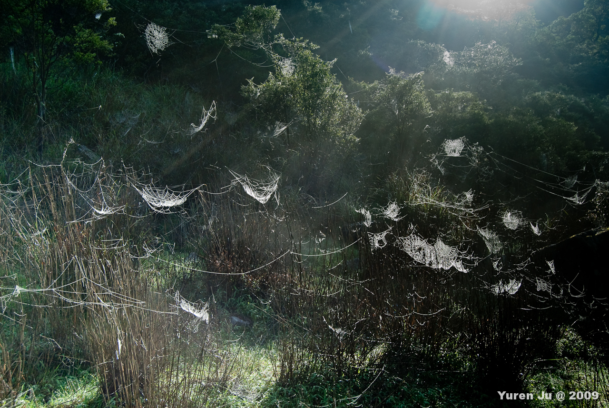
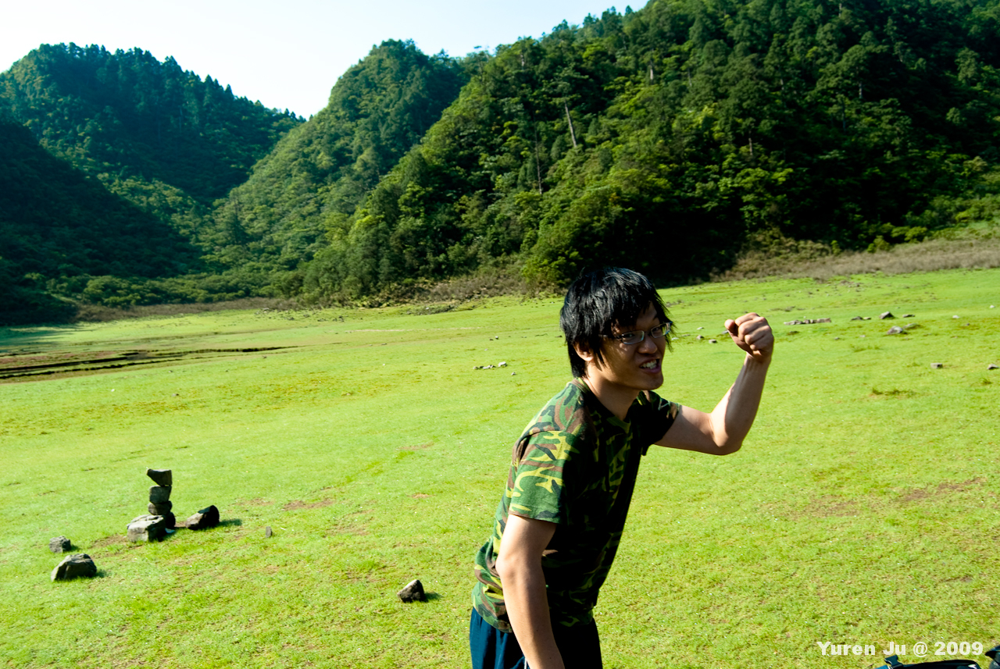

隔日凌晨，我跟 Znikang 都被冷醒了。大誠的溫度計告訴了我們為什麼。  
  
  
五度。而且剛看得時候是三度，那我想晚上溫度應該差不多是零度。  
  
穿了厚外套睡覺後，過沒多久 Payton 又過來叫醒我們。  
  
  
松蘿湖在每個時間點都有不同的面貌，而清晨的松蘿湖整個湖面上飄起了霧，就像毛毯一般，輕輕的蓋在湖上。  
  
  
再經過一段時間後，霧開始慢慢散去。剩下的水氣化成小小的一片雲，飄在松蘿湖上。  
  
  
睡完回籠覺，吃完早餐後，松蘿湖又變成另外一種面貌。陽光與陰影的分界線逐漸向我們靠近後，陽光照耀在松蘿湖上，整個寒氣都被驅逐了。  
  
  
夜晚寒冷的痕跡只剩下掛在枯枝上佈滿水滴的蜘蛛網。  
  
  
大家都恢復元氣囉。  
