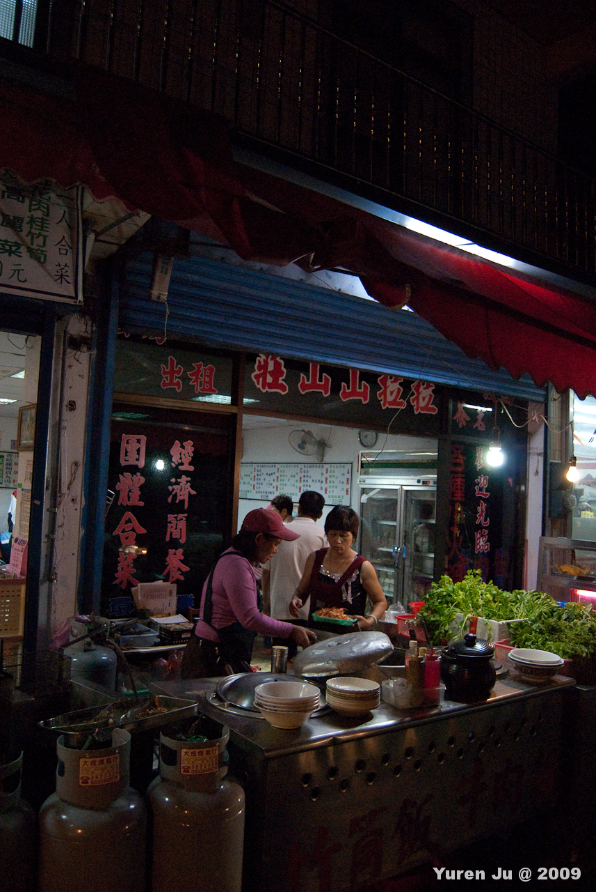

說到拉拉山上面的飲食，我不得不抱怨一下這間餐廳。  
  
豆乾、半顆滷蛋、青菜跟茄子，這樣要價 100 元。  
  
  
我可以諒解觀光地區很少一個人來，但不能原諒老闆娘的態度。我跟老闆娘講了很多次我要點雞腿飯，但是他完全都不理我。後來直接走他煮菜的地方，大聲的跟他說我要雞腿飯後，他才跟我說，要我吃 100 元的餐。因為很餓了，就直接答應。後來飯菜又一直沒來，我又去跟他說，他竟然把一盤青菜塞給我，然後說：『你一個人最麻煩了！』讓我超級不爽的。後來菜陸陸續續的上來，沒想到竟然一百元的餐只有這樣，難怪他要我別點 80 元的雞腿飯。  
  
這間店叫做：『拉拉山山莊』『阿平小吃店』，東西我根本就吃不完，因為太難吃了。  
