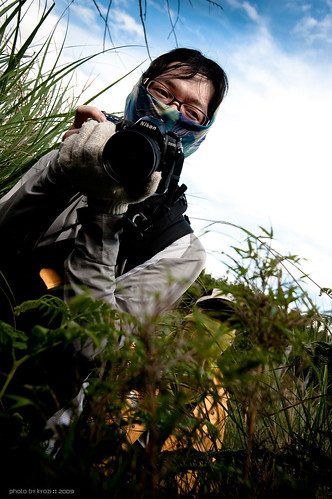
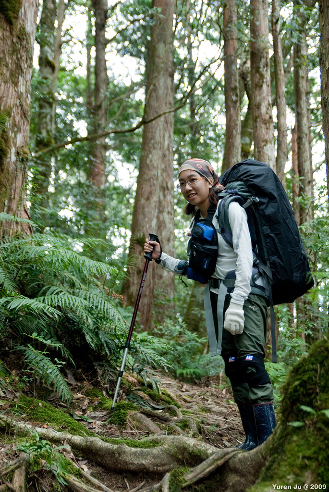
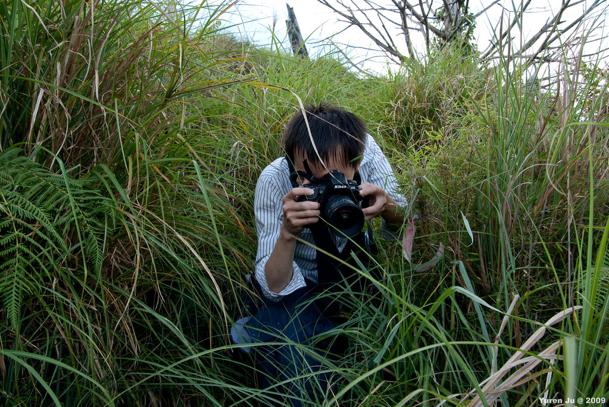
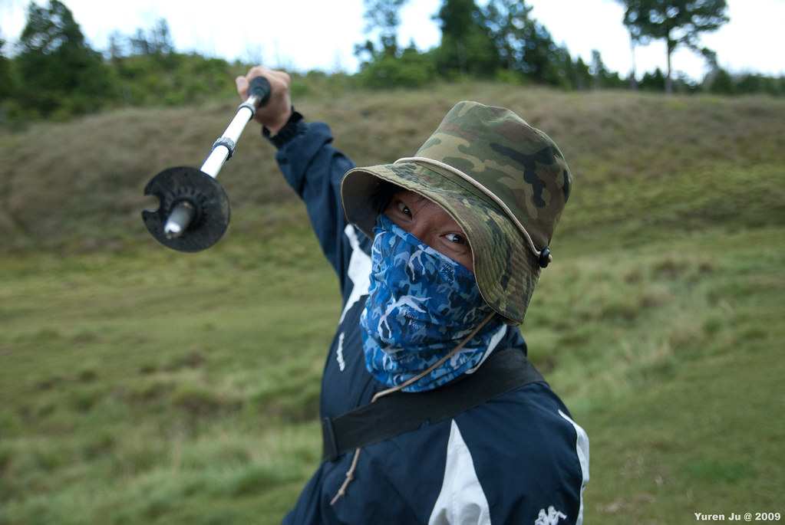
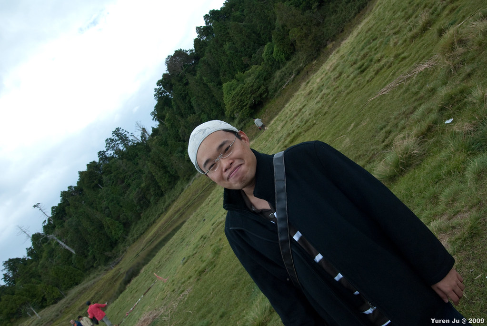
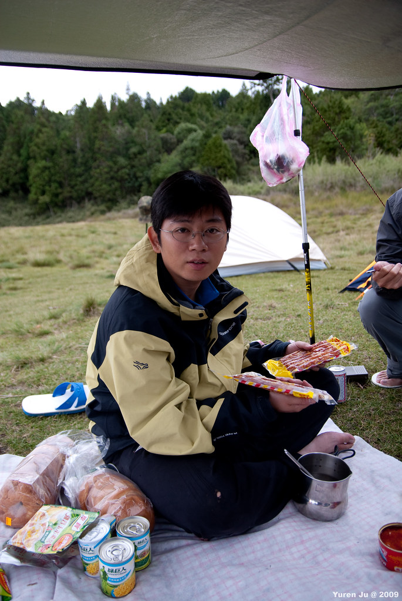
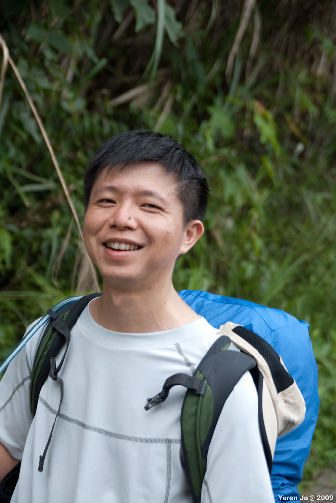
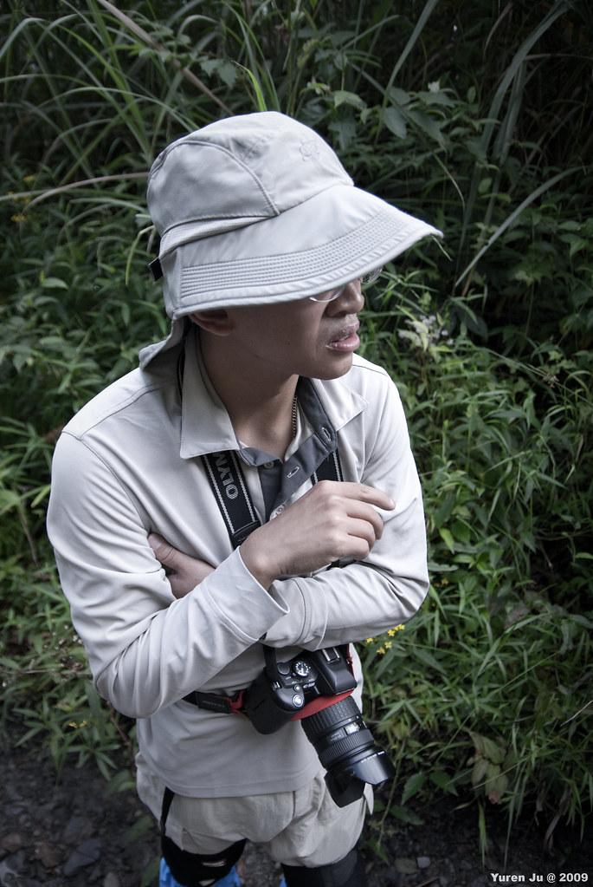

上一次爬松蘿湖時，大誠在路上就推薦我們也去加羅湖看看。一時衝動之下，就把加羅湖露營的活動給開了。基本上加羅湖的行程比起松蘿湖輕鬆一點，爬松蘿湖是無盡的碰到疲憊臨界點的感覺，加羅湖則是連一次臨界點都還沒到就爬完了。不過應該也是我已經第二次重裝露營的關係啦，哈。  
  
本次行走路徑如下。  
  
在較大的地圖上查看[加羅湖露營](http://maps.google.com.tw/maps/ms?ie=UTF8&hl=zh-TW&t=h&brcurrent=3,0x346ef3065c07572f:0xe711f004bf9c5469&msa=0&msid=102940795217138094975.00046e116fa2967ecc95d&ll=24.481837,121.453686&spn=0.031246,0.068665&z=14&source=embed)  
  
跟網路上別人的行程資料差不多，從柵欄處走到林道我們花了兩個小時二十分，休息午餐一小時二十分開始從巨木登山口往上爬。四個小時半後到達加羅湖。  
  
本次成員結構比[松蘿湖露營成員](http://yurenju.blogspot.com/2009/06/blog-post.html)單純一點，就平常瘋狂旅行團的成員加上一些外掛。  
  
我！這張是 Kyozi 拍的，感覺很讚 XD  
  
  
  
  
Chialin, 這次她很厲害，自己背了水喔，肩上超過十公斤的重量。  
  
  
Kyozi，這次口頭禪『你還有沒有臉阿』深受大家喜愛跟幹來用。  
  
  
Znikang，土匪造型很帥！  
  
  
輝哥，這次上吐下瀉又狂爆汗，下次別那麼鐵齒啦～哈  
  
  
大熊 (Merck)，名言：『好久沒一起出來玩了，一出來就來個有生命危險的』 XD  
  
  
Payton，本次嚮導！感謝 Payton 這次提供的超硬超鹹臘腸，本次成員一定都會銘記在心…  
  
  
Grissom, Payton 的前同事  
  
  
Wing, 跟我們第二次出來爬山囉，感謝他提供的四人帳 :D  
