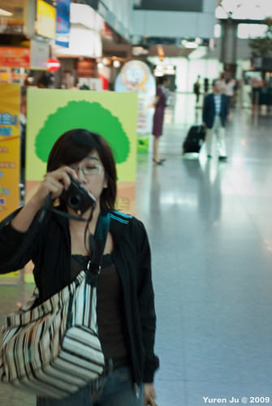
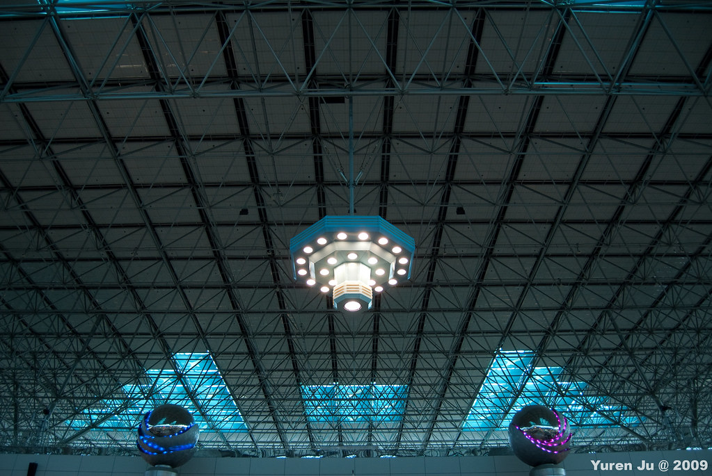
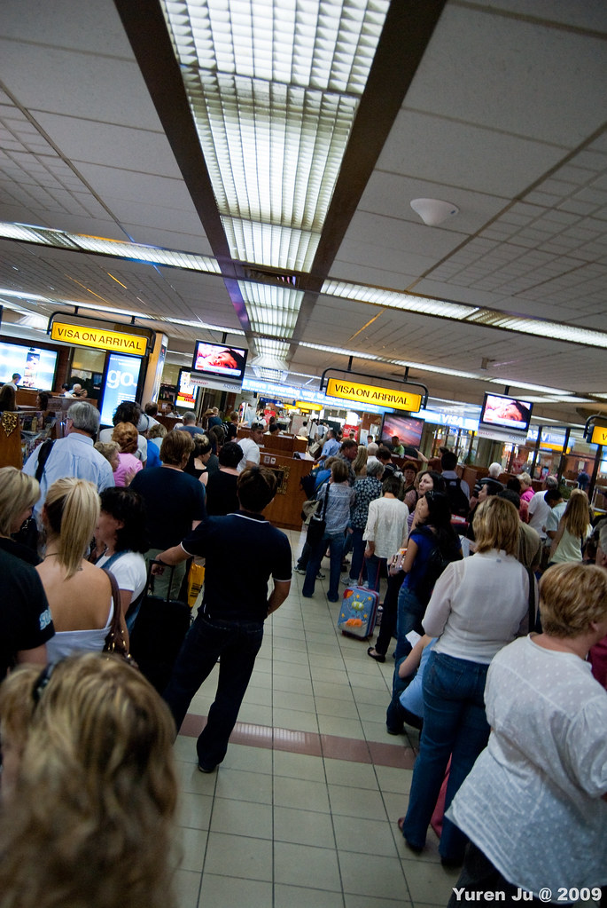
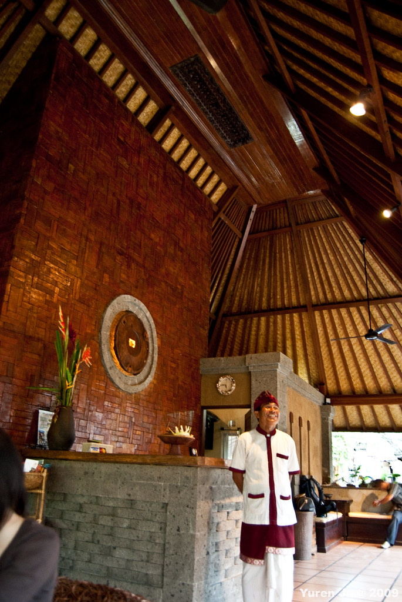
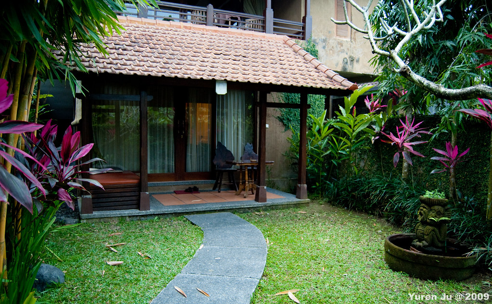
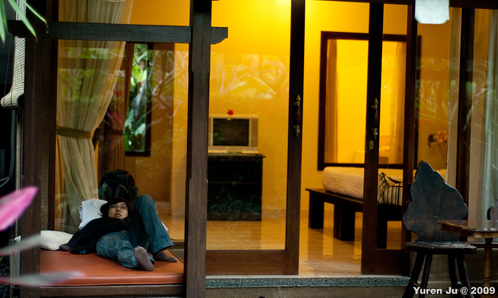
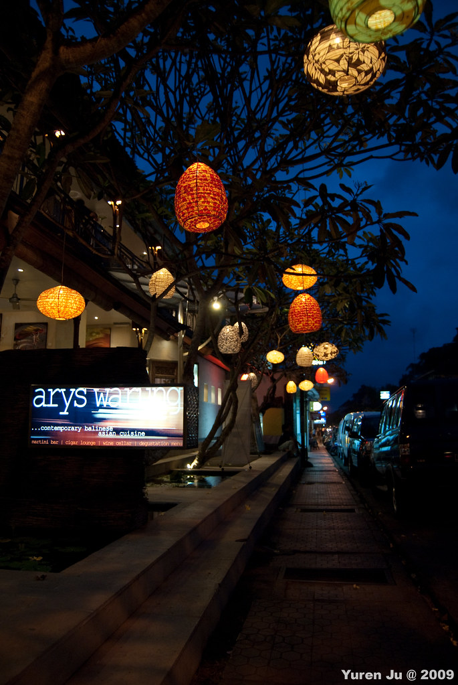
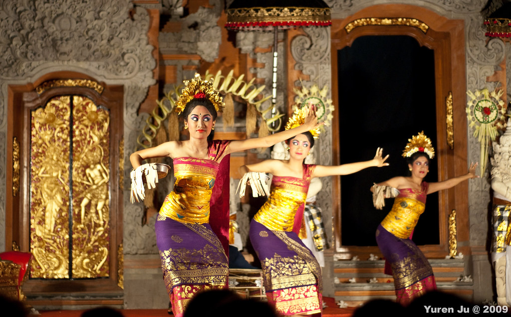
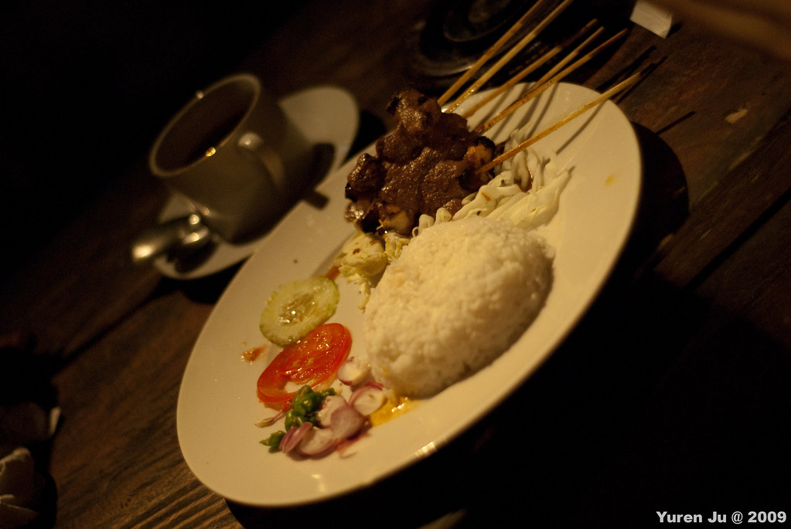

Chialin 最近找到新工作了。所以想趁著舊工作跟新工作之間的空檔出國玩，所以這次又在很倉促的決定下，去了峇里島。我們在兩個禮拜內搞定了役男出國申請、機票、住宿、包車、行程。這一切都要感謝國泰人壽的代言人 Chialin。  
  
  
  
這次出境則跟去香港一樣，我們從桃園國際機場出發，不過這次選擇搭國光客運到機場，感覺也是挺便利的。這次因為還蠻晚訂機票的，所以我們只訂到早上十點十五的飛機，而飛行時間是很囧的五個小時…。  
  
  
  
  
  
  
  
吃了飛機上難吃的飛機餐、跟 chialin 閒扯淡了四個小時五十五分鐘後，我們終於到峇里島了！而接下來要面對的！就是峇里島著名 sloooooooow 的海關。沒想到在機場就體會到峇里島的悠閒了阿。連海關人員都很悠閒。  
  
  
  
過了海關後，迎接我們的是 local agent - Koma 派來的機場接送。本次行程找的峇里島 local agent 是 koma，價格沒特別便宜，不過服務還算週到！經過了一個小時半的車程，我們到了位於 Ubud 市區的民宿 Tunjung Mas，這次住 Tunjung Mas Bungalow 的 superior Room，僅需 50 USD，便宜吧。剛到 Tunjung Mas 的時候還真不敢相信這間 hotel 只需要 50 USD...  
  
  
  
到我們的房間之後又更不敢相信這是 50 USD 可以住的地方！  
  
  
  
有人一到民宿之後就開始享受峇里島悠閒（踢飛～）  
  
  
  
晚上還有行程，所以也沒停留多久。不過這間房間非常的大，廁所跟浴室也是大的誇張。不過蓮蓬頭的水實在有點小管，洗起來感覺會著涼到。所以這間沒有很推，不過當然還是很物美價廉囉。  
  
稍坐片刻，我們就用飯店的免費接駁服務到了 Ubud Palace (Ubud 皇宮) ，附近的街道還蠻有那種老外度假勝地的 feeling 的，到處都是酒吧跟餐廳。  
  
  
  
小逛一下後，我們就去看雷貢舞 (Legong dance) 的表演...舞者荔枝大的瞪眼跟峇里島的傳統音樂真讓我感受到峇里島傳統舞蹈神奇的 tone 阿…。  
  
  
  
Chialin 拍了段影片，可以體會一下那種張大眼睛的舞蹈  
  
  
  
看完表演後我們隨機的挑了間餐廳吃晚餐，很幸運的還蠻 OK 的，價格也十分便宜（不過我忘記多少了）  
  
  
  
今天就這樣結束囉。  
  
  
在較大的地圖上查看[2009 峇里島](http://maps.google.com.tw/maps/ms?ie=UTF8&hl=zh-TW&brcurrent=3,0x3442ae17715a4b9f:0xbaeaecff55cfad73,1&msa=0&msid=102940795217138094975.000472aea6ecdd5afe24b&ll=-8.513204,115.26392&spn=0.016977,0.034332&z=15&source=embed)