第二天早上，我跟 Chialin 一早起來就先到處閒晃，峇里島街頭的住家跟民宿還蠻有特色的。  
  
[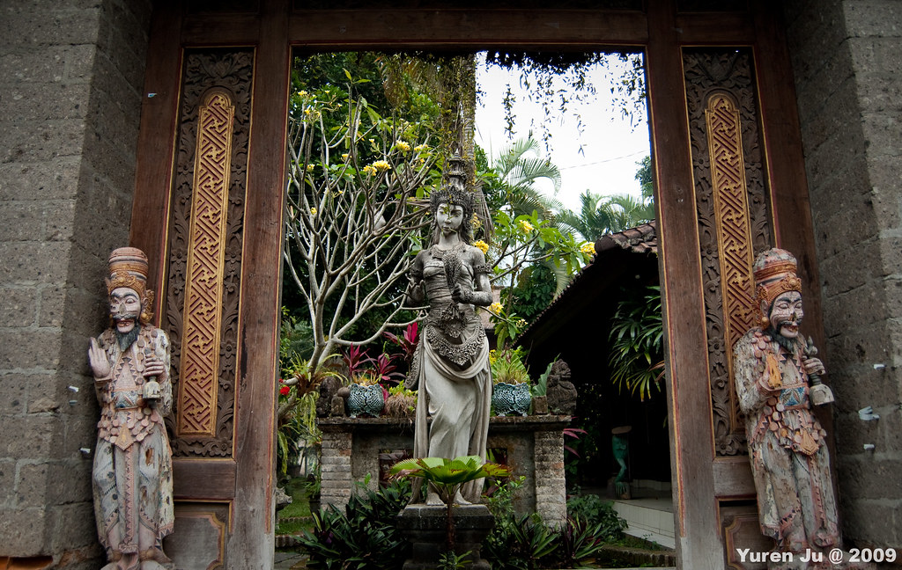](http://www.flickr.com/photos/yurenju/3887487136/ "Flickr 上 yurenju 的 峇里島很多這麼美麗的住家/民宿/Villa")  
  
跟台灣一樣，機車是這邊主力交通工具。  
  
[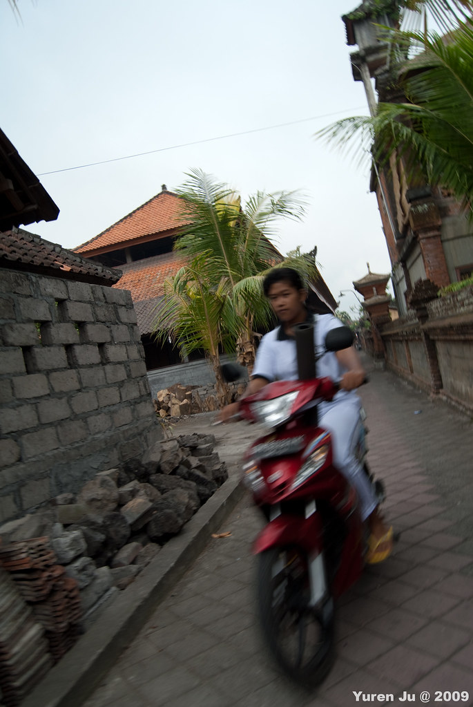](http://www.flickr.com/photos/yurenju/3886691169/ "Flickr 上 yurenju 的 機車是這間大宗的交通工具")  
  
  
  
  
  
逛完之後就回 Tunjung Mas 吃早餐了。為了體會當地生活，我們兩個點的是印尼傳統早餐，結果送上來的是炒麵跟炒飯，本質上雖然看起來跟台灣的一樣，不過完全是印尼風味阿。這次來峇里島吃了兩次炒麵後就沒點了，感覺並不那麼特別。而且說實在的有點像金門的炒泡麵 XD  
  
[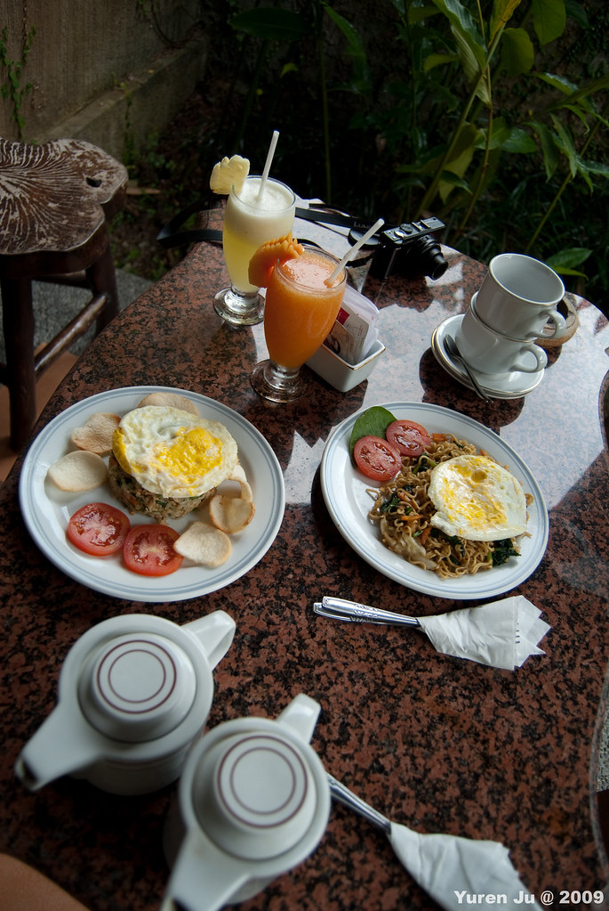](http://www.flickr.com/photos/yurenju/3887490162/ "Flickr 上 yurenju 的 第二天早餐！")  
  
吃完早餐要出發囉！這次很幸運的，Koma 派來的司機是網路上鼎鼎有名的 Widi! 他在許多 blog 出現過，沒想到這次也可以給他載囉。Widi 的中文真是不錯的阿，人又很和善。難怪網路上這麼多人推薦他。路上問他的時候，他說幾乎所有他的客人都是台灣人，只有少部份的中國人跟馬來西亞人。應該是很多人看了 blog 都跟 koma 指定 widi 吧？  
  
搭上車後，Widi 建議我們可以先繞去 Sukawati 看些石雕，接下來去緊鄰旁邊的蠟染工坊，再到附近的象洞，繞到聖泉廟，最後衝上 Batur 看火山跟去 Pura Ulun Danu Batur (巴杜廟)。所以我們就把 Sukawati 的行程加進去第二天的行程了。  
  
首先到的是 Sukawati 賣石雕的地方。  
  
[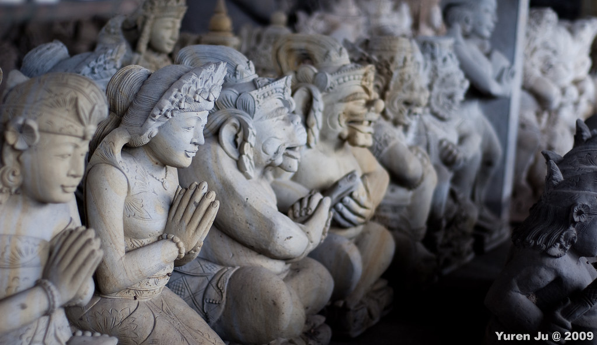](http://www.flickr.com/photos/yurenju/3887491644/ "Flickr 上 yurenju 的 石雕")  
  
如果還有要來的朋友，我建議你可以在 Sukawati 買石雕。就這幾天的行程看起來 Sukawati 的石雕明顯是比較精緻的，而且在此也可以殺價。不過我建議晚點來，先去 Ubud 市場熟練一下價格區間跟殺價的技巧之後，到 Sukawati 大概知道價格後會比較有概念。殺起價來也比較心安。  
  
蠟染工坊... 沒什麼照片，這邊除非你已經準備好白色衣服要蠟染，不然其實也不用來。購物我覺得在 Ubud 市場即可。簡單的說：石雕 => Sukawati，其他 => Ubud 市場，這樣就 OK 啦。  
  
接下來我們就去象洞囉。老杯杯在雕像旁偷閒呢...  
  
[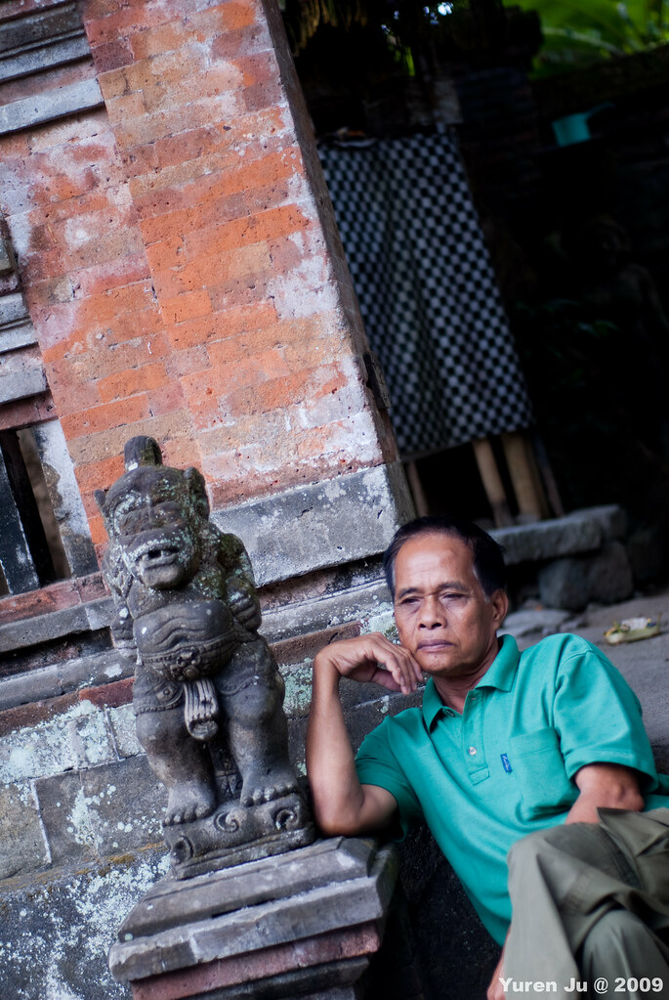](http://www.flickr.com/photos/yurenju/3887493428/ "Flickr 上 yurenju 的 偷閒")  
  
象洞旁超高的神木  
  
[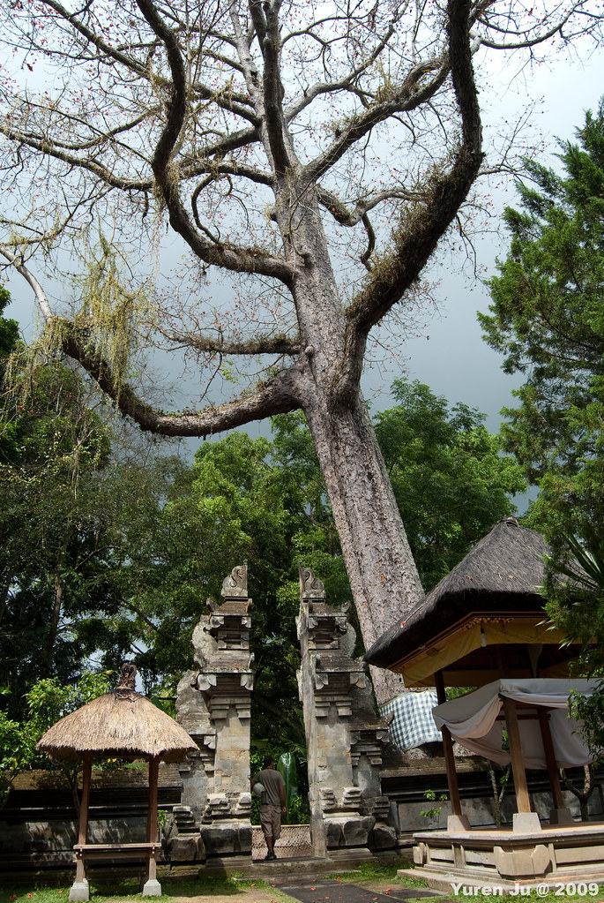](http://www.flickr.com/photos/yurenju/3886704151/ "Flickr 上 yurenju 的 象洞前非常高的樹")  
  
落花。  
  
[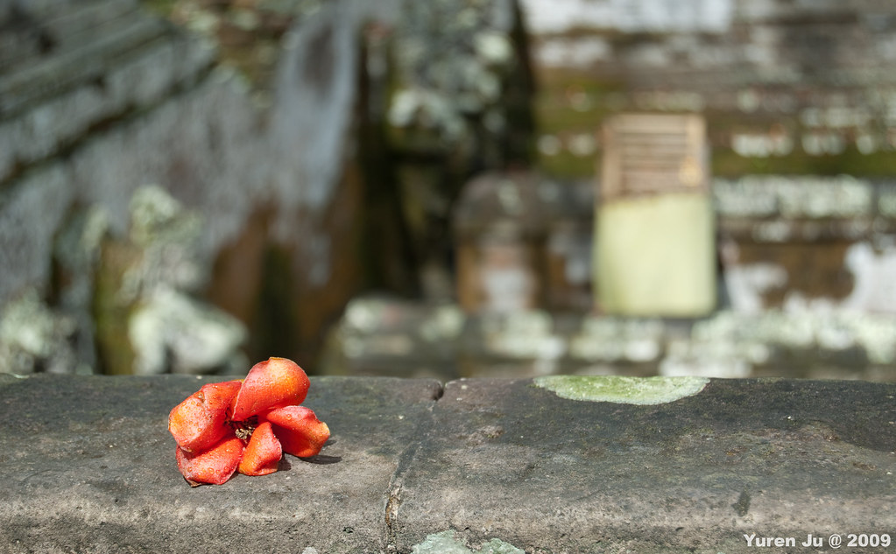](http://www.flickr.com/photos/yurenju/3886701271/ "Flickr 上 yurenju 的 花")  
  
Chialin 跟智慧之神比誰的眼睛先眨，勝負很明顯阿。  
  
[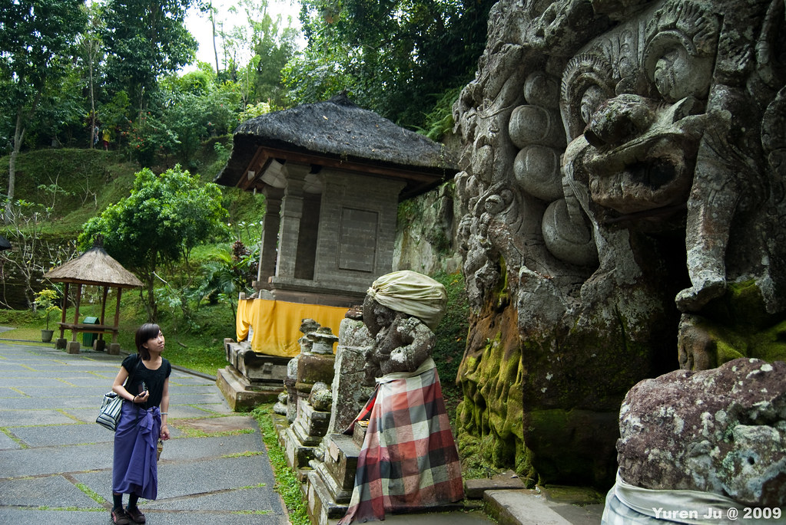](http://www.flickr.com/photos/yurenju/3887503064/ "Flickr 上 yurenju 的 Chialin vs 象洞")  
  
出來象洞後，我們跟著前面的人走，不知不覺走到了神奇的小徑，不知道繞到哪邊去了阿…不過路的盡頭是一座小小的廟  
  
[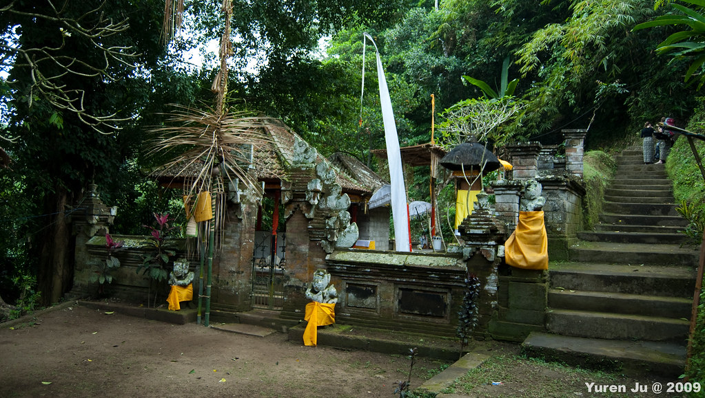](http://www.flickr.com/photos/yurenju/3886711493/ "Flickr 上 yurenju 的 隱藏在象洞附近的小廟")  
  
旁邊還有隱藏的森林裡面的柵門...進去裡面會遇到千尋嗎？  
  
[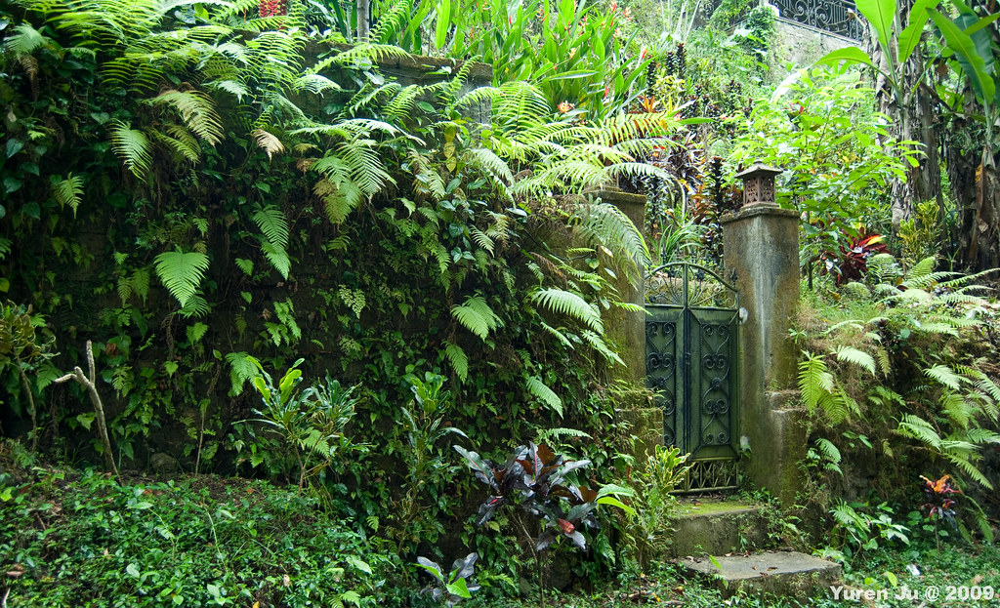](http://www.flickr.com/photos/yurenju/3886709585/ "Flickr 上 yurenju 的 隱藏在森林裡的小門")  
  
祭祀。  
  
[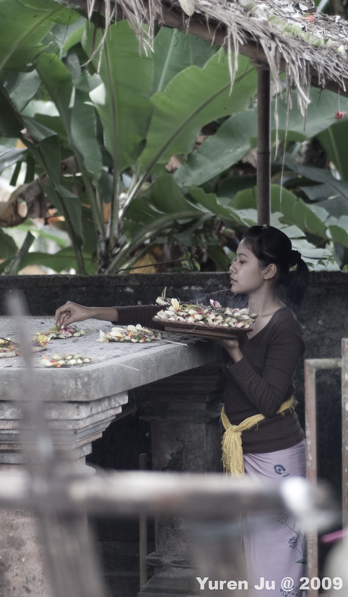](http://www.flickr.com/photos/yurenju/3886712433/ "Flickr 上 yurenju 的 祭祀")  
  
跟台灣一樣，觀光景點附近都會有賣東西。Chialin 在這邊買了沙龍，還不錯。我們也是在這間第一次在峇里島殺價。  
  
[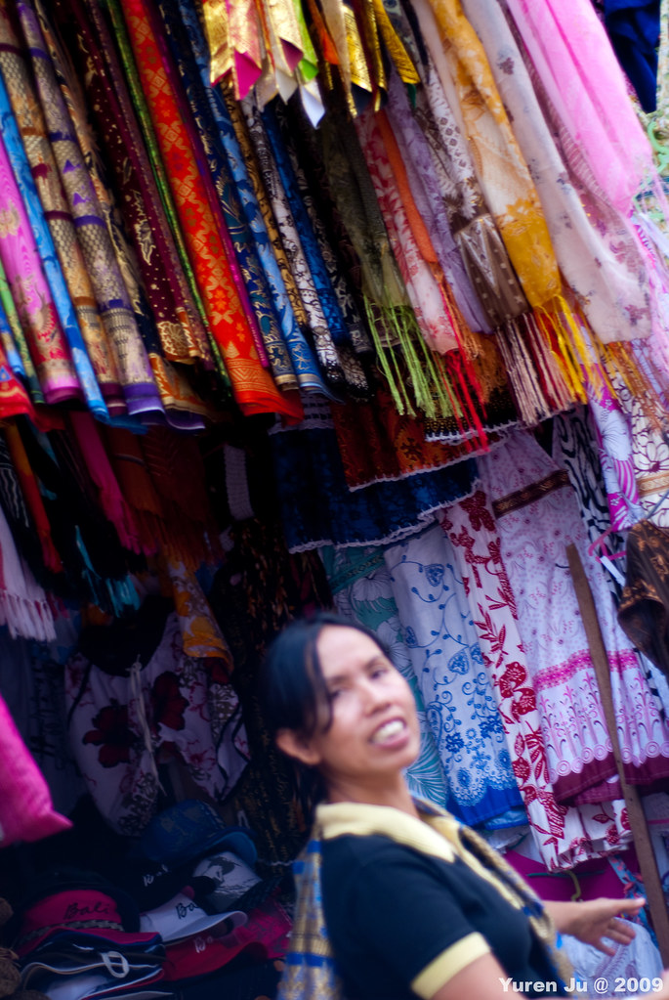](http://www.flickr.com/photos/yurenju/3886714149/ "Flickr 上 yurenju 的 沙龍")  
  
最後來張 Chialin 『俏皮』的表情…。  
  
[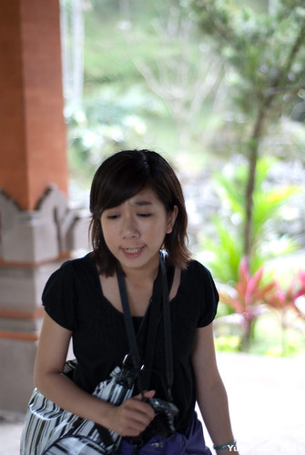](http://www.flickr.com/photos/yurenju/3886699283/ "Flickr 上 yurenju 的 我不知道該說什麼…")  
  
To be continue…