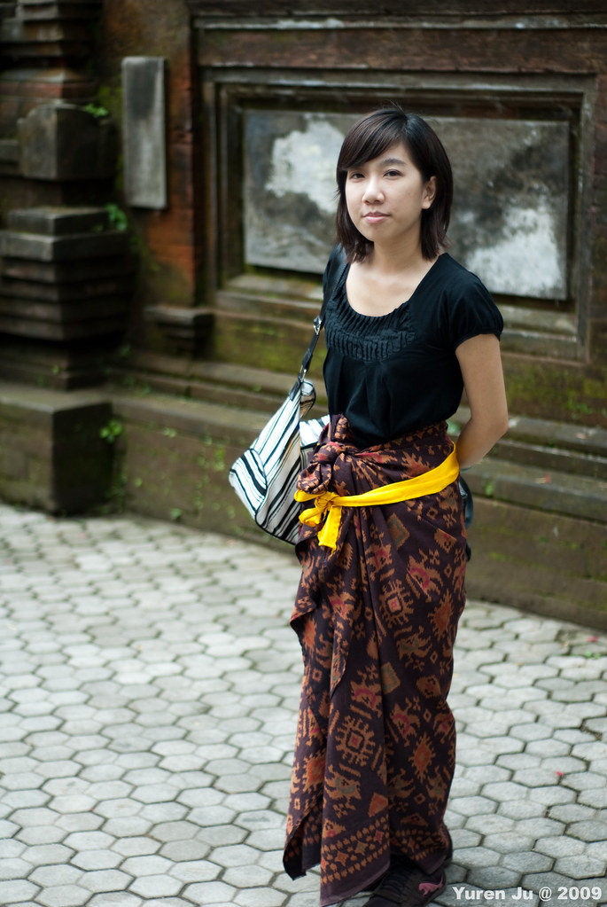
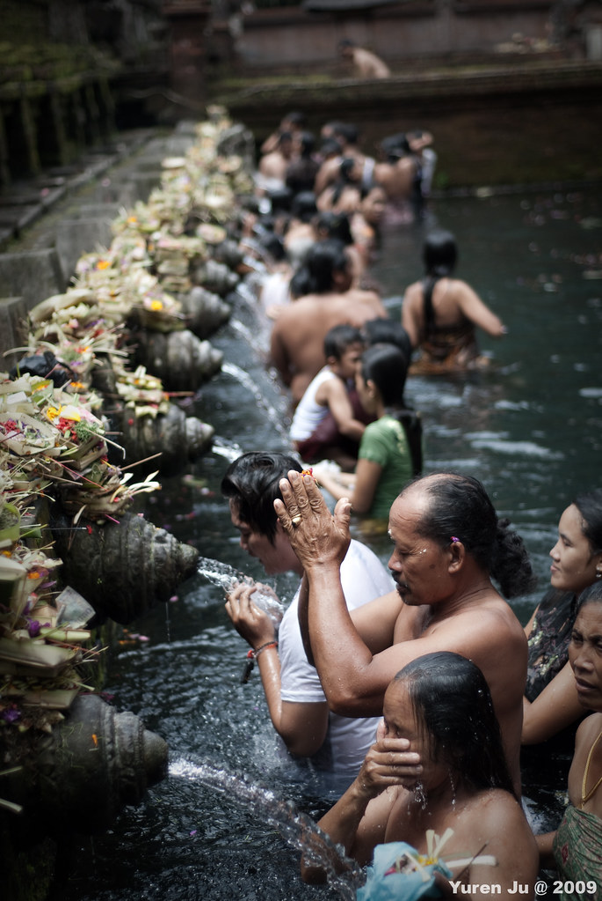
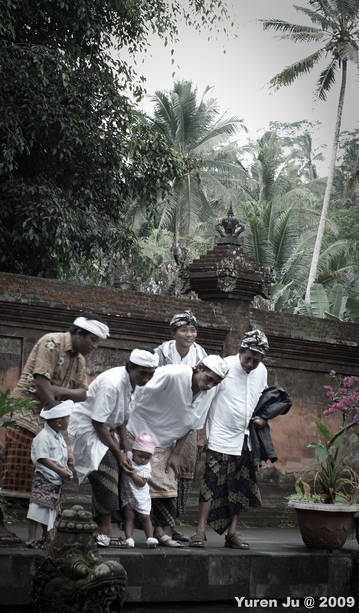
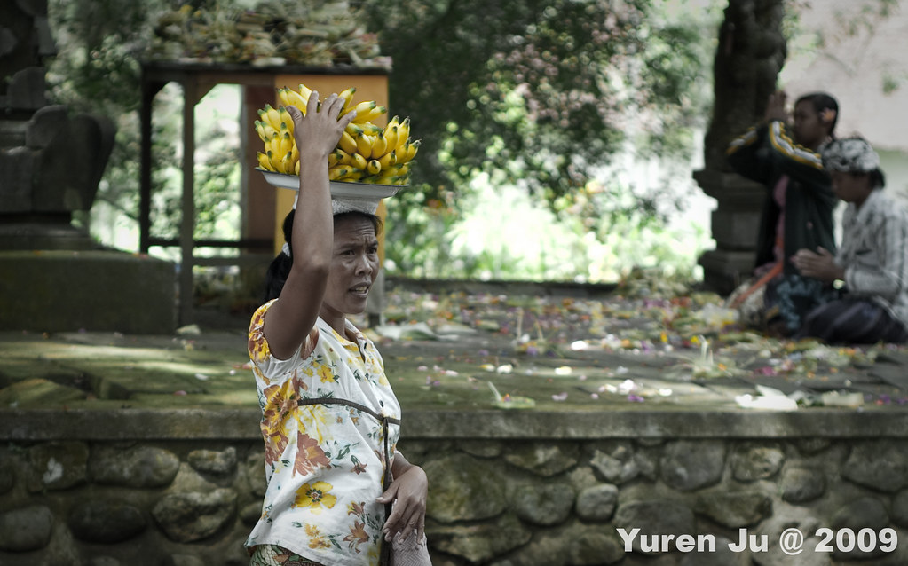
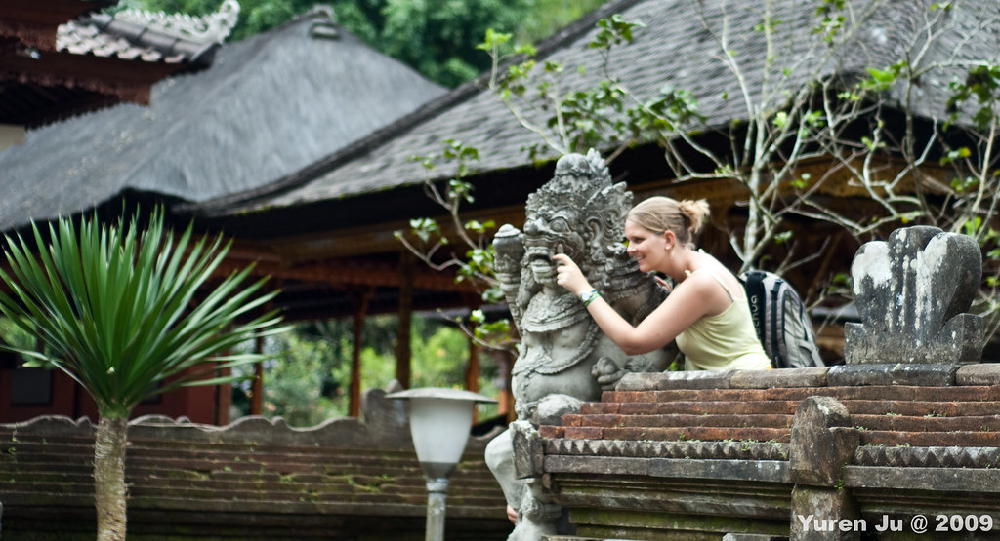
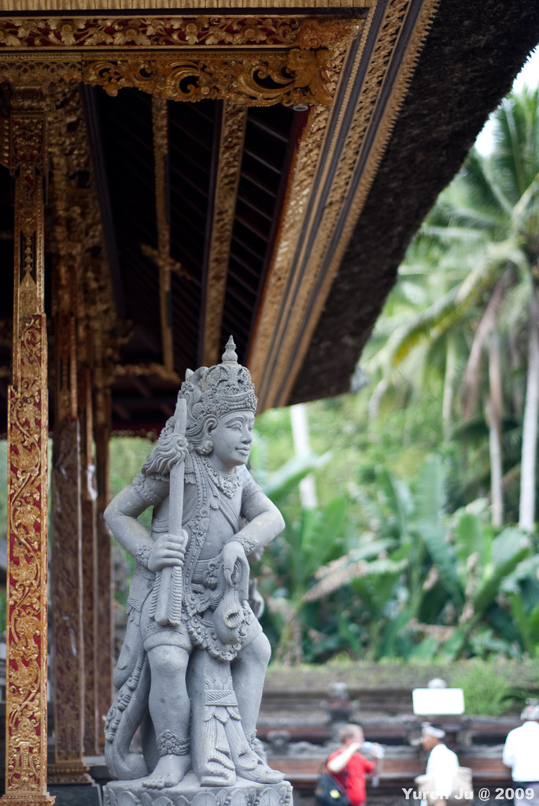
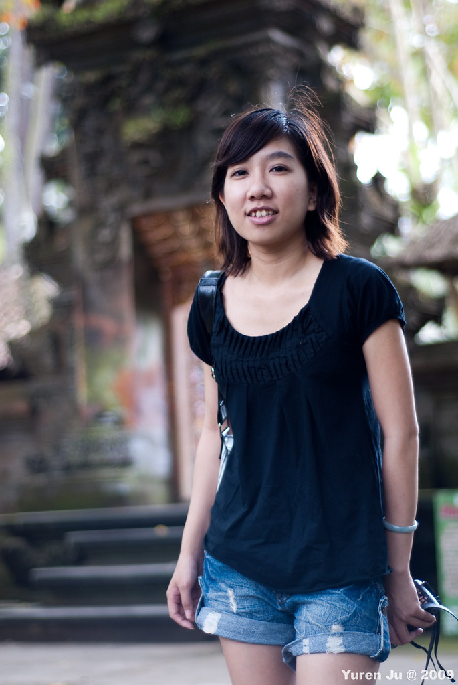
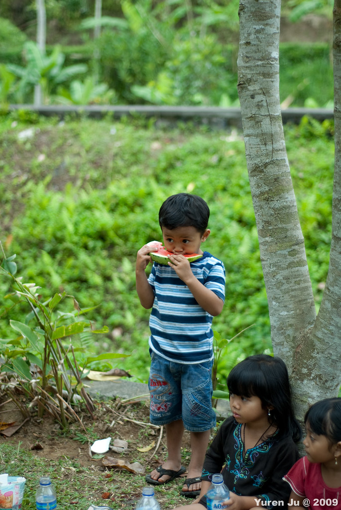
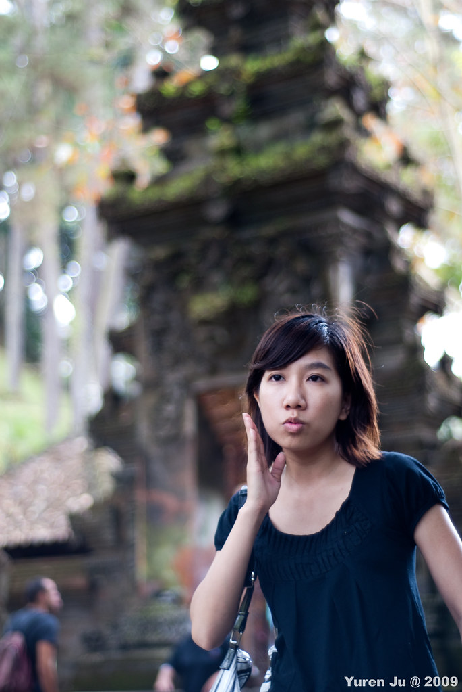

結束象洞的行程後，司機說我們進去了有點久，是不是被當地導遊拉去其他地方？他說因為當地導遊都會額外收費，所以他有點擔心我們被拉去。我跟他說我們是跟著前面的人走的 XD  
  
Widi 就說這樣很好，因為這樣免費！哈。Widi 問我們餓了嗎，如果還不餓的話，可以先去聖泉廟走走，再到 Batur (巴杜) 吃飯。所以我們就前往聖泉廟囉。  
  
這邊有蠻多廟宇進去都要穿沙龍的，廟方都會提供沙龍出借，這邊的沙龍還蠻好看的。  
  
  
  
顧名思義，聖泉廟就是有聖泉的地方。不少當地人都在這邊取聖泉沐浴，虔誠得很。  
  
  
  
  
  
  
  
而且這邊也可以捕捉到不少當地人的日常生活。  
  
再看什麼呢？  
  
  
  
不要看這邊出產很多水果，還是台灣的比較好吃啦。  
  
  
  
讓金髮妞幫祢剔個牙吧  
  
  
  
  
峇里島充滿了石雕。  
  
  
  
Chialin  
  
  
  
峇里島的小朋友也很可愛，不過我想應該是跟台灣的小朋友一樣白目。  
  
  
  
Chialin 的俏皮 II - 皮膚很滑的 Chialin....  
  
