註：旅行地圖跟大圖只有在**[\[原文\]](http://yurenju.blogspot.com/2009/09/day-3.html)**可以正常顯示  
  
第三天一早我們就開始收拾行李，今天我們要從 Tunjung Mas 換到 Payogan villa 。所以今天就把所有行李上了 Widi 的車，準備移動囉。  
  
今天早上的第一站，是孟威 (Mengwi) 的塔曼．阿尤寺 (Pura Taman Ayun)。不愧是旅遊書上介紹較少的景點，感覺起來驚豔程度就低得多了。  
  
[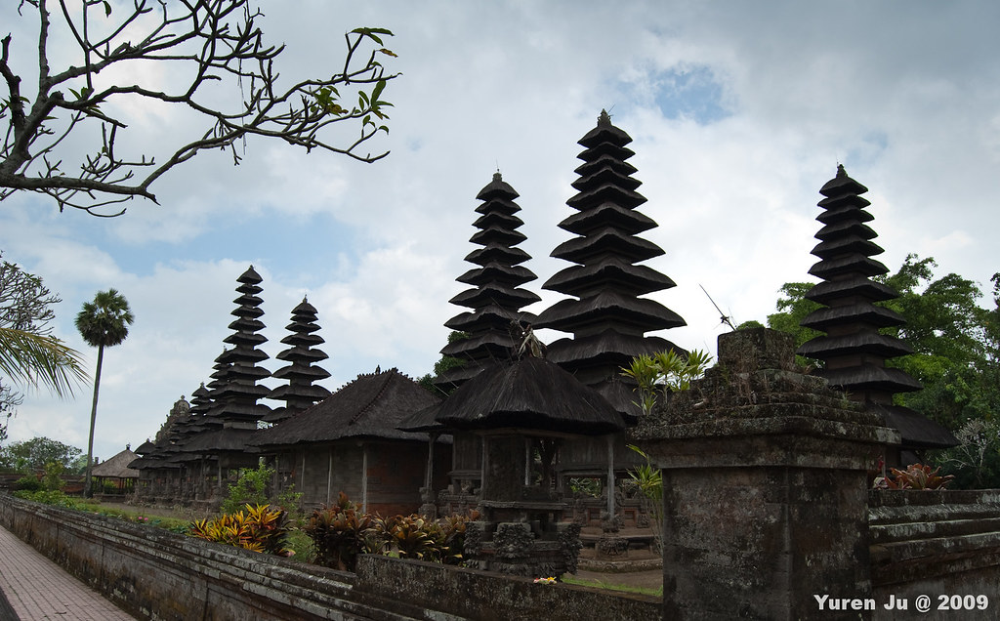](http://www.flickr.com/photos/yurenju/3903654961/ "Flickr 上 yurenju 的 Pura Taman Ayun")  
  
  
  
  
不過在裡面漫步的感覺還是不錯的。早上我們比較早出門，其他遊客看起來也還沒醒。而早上的動物們也很慵懶。  
  
[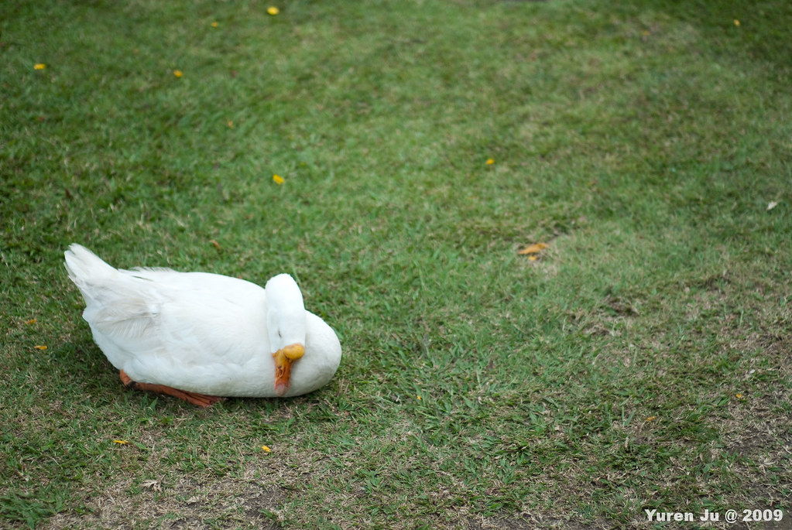](http://www.flickr.com/photos/yurenju/3904435400/ "Flickr 上 yurenju 的 鵝")  
  
這隻貓在樹上休息，畫面還蠻妙的。  
  
[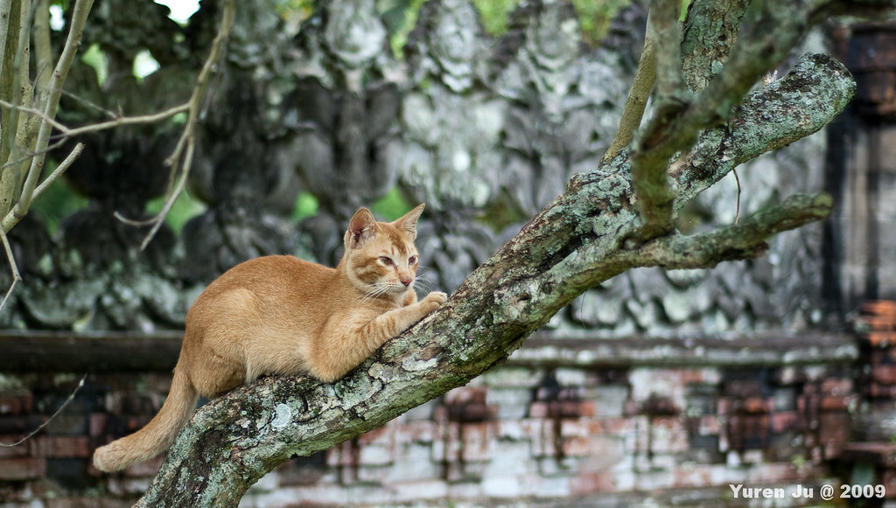](http://www.flickr.com/photos/yurenju/3903651143/ "Flickr 上 yurenju 的 花貓上樹")  
  
在廟旁邊有個開放的畫室，賣些畫跟紀念品。  
  
[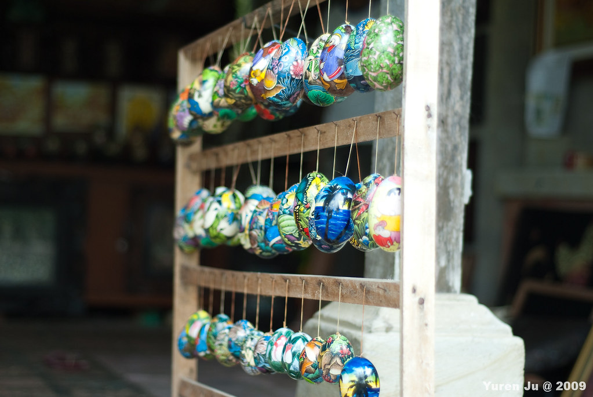](http://www.flickr.com/photos/yurenju/3903652871/ "Flickr 上 yurenju 的 彩蛋")  
  
畫家起得很早，一早就對著畫布凝視。  
  
[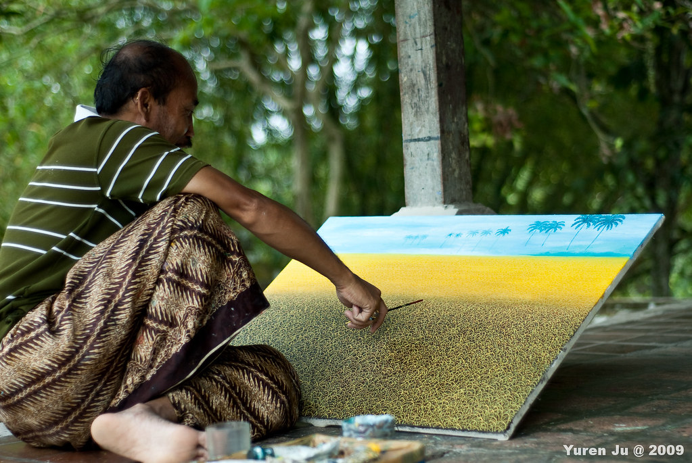](http://www.flickr.com/photos/yurenju/3904436948/ "Flickr 上 yurenju 的 繪")  
  
Chialin 大概也太早起來了，感覺有燒掉幾根筋。  
  
[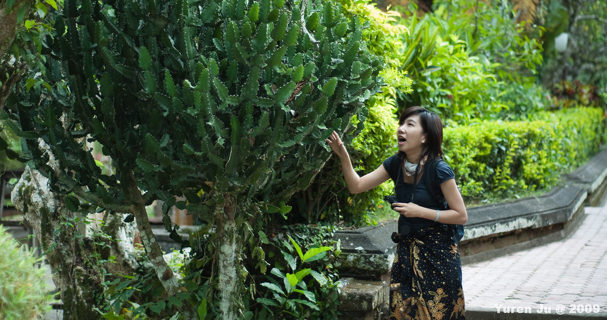](http://www.flickr.com/photos/yurenju/3903654429/ "Flickr 上 yurenju 的 仙人掌")  
  
還模仿了日本當紅搞笑藝人Edo Harumi，Good~  
  
[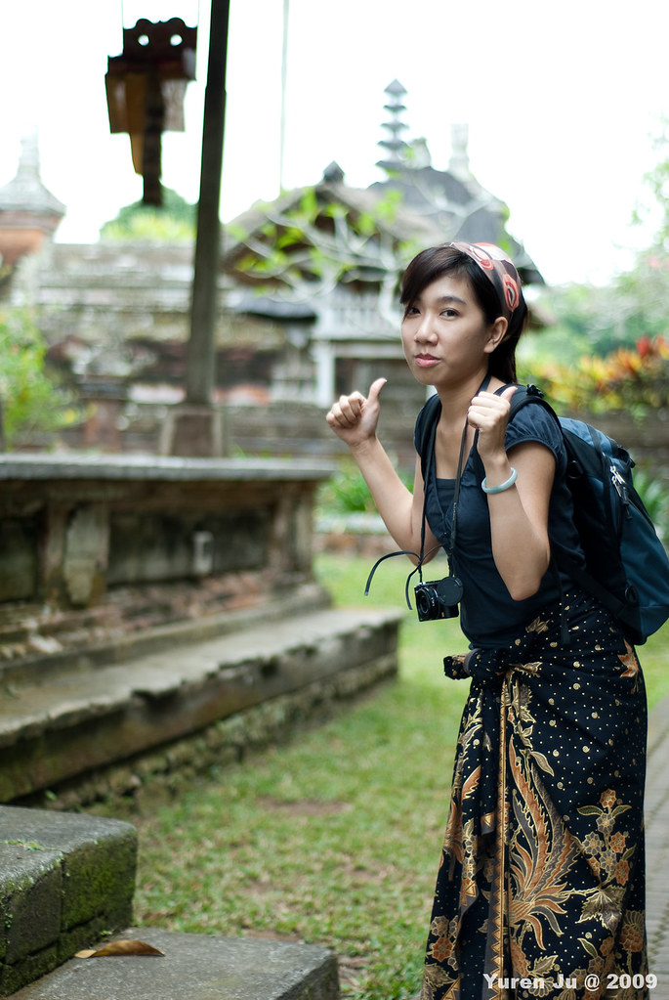](http://www.flickr.com/photos/yurenju/3904439074/ "Flickr 上 yurenju 的 YRJ_5045")  
  
離開塔曼．阿尤寺後，我們就直接前往了海神廟 (Pura Tana Lot)。海神廟是非常熱門的觀光景點。剛進去大門的時候還覺得這只是個建在海邊旁邊的廟。直到漫步至海邊時，才對海神廟感到震撼，原來它是一個只有退潮的時候才可以到的寺廟，很幸運的是我們到的時候是退潮，剛好可以走過連接陸地與海神廟的岩石平台。  
  
[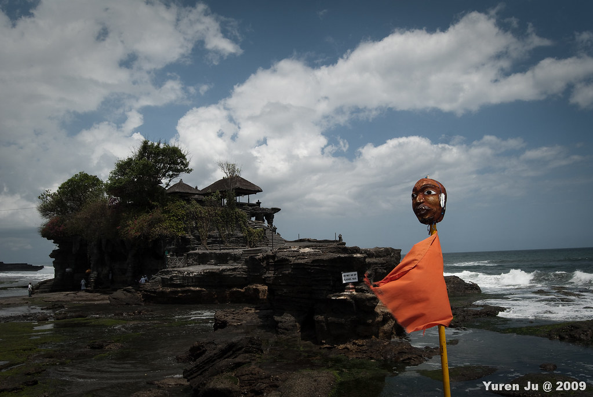](http://www.flickr.com/photos/yurenju/3904485948/ "Flickr 上 yurenju 的 YRJ_5086")  
  
但是跟許多廟宇一樣，這邊遊客都無法進入。而入口有些信眾顧著門口。  
  
[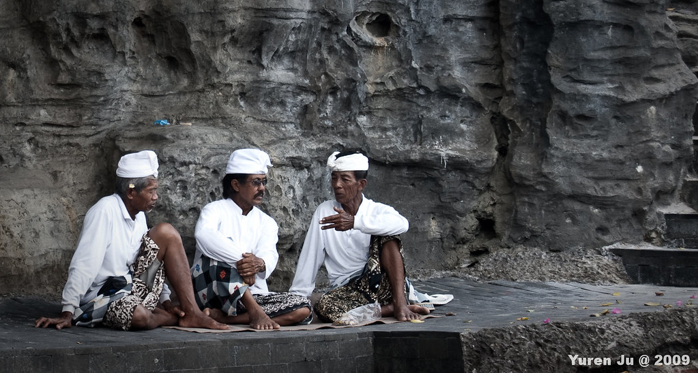](http://www.flickr.com/photos/yurenju/3903703451/ "Flickr 上 yurenju 的 YRJ_5073")  
  
到了海神廟下面天然的洞穴，原來下面有聖泉可以洗臉，而信眾則會幫你黏米跟別一朵花在髮鬢。記住 -- 峇里島上，任何跟你招手的都需要付費。  
  
[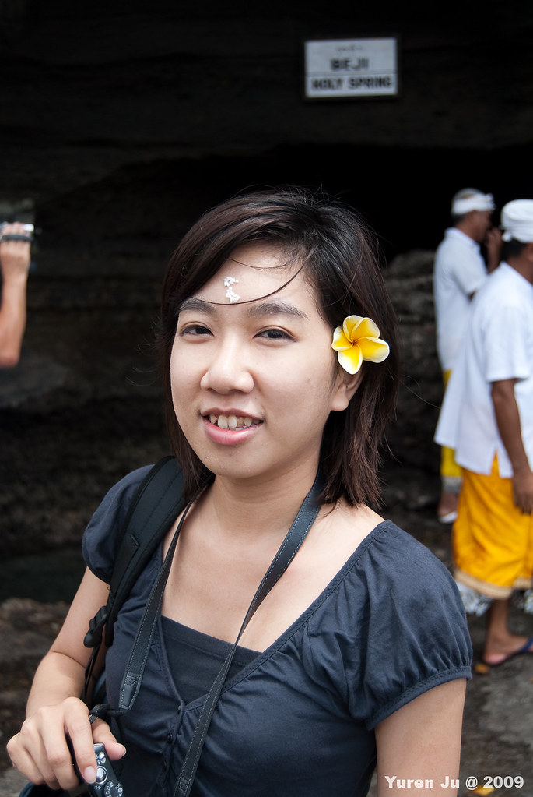](http://www.flickr.com/photos/yurenju/3903702949/ "Flickr 上 yurenju 的 YRJ_5072")  
  
我們退到遠一點懸崖上才看到海神廟的全貌。  
  
[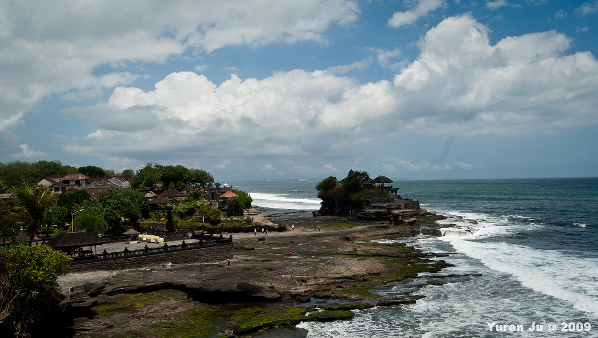](http://www.flickr.com/photos/yurenju/3903702477/ "Flickr 上 yurenju 的 YRJ_5093")  
  
而懸崖盡頭竟然又有一面『Not Entry』的警示牌，我想這條路要不是奉勸不要輕生，否則就是退到乾潮後通往海龍宮的路吧。  
  
[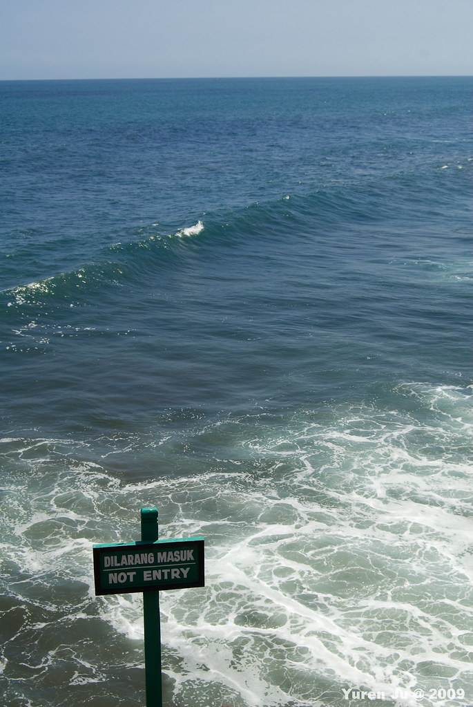](http://www.flickr.com/photos/yurenju/3903703965/ "Flickr 上 yurenju 的 YRJ_5105")  
  
海神廟後，我們到預約的 Spa -- The Ulin spa，展開我們的 Spa 之旅～ 接下來我們又去了 Geneva 購物，最後才回到 Villa。  
  
至於 Villa 就留到下次介紹吧，一點多了，明天還要上班的勒。  
  
\[update\]  
加入第三天地圖  
  
  
在較大的地圖上查看[2009 峇里島 day 3](http://maps.google.com.tw/maps/ms?ie=UTF8&hl=zh-TW&brcurrent=3,0x3442ae741e185a49:0x8c8db93eb1d0d2b6,1&msa=0&msid=102940795217138094975.0004732d8725125ca1906&ll=-8.599353,115.19371&spn=0.305516,0.549316&z=11&source=embed)