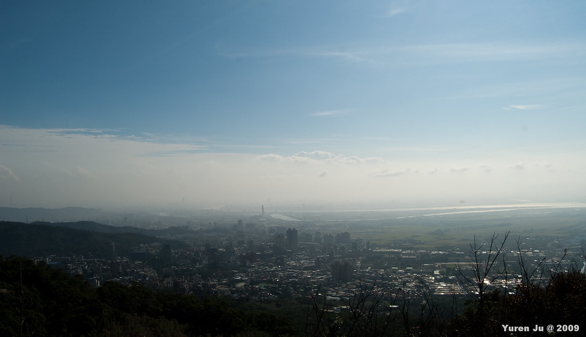
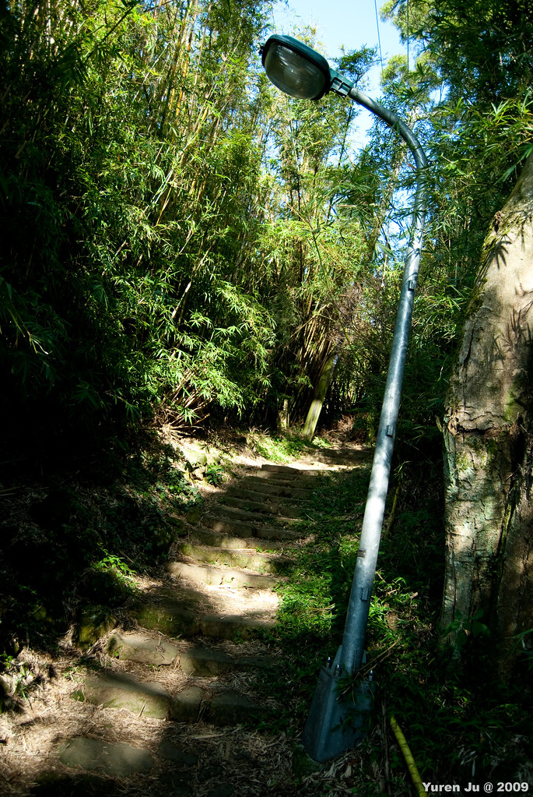
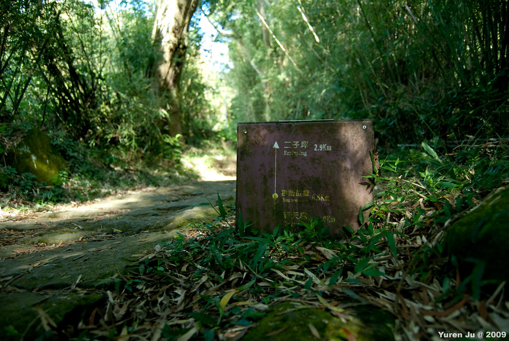
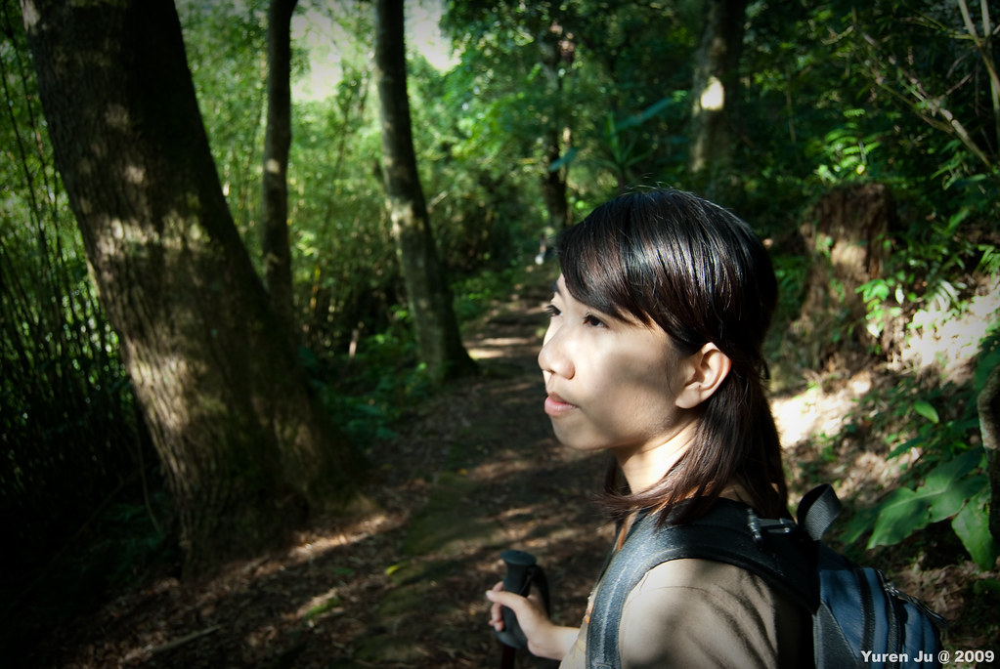
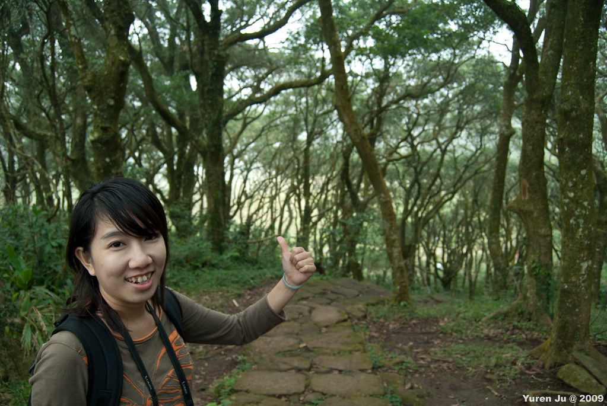
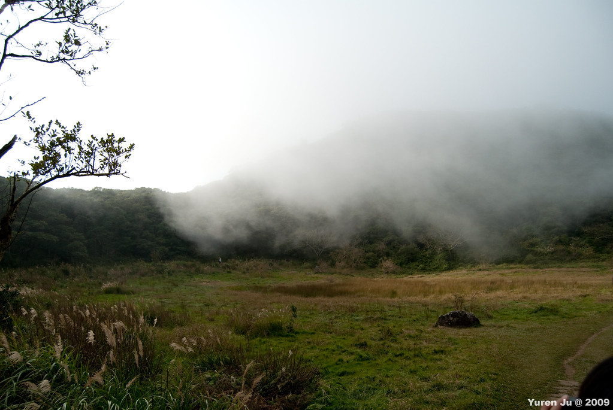
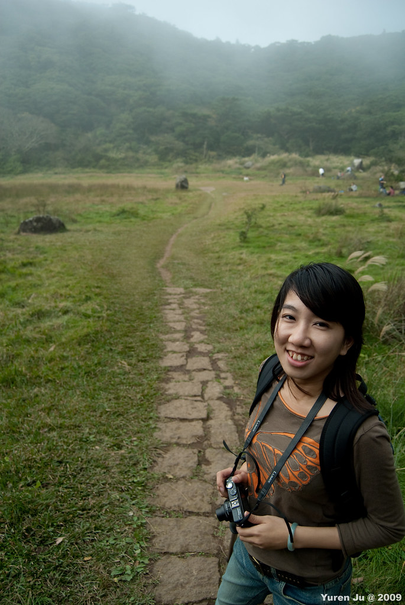
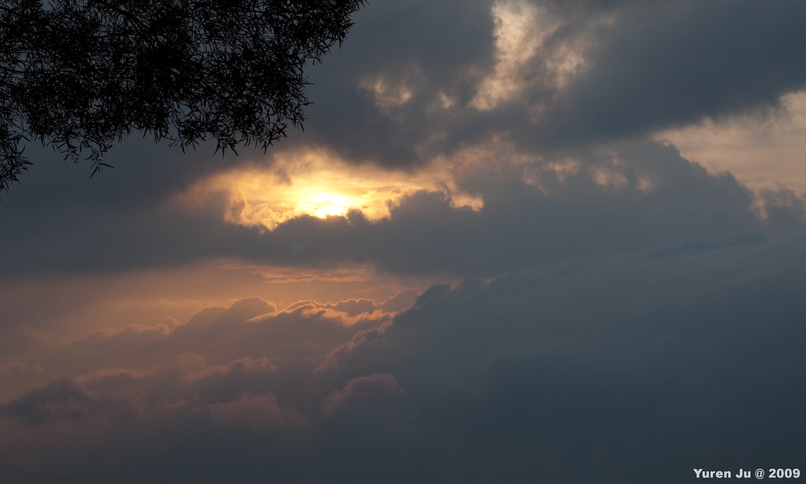

昨天下了大雨，原本預定要去健行的計畫被打亂了。所以就跟 Chialin 去登了『新光山岳』，買了超多戰利品回來…。今天一覺醒來突然發現天氣好得要命，所以過了中午後，就決定還是去向天池健行。  
  
很懷念的在北投吃完午餐後（搬離北投後就沒在那附近吃飯了），我們就騎上山囉。沿著大同路、復興四路、三路往上時，就慢慢離唉了台北市地平線。快到登山口時，台北市已經在我們腳下了。  
  
  
  
  
  
這次健行的入口在清天宮，也就是 [公車小6](http://www.taipeibus.taipei.gov.tw/emap/program/html/bus_cnt.asp?s=%A4p6) 的終點站。  
  
  
在較大的地圖上查看[向天池](http://maps.google.com.tw/maps/ms?ie=UTF8&hl=zh-TW&brcurrent=3,0x3442ae17715a4b9f:0xbaeaecff55cfad73,0,0x3442ac6c9e3bc587:0xfbdf07e4b530c0a4&msa=0&msid=102940795217138094975.00047a258c0f0eae6fcf6&ll=25.167271,121.500807&spn=0.015537,0.034289&z=15&source=embed)  
(地圖, 在 facebook 上沒辦法顯示)  
  
而往向天池的健行步道基本上是很熱門的步道，整個健行步道都是石頭砌成的路。更誇張的是入口處附近的步道還有路燈勒。  
  
  
  
而根據路牌，清天宮距離向天池大約兩公里，我們走沒多久就快到一半了。  
  
  
  
不過雖然是熱門路線，不過整條步道除了最後是緩坡以外，其他都是上坡，所以還是有點累，不過跟[松蘿湖](http://yurenju.blogspot.com/search/label/%E6%9D%BE%E8%98%BF%E6%B9%96)、[合歡山](http://yurenju.blogspot.com/2009/09/blog-post.html)那些行程比起來，還是輕鬆太多了。你看 chialin 都走到開始發呆了。  
  
  
  
最後一段其實都是緩坡。當我們走到覺得有點煩之後，沒想到前面竟然起霧了。走到轉折處，前面突然豁然開朗，向天池到了。  
  
  
  
到向天池後，去加羅湖、松蘿湖的記憶突然都湧現出來。看到雲霧飄在湖上的情景，就像是我們去的那兩個山中湖泊一樣。  
  
  
  
不過現在向天池並沒有池水。只是昨天下了雨，所以積了點水氣在向天池凹陷的谷中。  
  
  
  
不過這個景象比我們想像的還要漂亮多了，其實還蠻開心的。我們在向天池待了一小段時間，吃個登山必備的健達巧克力，閒聊一下後我們就下山了。畢竟中午才上山時間還是比較晚一點。  
  
路上回來時正巧碰到夕陽西下。下午天氣就沒早上那麼好了，下山後就有點冷。  
  
  
  
後來就回到天母吃個五花馬（排了超久的隊阿），我們就滿足的回家囉。星期六去新光山岳買到手軟，星期日在向天池爬到腳軟，感覺還蠻充實的阿！ :D