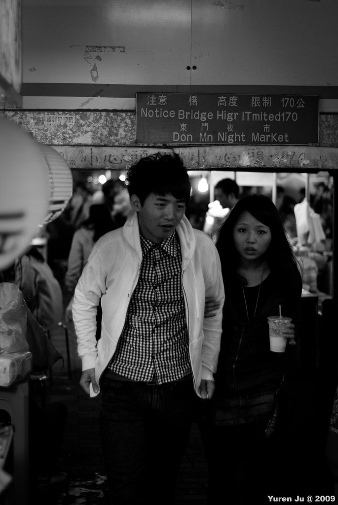
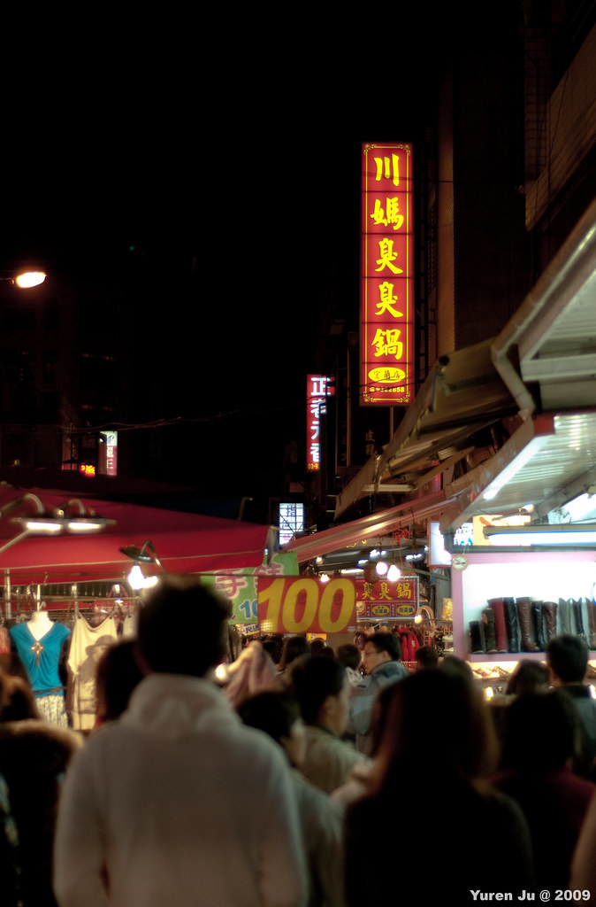
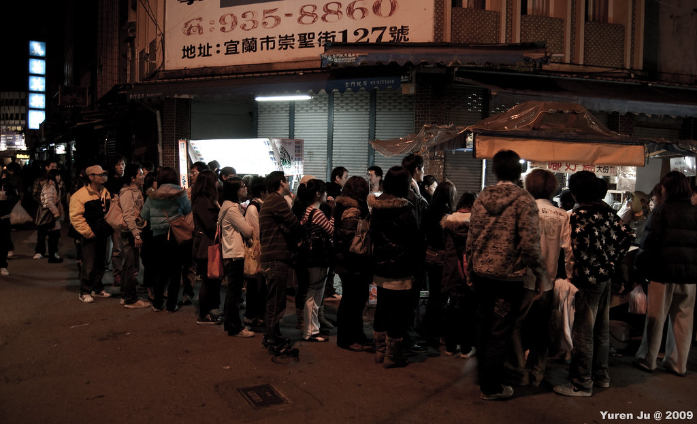
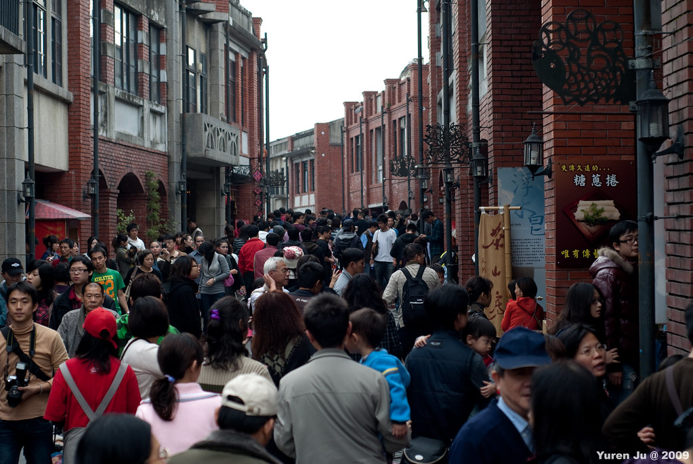
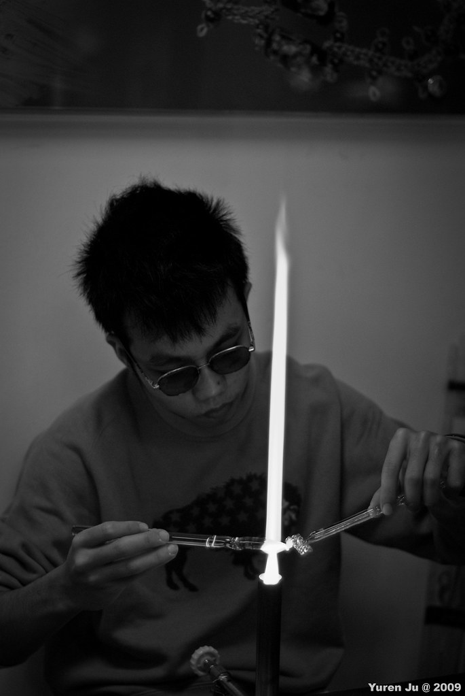
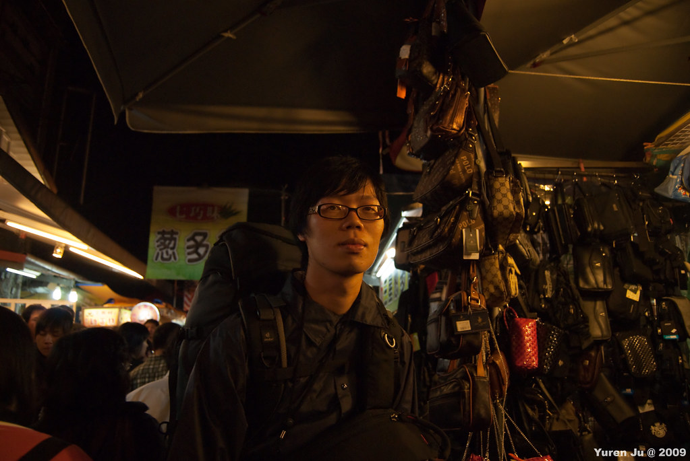
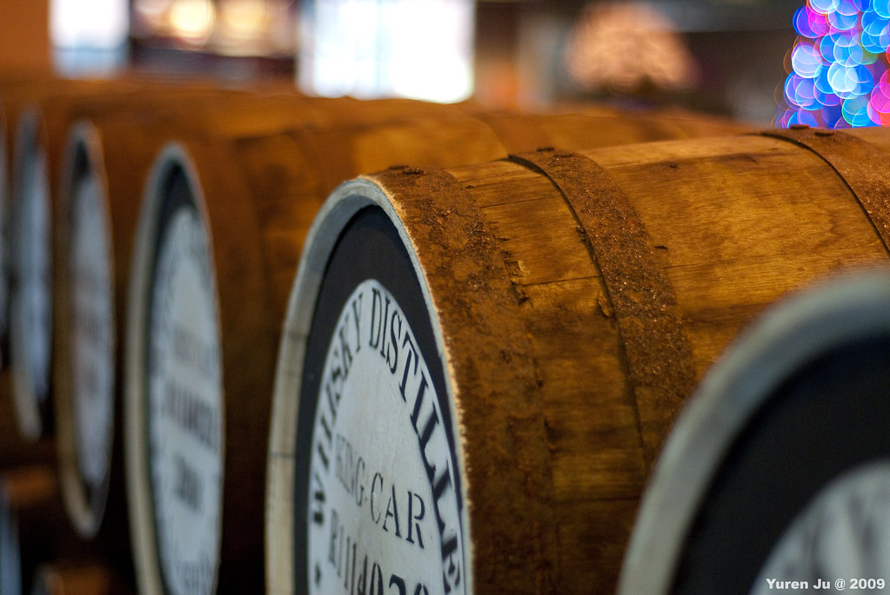

2010 年的第一個假期，我跟 Chialin 兩個人騎車到宜蘭去玩。自從上次松蘿湖登山跟 Znikang 一起騎過北宜公路後，就覺得這是條騎起來很舒服的公路。雪山隧道開通後，要去宜蘭的開車族大多都會選擇從雪隧開到宜蘭，而北宜公路原本汽車很多很危險的路段，就變成了風景優美的山林公路。  
  
  
我們從明德站出發，在坪林稍微休息後再騎往宜蘭礁溪。  
  
跟去年來相同的感觸，北宜公路後段寬闊的蘭陽平原美景還是讓人讚嘆阿。不過天氣不太妙，所以也沒拍下美麗的蘭陽平原照片。  
  
到礁溪的湯圍溝公園泡腳後，我們才拼命的用手機找附近有啥比較好的溫泉。不過溫泉大家都想泡阿…幾乎所有的湯屋都客滿了。找得半死後突然在路邊看到一間『和風溫泉會館』，進去問才知道只要等一下下就可以泡湯屋了。所以我們兩個就一邊掠食宜蘭小吃邊排隊。（附帶一提，湯圍溝公園後面有間蔥油餅真的有夠好吃的）  
  
礁溪的溫泉全部都是無色無味的。剛開始泡的時候真的覺得只是在泡熱水澡。過了一下子之後猛冒汗又頭暈，泡完後膝蓋又有種神奇的 feeling…才曉得飯店不是放放熱水澡騙錢 XD  
  
泡完溫泉我們就先到宜蘭市的可青大飯店 check in（這間不太推薦…）。原本想說回旅館休息一陣子後要殺到羅東夜市吃晚餐的，不過泡完溫泉後頭有點暈，想到還這麼遠的路程頭更暈了。所以後來我們就直接在宜蘭市的東門夜市吃晚餐。  
  
我發現這邊歧視高個子…。  
  
  
  
老闆你的招牌歪了！  
  
  
  
排隊真是常態阿。不過東門夜市還好，隔天去羅東夜市才誇張。  
  
  
  
第二天一早我們先到火車站寄放行李，只要十七元唷，很多火車站都有提供這個服務。接下來我們就前往冬山河親水公園，租了腳踏車在冬山河腳踏車道亂晃。騎腳踏車微風從耳邊掠過的感覺真的很棒阿。好久沒騎腳踏車了，感覺真好。而且我發現喬巴不會用變速器 XD  
  
  
  
而且還會跟鴨子對話…  
  
  
  
後來我們到傳統藝術中心晃了一下，真是人山人海阿。  
  
  
  
不過裡面還算不錯啦。簡單的說就是傳統建築 + 傳統藝術 + 名產的地方。  
  
  
  
傳統藝術中心結束後我們去火車站領了行李。秉持著到此一遊的方針，我們還是到羅東夜市裡面吃飯。可怕的是除了羅東夜市超多人外，而且我還要背著我跟 Chialin 的行李在夜市裡面人擠人。  
  
  
  
羅東夜市排隊的人潮實在太誇張了。任何你想吃的東西，排隊十公尺都只是基本開銷阿。到此一游的在羅東夜市吃完晚餐後，我們到了就在金車威士忌酒廠正對面的香巴拉民宿 check in。這間民宿還蠻不錯的，全新裝潢又乾淨。除了地點有點小偏僻以外，這間是蠻不錯的選擇。  
  
第三天我們逛了對面的金車威士忌酒廠。  
  
  
  
因為是最後一天的關係，我們沒有跑其他的行程。這次的宜蘭行我們幾乎是邊走邊 cancel 行程，不過也因為這樣，讓我們度過了一個輕輕鬆鬆的宜蘭假期囉。