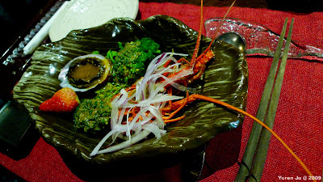
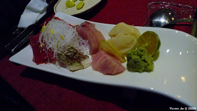
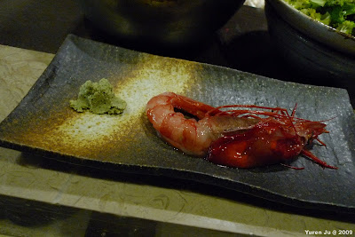
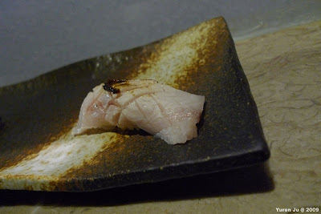
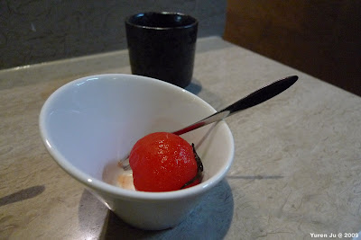

這個週末原本以為天氣應該不怎麼樣，不過沒想到老天給了我個巴掌，竟然是晴天阿。害我沒有排活動出去。不過沒排活動還是可以就近解決啦。禮拜六我跟 Chialin 一起去了間在天母的日本料理店：味留．壽司．割烹。這間日本料理店在網路上的資料少之又少，ptt 的食物版竟然只有三篇相關文章，愛評網也只有一篇介紹文章。不過衝著每篇文章都是正評，我還是冒著危險訂了這間餐廳。  
  
（相片不怎麼樣…）  
  
味留．壽司．割烹座落在士東路的最底端，所以從我家騎過去沒多久就到了。進去之後就一整個是高級餐廳的 feeling 阿。然後因為網路文章太舊，所以價位上跟我看到的也有出入。不過既然出來了勒，就給它吃下去吧，管他的～。  
  
首先第一道餐點是小龍蝦+鮑魚 (熟食)。上面淋的醬汁是清爽的和風醬（我想應該有加點芝麻）。小龍蝦剖成兩半後，用筷子可以輕易的把整條龍蝦肉給分離開。這吃起來真是超讚的阿。最後來顆草莓更是畫龍點睛阿，酸甜的味道真是把這道菜結尾的超清爽。  
  
  
  
接著就來了皇帝豆，這沒什麼特別的，單純中場休息出來跳舞的人偶娃娃。  
  
接下來是生魚片拼盤。把它拍差了真是不好意思，不過實際上是非常好吃的。我是從左邊的鮪魚赤身開始吃，到右邊的鮪魚腹肉結尾，真的太好吃了。尤其是上面有稍微烤過的生魚片微焦的口感更棒。干貝也是一絕，味道非常的鮮甜，是我吃過最好吃的干貝了。鮪魚腹肉實在處理的太棒了。除了滿佈油花的生魚片外，斜放在生魚片上的檸檬更是提供原本脂肪濃厚的鮪魚腹肉清爽的味道。在東港吃過這麼多腹肉，這才第一次吃到這樣處理的方法，果然是太鄉巴佬了 :P  
  
  
  
接下來上的是貝類的湯。感覺主要的目的是前面的生食過後去膩暖身的。不過個人覺得普通。  
  
不過因為客人很多，所以服務生商量請我們換位置到吧台去，前前後後說了超多次抱歉的 :P。剛坐到吧台，師父又跟我們道了一次歉，說等等會補償我們。接下來上的是魚白。師父說這是浸泡過豆漿，在稍微經過烘烤的魚白。剛吃得時候覺得味道超濃郁的，沾了芝麻鹽後感覺味道比較均衡點。  
  
接下來師父就一直超忙的，不過我們也沒趕時間就邊聊邊等。後來師父說他終於忙完了。後來就挑了兩條頗大的胭脂蝦弄成生魚片給我們。我從來沒吃過蝦子的生魚片，所以這真是個挑戰阿…。師父為蝦子去殼的時候，蝦䯝外面的薄膜沒有破壞掉。所以嘴巴貼在蝦頭上，稍微一吸蝦䯝就噴出來了，一整個爆漿阿…。蝦䯝跟蝦肉都很美味，不過因為是第一次吃胭脂蝦生魚片，所以這麼生的食物最後我還是沾了點醬油來去去生味。  
  
  
  
接下來又陸續出了魚下巴、鮑魚、單一魚種的生魚片跟味噌湯。不過最讓我震驚的還是下一道，劍鯊握壽司（不知道有沒有拼錯）。這真是讓我感到驚訝的握壽司，我不知道該怎麼形容他的口感。不過這是我吃過最好吃的握壽司了。  
  
  
  
接著是鮪魚赤身的握壽司，也是相當好吃。最後有個很妙的菜就是玉米切片。在這個時候上感覺有點唐突，不過放在握壽司的最後，玉米的甜味倒是也平衡了前面生魚片握壽司的味道。倒數第二道是紅豆湯，蠻好喝的～不過也是啦啦隊等級。  
  
最後一道！是非常神奇的『玫瑰蕃茄甜點』。猜測作法應該是把蕃茄去皮之後丟到有玫瑰的醬汁中醃製。外面那層是玫瑰香甜味道，咬開之後裡面的蕃茄酸甜跟玫瑰的味道混在一起…實在是太妙了 XD  
  
  
  
這甜點真是超好吃的。  
  
以上是兩個沒有吃過日本料理店，第一次去吃的鄉巴佬心得 XD  
  
這次去吃才知道廚師真的是整個日本料理店的重心阿。師父要接電話（定位的時候要確定時間跟食材可不可以配合）、跟吧台客人聊天（而且還很風趣）、要弄所有的餐點，而且還要跟客人 social （我正巧看到客人幫胖師父斟了杯酒，胖師父竟然就一口乾了！）看酒色感覺起來不是酒精含量很低的酒阿。  
  
不過這邊的食材真的是超新鮮的。處理餐點的地方也有很多小細節讓人覺得很細心。不過日本料理價位還是太高了。我想最多只能半年吃一次吧。  
  
所有食物的照片我放在 [Picasa 裡面](http://picasaweb.google.com/yurenju/201002)，有興趣的再去看吧 :)