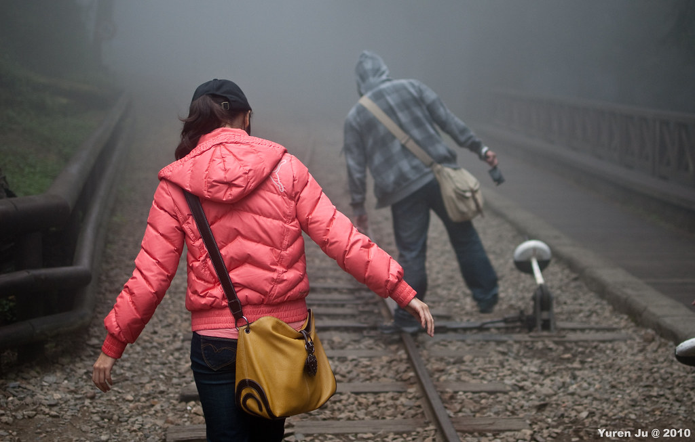
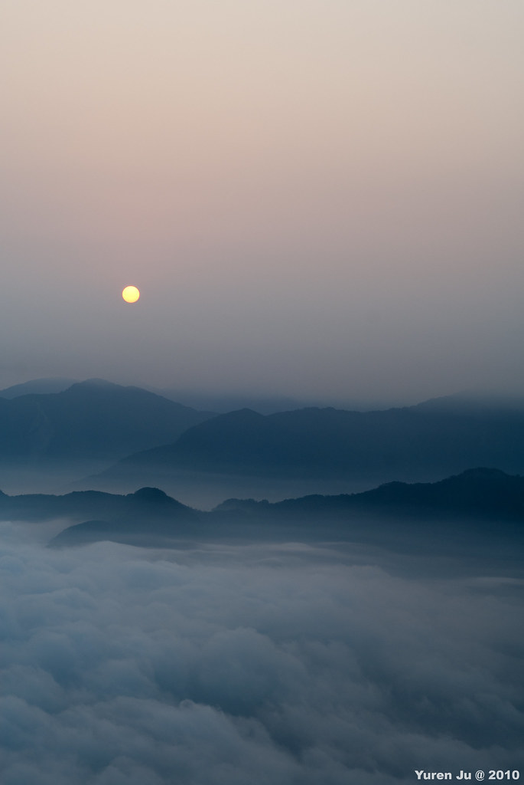
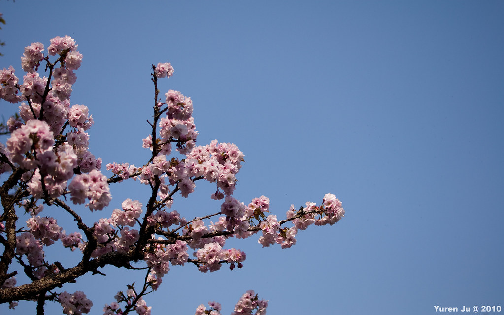
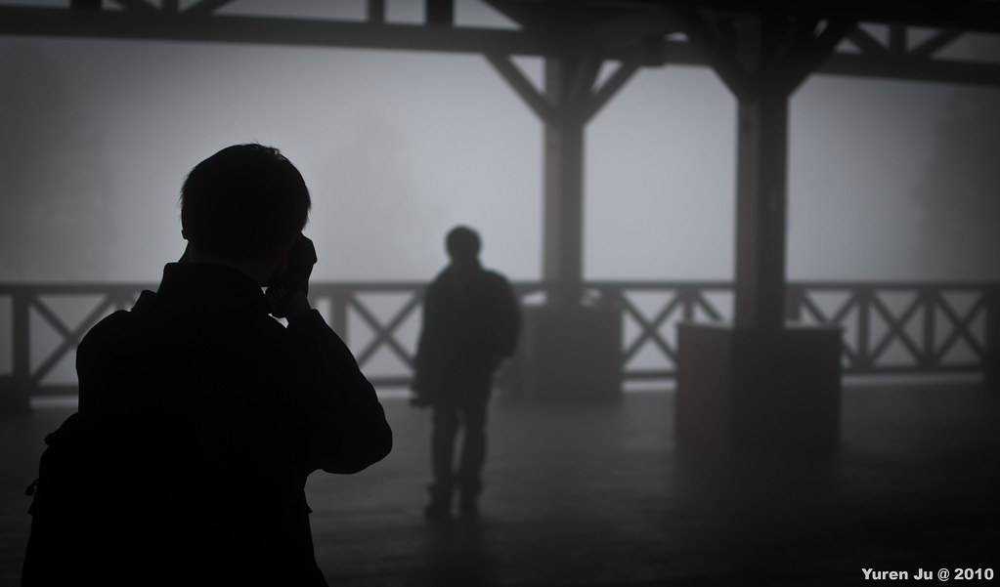

二月份去司馬庫斯的時候，Kyozi 就在提要去阿里山賞花的事情。過了一個月後這件事情就實現了。這次比較可惜的是小羊很不巧的在出發前捅了自己一刀，所以就沒辦法跟我們一起去。  
  
不過更不幸的是，我在要去阿里山的前兩天感冒了。  
  
就跟活動頁面上寫的一樣，這次的重點是賞花跟大塔山日出。所以第1天我們就大致上逛了整個阿里山森林園區，也去了沼平車站看看花況。不過感覺來的有點晚，綠葉都有些冒出來了。而且這次走完整個阿里山超快的耶，一下子就繞了一整圈了。  
  
  
灰哥跟萬老師很有默契的走鐵軌 (在這個 moment, 灰哥已經吃過了兩隻香腸了)  
  
  
  
晚上玩完萬老師帶來的碰糖秀後，我們早早就睡了。第2天兩點多我們就起來準備衝大塔山日出。我們 2:15 的時候女生房來應門的表情真是超呆滯的，應該是一整個沒睡飽，又發現我們十五分鐘就全部整理好他們還正在整理吧 XD  
  
我們在小七吃飯整備後就直上大塔山了。剛開始的時候我們在伸手不見五指的阿里山森林園區裏面移動 (大家都帶了頭燈或手電筒)，中間沿著鐵軌準備銜接上大塔山登山步道入口。剛開始走鐵軌的時候心裡還 OS 說，『哇太酷了，沒想到去大塔山走鐵軌還蠻輕鬆的阿』等我聽到 Znikang 跟 Kyozi 說剛到入口時我心裡才些微的覺得不對勁，而看到大塔山登山後後面一望無際的階梯海的時候，還真是超無言的…。  
  
當時的情況就是用手電筒照上去，就看到照到的亮光處綿延著一條階梯，然後在最遠處消失不見~ 這是什麼鬼！！  
  
不過往上爬的過程雖然蠻累的，不過還是蠻有樂趣的啦。中間我們關掉所有手電筒，阿里山的夜空佈滿了星星。更恨的是大家都有看到超大顆的流星，我竟然錯過了 Q\_Q  
  
我們到上面的觀日出平台的時候其實時間還有點早。大家就隨處拍拍走走。這次有帶爐頭，就熱了阿華田跟煮了咖啡給大家暖暖身子 (我又忘記萬老師不喝咖啡的事情了，感覺這次感冒一直在耍笨)。  
  
天空漸漸轉換成魚肚白後，我們大概也明白今天是看不到日出了。不過大塔山上的雲海還是非常的漂亮。雲層層的互相交疊，一直綿延到倚靠在山邊的燈火處，感覺真的很棒。太陽慢慢從雲層後方升起後，些微染紅的天空配上山景雲海也是非常漂亮。  
  
  
  
在上面待了段時間後，我們就下山了。這次下山其實還蠻平順的，沒像之前爬山的時候下山這麼累 (等級也不太一樣啦)，不過到平地的時候腳還是有點小抖。  
  
  
  
後來我們繞到阿里山警察局也停下來賞花。  
  
  
最後逛一下阿里山車站，這次的行程差不多就到這裡了。  
  
  
這次感謝 Kyozi 規劃活動，Znikang 跟 Chialin 處理交通的事宜囉。不過這次感冒真的很難過，大多數的時候都沒辦法發出聲音。不過上到大塔山感覺還是很感動囉。這樣稍微勾起高山的那種感動，想說是不是五月找個假日再去找座山爬勒？應該會不錯吧。  
  
另外，這次短短的兩天行灰哥就吃了五隻香腸！羅馬真的不是一天造成的阿…。