上週末 Chialin 二姐結婚，特地跟 Kyozi 借了閃燈跟 17-35mm 去幫忙紀錄婚禮。早上六點十五分起床漱洗後，稍微清點一下昨天已經整理的行李就出發了。而且這次我沒訂錯票，所以很順利的就來到台南了。  
  
這次的婚禮攝影非常兵荒馬亂。我先在 Chialin 家小待一陣子後大家就開始進行最後的補妝。搞定後就下去一樓祭祖了。  
  
[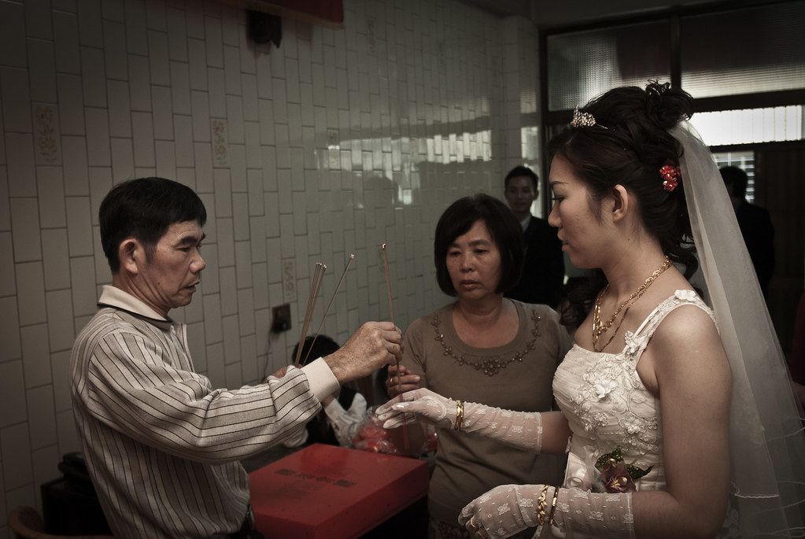](http://www.flickr.com/photos/yurenju/4516462828/ "Flickr 上 yurenju 的 祭祖")  
  
  
父母幫新娘蓋上頭紗。  
  
[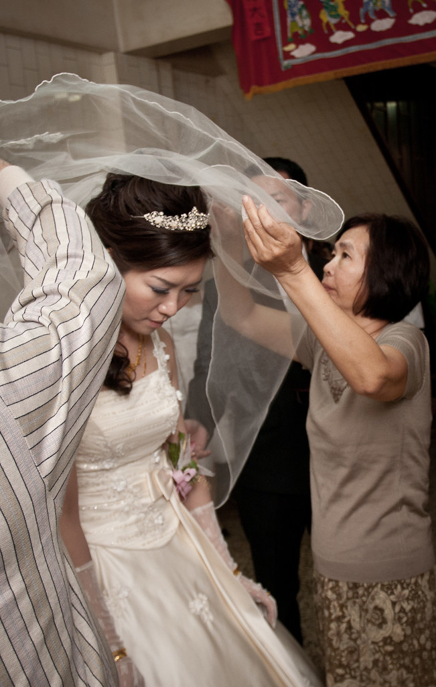](http://www.flickr.com/photos/yurenju/4515830319/ "Flickr 上 yurenju 的 蓋頭")  
  
Chialin 的二姐感覺有點哽咽了。  
  
[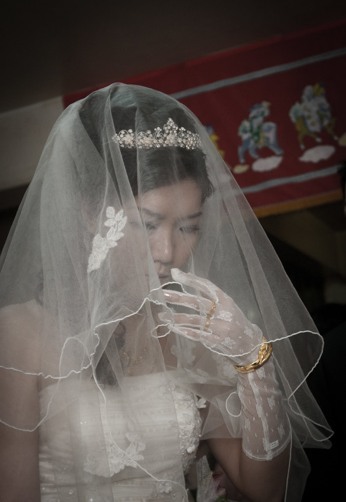](http://www.flickr.com/photos/yurenju/4515830665/ "Flickr 上 yurenju 的 哽咽")  
  
坐上禮車到男方家後，就是拜轎/摸橘子的儀式啦。  
  
[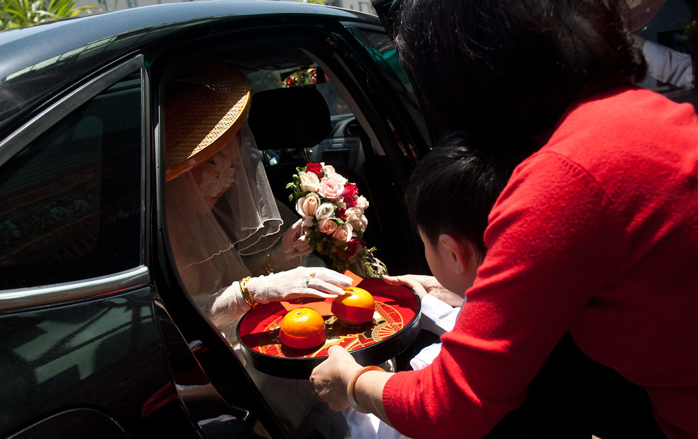](http://www.flickr.com/photos/yurenju/4516466734/ "Flickr 上 yurenju 的 拜轎/摸橘子")  
  
祭祖也是少不了的  
  
[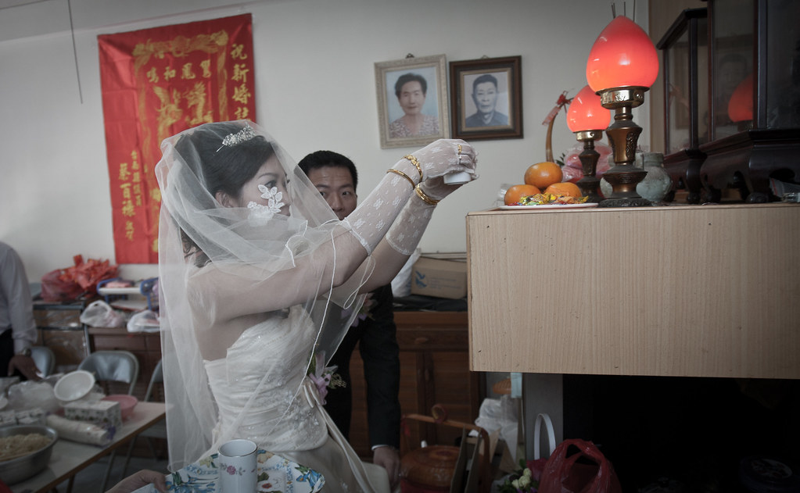](http://www.flickr.com/photos/yurenju/4515834167/ "Flickr 上 yurenju 的 男方祭祖")  
  
沒想到的是這個時候大家開始打 Wii, 連新娘都 high 起來了！  
  
[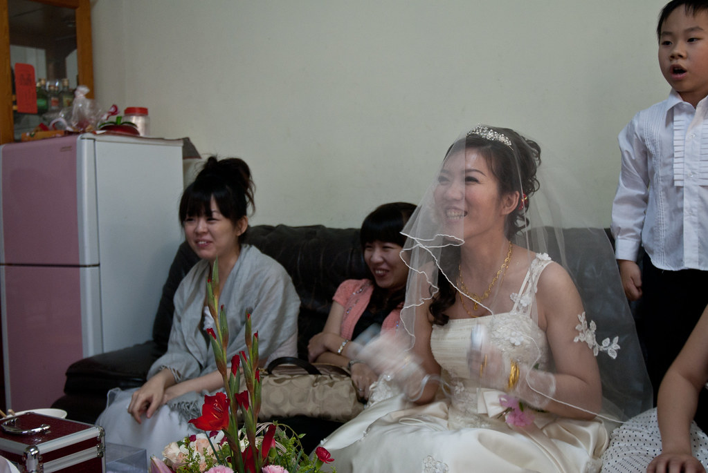](http://www.flickr.com/photos/yurenju/4515835103/ "Flickr 上 yurenju 的 沒看過新娘玩 Wii 吧？")  
  
因為迎娶是早上十一點，不過進房卻是下午五點，所以中間我們就小作休息，還順便去 Chialin 阿姨家參觀豪宅。  
  
回來之後終於可以進房，接下來就是掀頭蓋了！  
  
[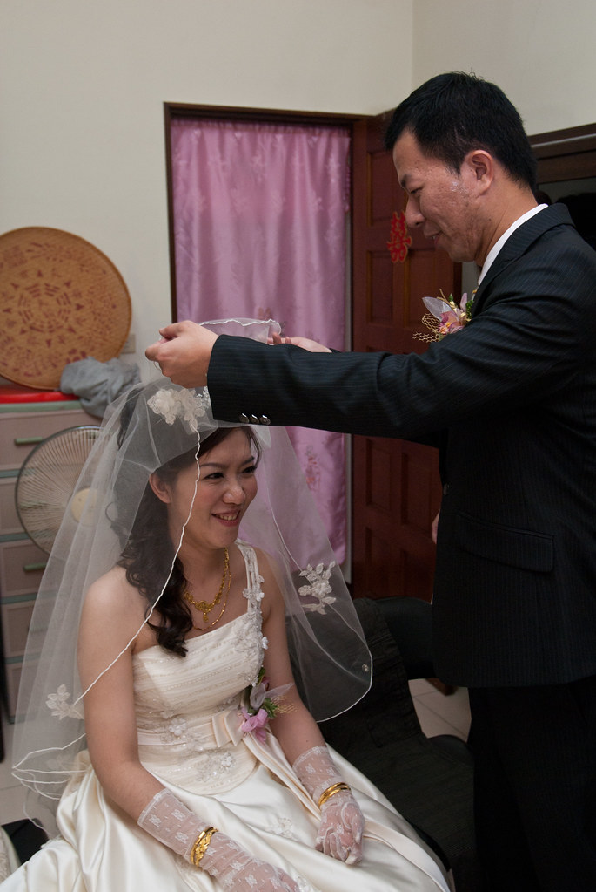](http://www.flickr.com/photos/yurenju/4516470952/ "Flickr 上 yurenju 的 掀頭蓋")  
  
當然婚禮的結尾就是宴客啦。當我跟 Chialin 依然在兵荒馬亂的時候，轉過頭來就剛好看到康姐、兔兔、小杜他們來了。  
  
合照  
  
[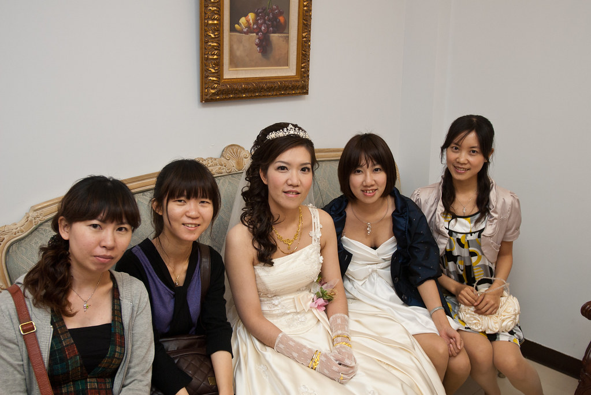](http://www.flickr.com/photos/yurenju/4515856099/ "Flickr 上 yurenju 的 台南幫")  
  
走紅地毯  
  
[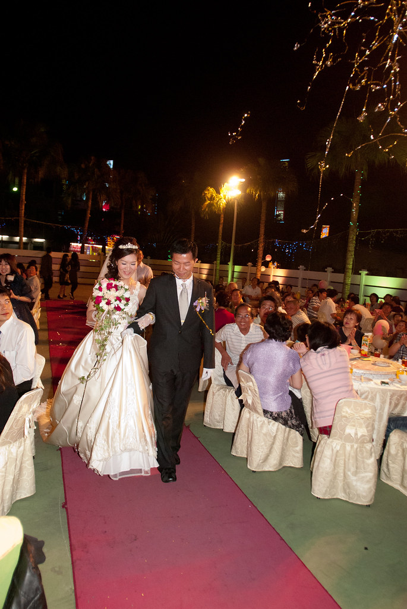](http://www.flickr.com/photos/yurenju/4515838679/ "Flickr 上 yurenju 的 紅地毯")  
  
熱絡  
  
[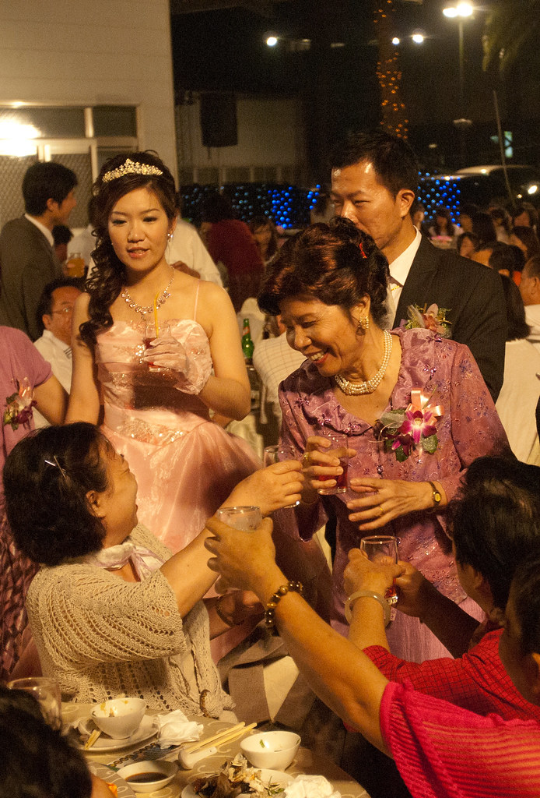](http://www.flickr.com/photos/yurenju/4516474260/ "Flickr 上 yurenju 的 熱絡")  
  
今天新郎/新娘應該敬酒到手都酸了吧  
  
[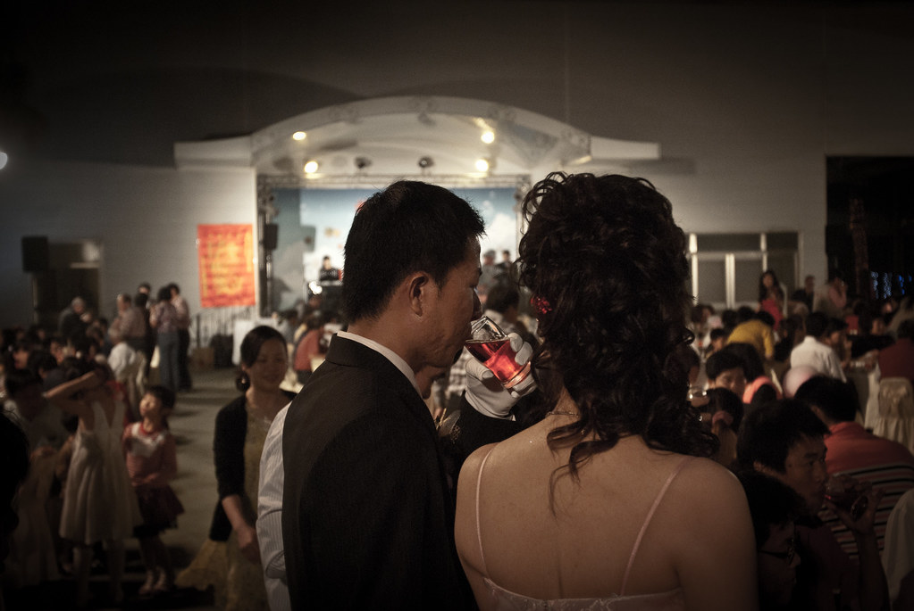](http://www.flickr.com/photos/yurenju/4515840025/ "Flickr 上 yurenju 的 無盡的敬酒")  
  
送客。  
  
[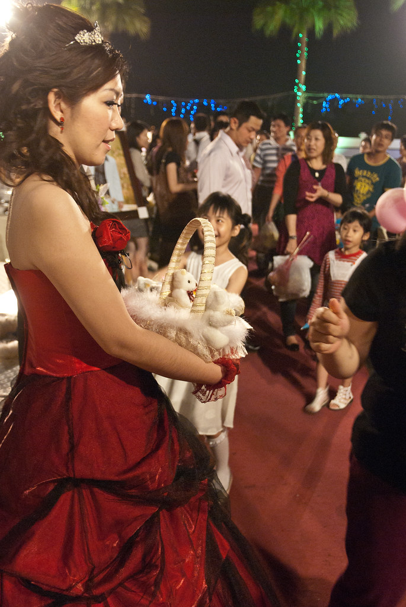](http://www.flickr.com/photos/yurenju/4515841255/ "Flickr 上 yurenju 的 送客")  
  
這次作過婚禮攝影後，才發現婚禮攝影真的是件吃力不討好的事情。不僅難度很高，而且還非常的累。如果可以的話，婚禮攝影時我只想當側拍 XD  
  
[所有照片在這](http://www.flickr.com/photos/yurenju/sets/72157623718001297/)。