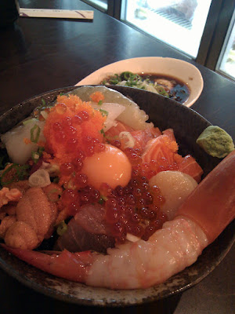

  
原本今天預定要大家一起去吃的金泰海鮮蓋飯就因為下雨天取消了。但是我們倆想出去蹓躂的心是不會被雨天阻止的。  
  
所以我們就決定搭著公車來趟都市之旅。  
  
我們先搭捷運從明德站到民權西路站，再轉紅 32 公車在民權大橋下車，金泰其實就在附近了。下雨天街道冷冷清清的，而這邊又是很偏僻的地方。原本我還開著玩笑說如果 google maps 騙我 (這很常發生) 就當作來這邊散步。不過在輪胎行的街角右轉後，我們看到大排長龍的隊伍，就知道沒走錯地方了。  
  

  
等了大概一小時後 (中間還被 google maps 騙說附近有小七…) 終於輪到我們吃囉。前面先來碗極豐盛的味噌湯後(有魚有花枝有味噌…)，我們如願以償的吃到無敵海鮮蓋飯。  
  

  
引用自[內湖小人物](http://aqei.pixnet.net/blog/post/3522507)，無敵海鮮蓋飯的內容是：  
  
『  

1.  牡丹蝦一尾
2.  海鱸蝦二尾
3.  干貝一粒
4.  生蠔一顆
5.  海膽二葉（也有可能是一葉，主要看總體大小）
6.  花枝一花（兩三片捲起來的那種花XD）
7.  蝦卵很多顆
8.  鮭魚卵很多顆
9.  生魚片數枚
10.  生蛋黃
11.  白飯和哇殺米（廢話）

』  

  
點評部份內容。  
  
  

*   **海膽**，單獨吃下去後背景就『刷~』的一聲回到了去年到的[小琉球海邊](http://yurenju.blogspot.com/2009/06/2009.html)，彷彿我就徜徉在小琉球的大海上 (哇哈哈哈哈~~哈哈~哈哈………)。這海味真是濃，拜見過海膽的味道了。
*   **花枝**，這是整碗裏面我最不能接受的。對我來說還是太生了。
*   **生魚片**、**蝦卵**、**鮭魚卵**就不用講，配飯相當讚。
*   **牡丹蝦**比上次去吃[味留．壽司．割烹](http://yurenju.blogspot.com/2010/01/blog-post_10.html)小隻一點，不過口感比較扎實，配上蝦腦微苦的味道感覺很均衡。

  
領教過無敵海鮮蓋飯了。對我來說還是太生，不過無疑是很新鮮又好吃的海鮮蓋飯。

  
吃完飯後跟 chialin 聊到她之前在松山機場附近的原燒旁邊有看到哈亞咖啡。有喝過天母店的兩人就決定今天吃完海鮮後，要來杯黑咖啡均衡一下。就又坐著紅 29/31/32 (這幾台都會到) 在民權敦化路口下車。  
  
我們在巷弄中繞了一陣子，然後這時候又被 google maps 表了一次，因為標示哈亞咖啡的地方，沒有哈亞咖啡。緊急到咖啡館官網查詢地址，發現地址不對 (可能是搬過家)。還好在附近，所以我們終究是到了哈亞咖啡館。  
  
一個下午我們喝了三杯咖啡：Galapagos (中文太難打放棄)、巴西契瑪莊園 (Brazil Cima)、哥斯大黎加皮菈莊園 (La Pira)。  
  

  
最滿意的是 Galapagos，這支甜味會逐漸蔓延開來又帶點回甘，雖然是水洗豆不過味道並不很單一，是我喜歡的類型。  
  
在哈亞咖啡看著國家地理雜誌、玩 Android 的遊戲跟閒聊打屁，就過了一個下午的時間。也中和了海鮮蓋飯的霸氣十足的調性阿，哈。真是悠閒~  
  
結束後我們又決定逛一下新光三越南西店，所以又坐公車到捷運中山站附近逛街。最後才打到回府順便看了[夏日大作戰 (Summer Wars)](http://www.imdb.com/title/tt1474276/)。就度過了這個下雨的星期六囉。  
  
坐公車去了這麼多地方，真是看似忙碌的悠閒阿。