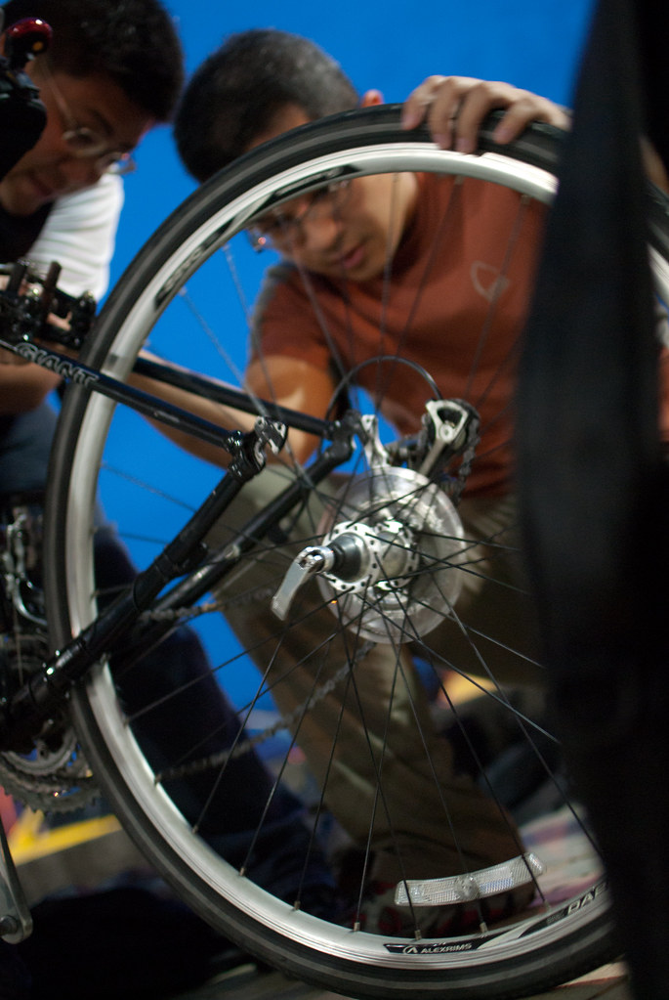
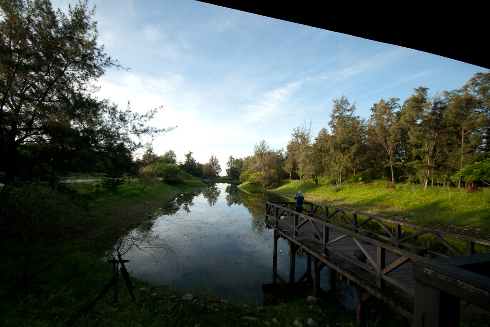
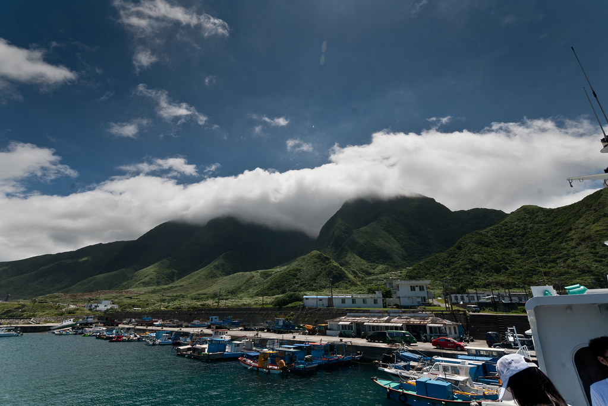

禮拜二早上把行李整理的差不多後，就在明德站跟 Jerry, Kenny 會合，準備到火車站坐車了。這次跟 kyozi 借了小折，不過真的比我想像的重多了，在面積遼闊的火車站上上下下的移動讓我冒了一身汗。後來就直下台東囉。  
  
Jarvis 這次帶了全尺寸的單車，我們就在昏暗的台東火車站外租裝單車。  
  
  
  
  
  
  
  
這是吃飯經過的一間賣傳統零嘴的攤販，上上下下吊滿了像上次在九份賣的零嘴。  
  
  
  
早上的台東森林公園  
  
在公教會館睡了一晚後，早上五點多就吃早餐、準備往富岡港口前進搭船到蘭嶼去（不過我們還是趕路繞到森林公園，很值得）。知道蘭嶼的距離後我就決定要吃暈船藥。果然同行的一個小朋友就吐的亂七八糟…。覺得自己平衡感很敏銳的人最好還是來一顆。  
  
不過到了蘭嶼開元港口往島上的方向一看就忍不住掛上笑容。  
  
蘭嶼，我來囉。  
  
