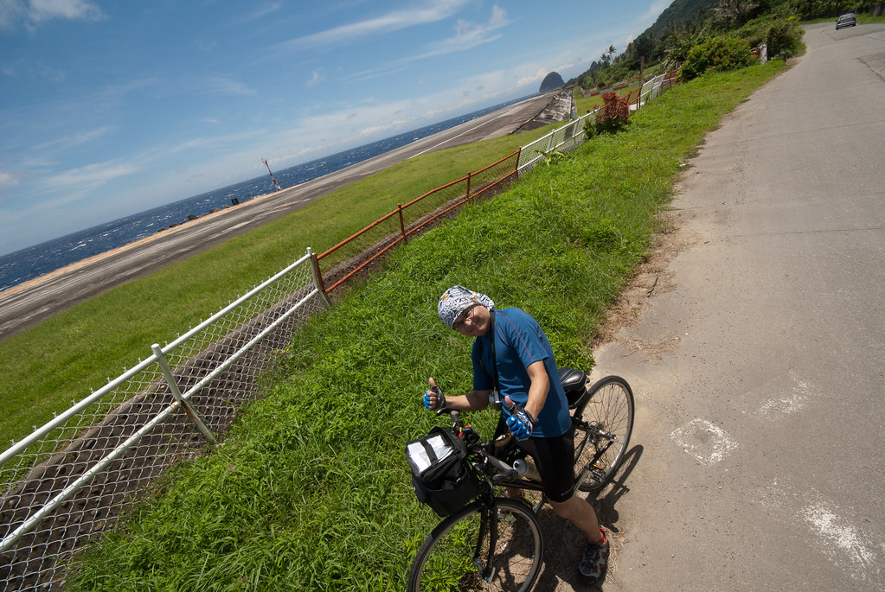
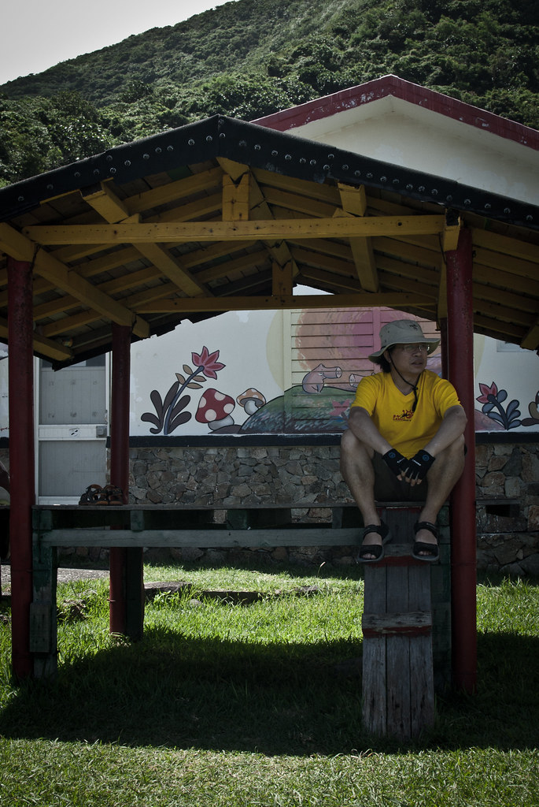
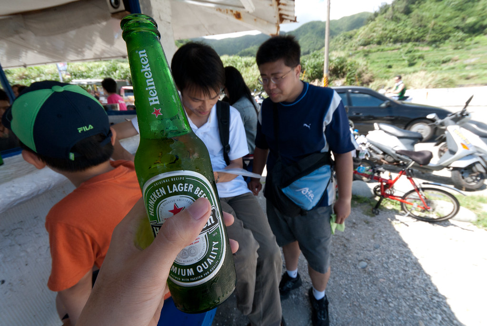
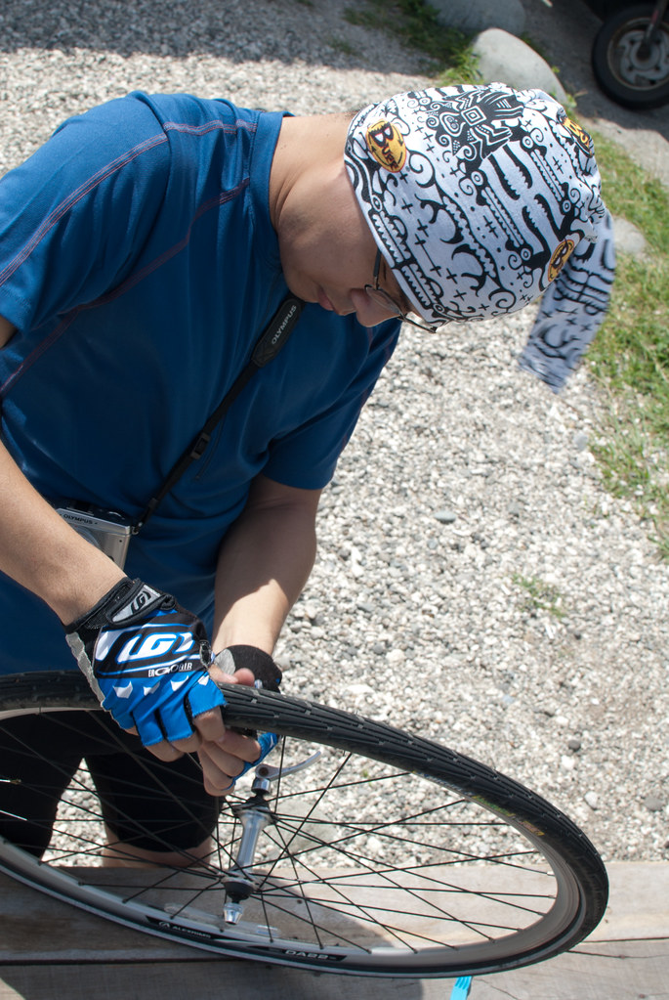
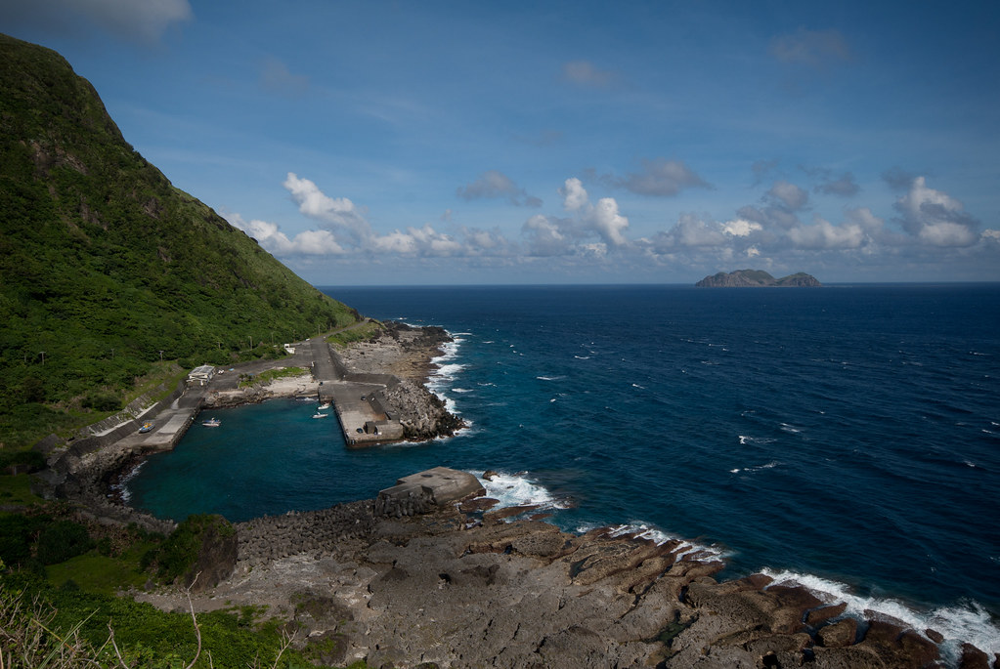
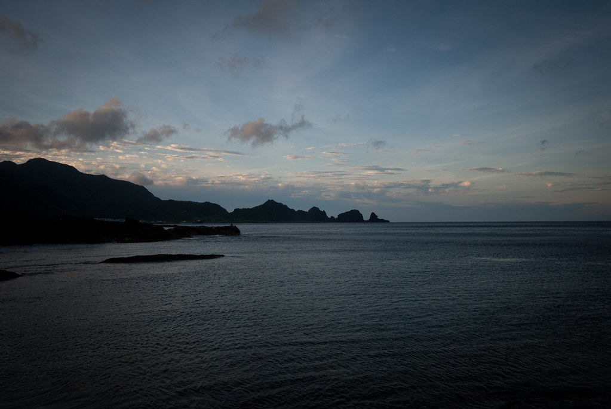
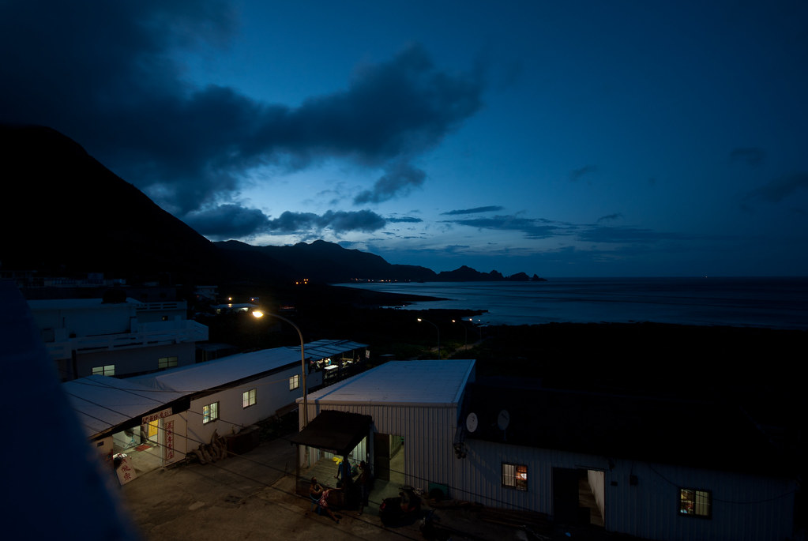
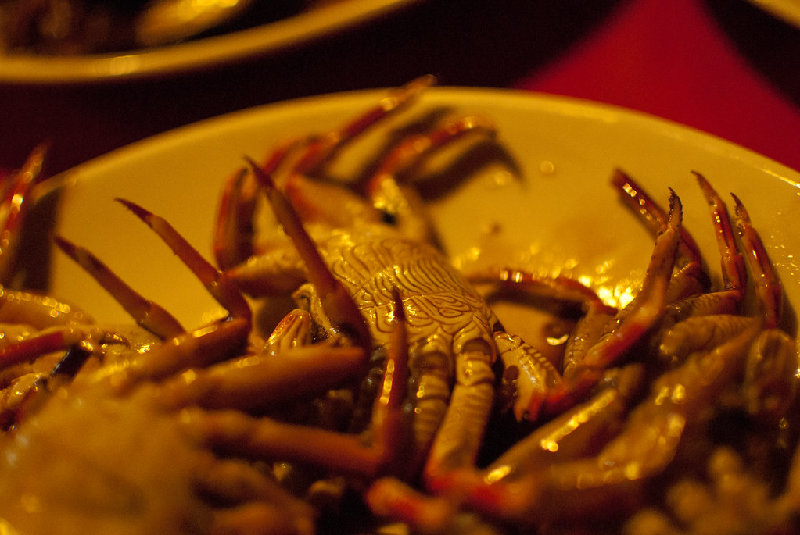

踏到蘭嶼的土地後發現，這邊天氣真是好到爆炸。隨便一個地方都是藍天白雲阿。  
  
  
  
不過這對騎單車/小折的我們也是種考驗。到蘭嶼的時候差不多中午，而這個時候的陽光真是考驗我這個好幾年沒騎單車的人。還好我們這行人走自由風，我們路上就是走走停停的。  
  
  
  
遇到涼亭就睡個覺。  
  
  
  
  
  
遇到酒吧就來杯海尼根。  
  
  
  
遇到破胎就補胎…  
  
  
  
不過話說回來，這邊的海真是藍得不真實阿。  
  
接著我們不停的移動（其實是一直停）  
  
  
  
一直移動…  
  
  
  
然後就天黑了 囧  
  
晚餐則請民宿老闆幫我們準備了風味餐。建議來蘭嶼的朋友至少要有一餐是吃類似的食物。風味餐全部取材於蘭嶼，有飛魚乾、海木耳、秋海棠、螃蟹等等。雖然不是特好吃，不過料理方式跟食材都跟台灣不太一樣。  
  
  
  
然後一天就過去啦。蘭嶼享受的就是悠閒，我們也慢慢的騎車來度過悠閒地時光。