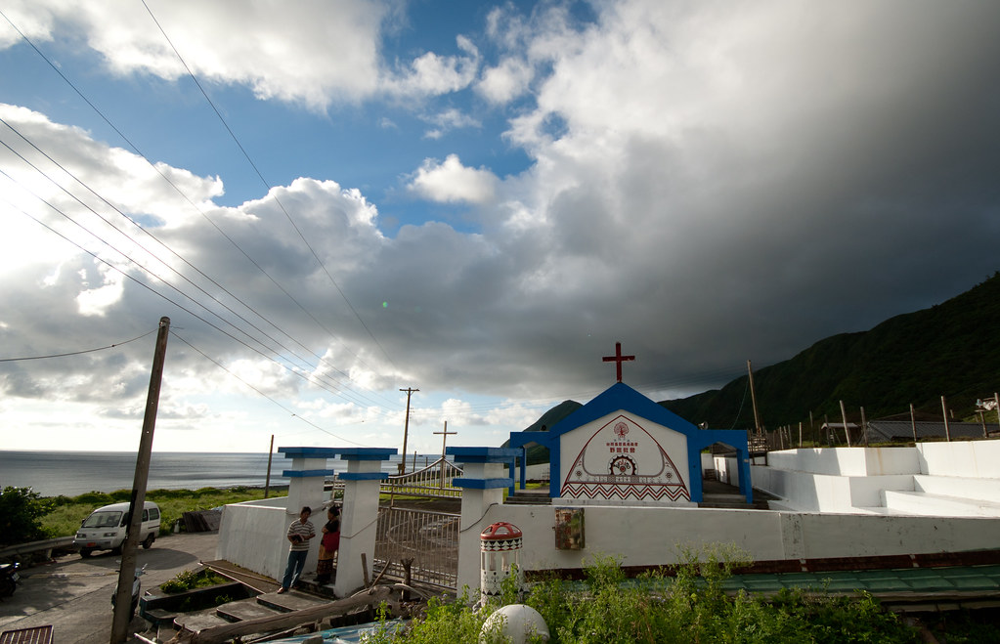
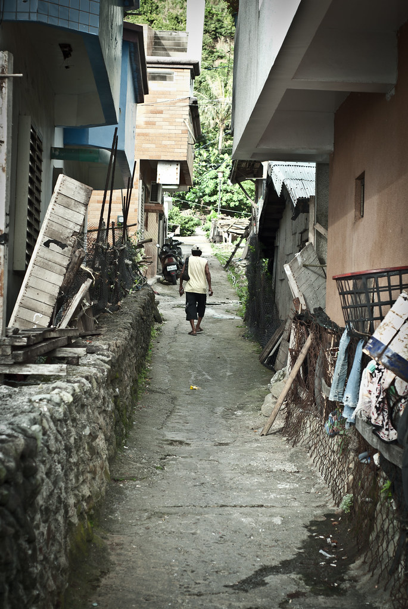
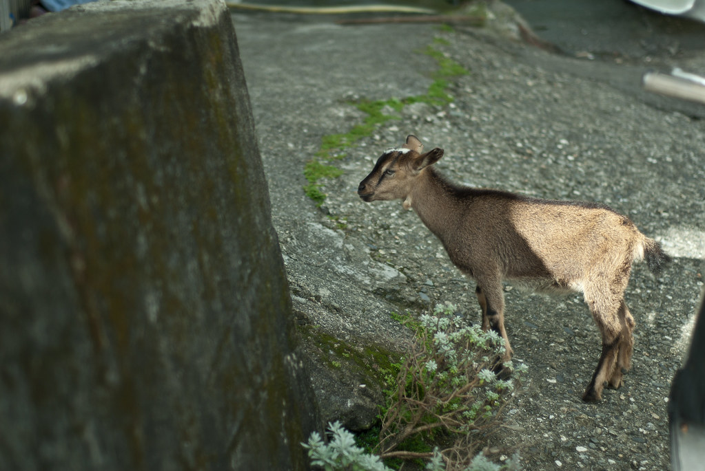
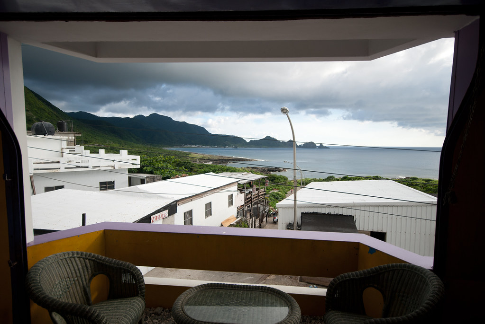
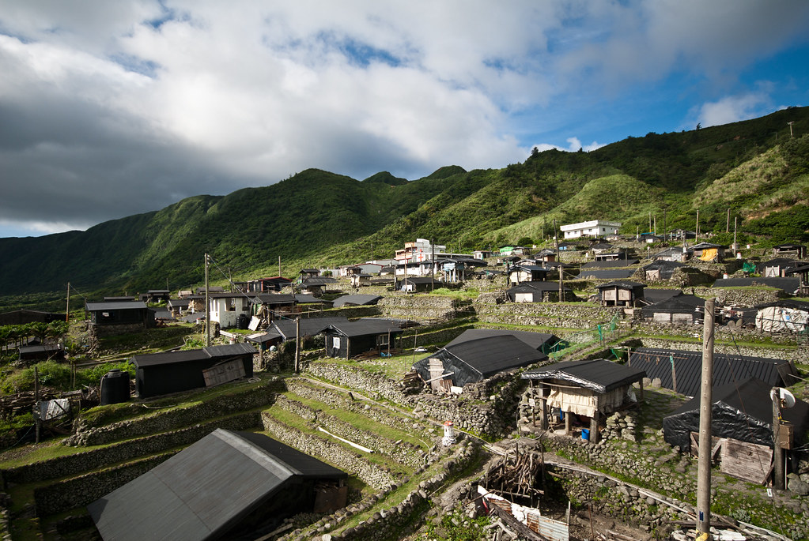
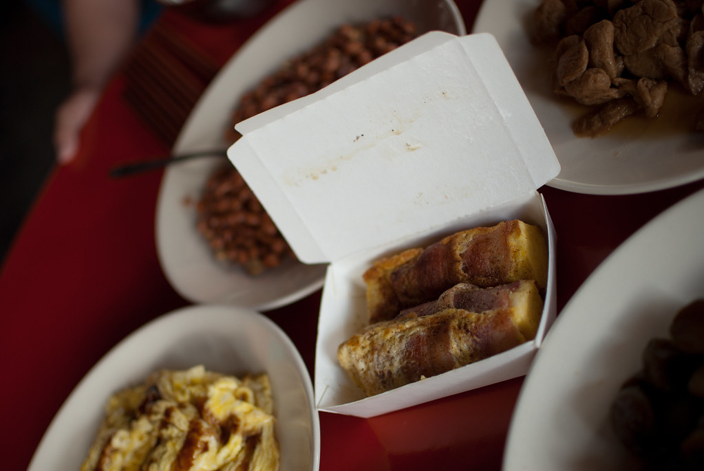

第二天原本預計要起來看日出，不過我們這麼隨性的行程當然不一定看得到日出囉。不過早上六點多我還是起來到處走走。  
  
  
  
  
  
這邊似乎是基督教為多數，在蘭嶼村落裡只看得到教堂，在小琉球則全部都是廟。  
  
背影。  
  
  
  
這隻小羊在村落裡瞎逛，感覺警戒心很高，一直邊看著我邊移動。牠的眼神流露出『看三小』的情感。  
  
  
  
這是從我們房間外陽台望出去的風景，晚上坐在這邊喝酒打屁的感覺很不賴，早上則是很清新。  
  
  
  
蘭嶼的傳統住處 - 地下屋。這些房子都還有人住的，所以不太方便走到裡面拍照。我只有拿 35mm 偷偷在附近晃，不過也沒捕捉到什麼好畫面。  
  
  
  
吃完早餐之後，我們就出發繼續蘭嶼環島之旅囉。  
  
  
