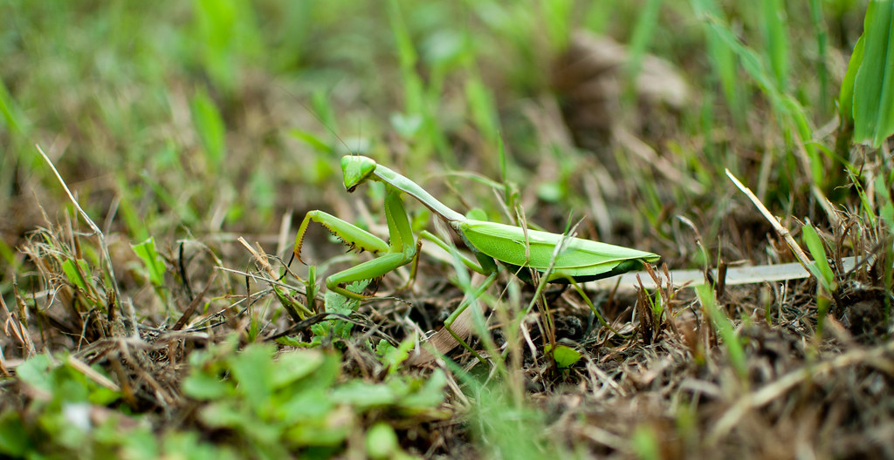
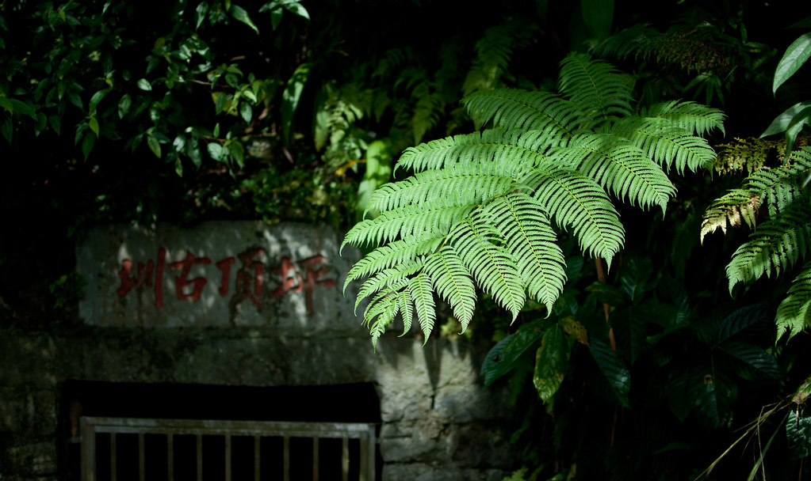
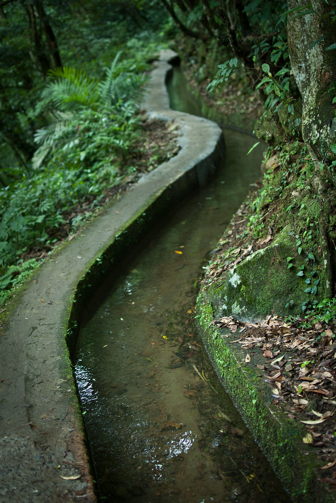
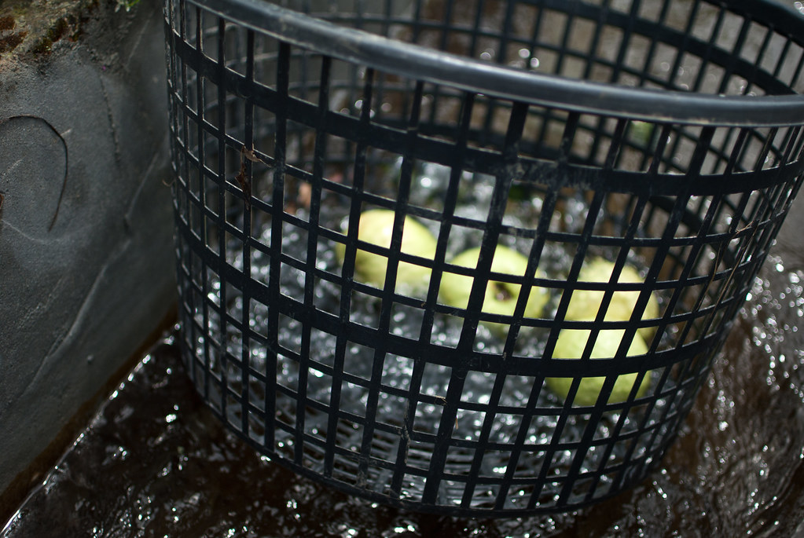
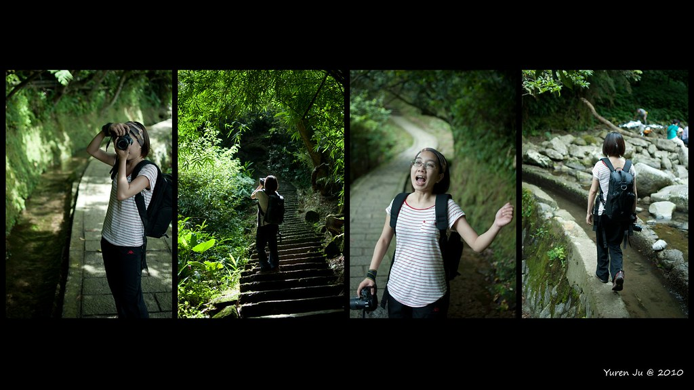

這週日我們決定出去走走，早上七點起床到 7-11 吃個早餐就出門了。這次的目標是『狗殷勤古道』，所以我們依循 [Tony 的遊記](http://www.tonyhuang39.com/tony0550/tony0550.html)從原住民文化公園進入。沒想到走錯路，沒找到正確的入口進去，就放棄了。  
  
拍了些小東西就離開原住民公園。  
  
  
  
不過我們當然不會這麼輕易就放棄。所以我們打算從另外一頭的古道進去看看，也就是平明步道。不過後來騎車的時候都沒看到明顯的指示路牌，最後又看到坪頂步道，想說標示這麼清楚應該是比較熱門的步道，所以又臨時改變主意到了坪頂步道了。  
  
  
  
基本上坪頂步道是個 V 型的步道，剛開始我們一直走下坡的時候很擔心回來的時候要一直爬坡，後來掉頭走的時候有個阿姨跟我們說這是可以繞一圈的路線，所以就繼續走囉。  
  
  
  
整個坪頂步道旁邊幾乎都有水圳流過，走在川川的水聲旁邊感覺還蠻涼爽的。走到最後面是個簡單的社區，有些居民在邊賣農產品。有趣的是有人把芭樂放在籃子裡放在水圳裡降溫，感覺起來就蠻好吃的感覺 XD  
  
  
  
最後我們走回來的時候就沿著水圳走回來，省了不少時間。基本上坪頂步道還蠻輕鬆的，算是悠閒路線。  
  
  
  
補遺兩張  
 