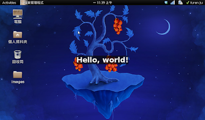

有用過 Firefox 的延伸套件嗎？那是個很好的功能擴充模式，使用者可以選用自己喜歡的延伸套件後，增強 Firefox 的功力。感覺就像洛克人拿到手部裝備一樣厲害。  
  
有想過如果你的桌面也可以有這麼好用的延伸套件可以用嗎？gnome-shell 正在逐漸的啟用這種延伸套件模式。相信過沒多久，gnome-shell 就能全面啟動了 (笑)  
  
基本上 gnome-shell  有幾個特點：  

1.  可變更原有的元件：跟 Firefox 一樣，你可以隨意變更已存在的元件。Firefox 使用 overlay 的概念，而 gnome-shell 你可以從 Main 或 Global 參數裡面取得原有的元件，再做修改。
2.  gnome-shell 延伸套件使用的程式語言是 Javascript!
3.  gnome-shell 的樣式是採用 CSS!

如果你寫過 Firefox 延伸套件，相信 gnome-shell 延伸套件對你來說會非常親切的。如何開始第一步呢？首先當然你要先啟用 gnome-shell，在 Ubuntu 底下你可以安裝 gnome-shell，然後在終端機輸入以下指令啟動 gnome-shell。

```
gnome-shell --replace &
```

要如何開始撰寫擴充程式的第一步呢？gnonme-shell 提供了建立一個簡易擴充套件的方式，鍵入以下指令：  
```
gnome-shell --create-extension
```接下來要輸入 Name, Description 跟 Uuid。輸入完畢之後，gnome-shell 會開啟你預設的編輯器，開啟一個由 gnome-shell 提供的樣板延伸套件。

  
```
// Sample extension code, makes clicking on the panel show a message
const St = imports.gi.St;
const Mainloop = imports.mainloop;

const Main = imports.ui.main;

function \_showHello() {
    let text = new St.Label({ style\_class: 'helloworld-label', text: "Hello, world!" });
    let monitor = global.get\_primary\_monitor();
    global.stage.add\_actor(text);
    text.set\_position(Math.floor (monitor.width / 2 - text.width / 2), Math.floor(monitor.height / 2 - text.height / 2));
    Mainloop.timeout\_add(3000, function () { text.destroy(); });
}

// Put your extension initialization code here
function main() {
    Main.panel.actor.reactive = true;
    Main.panel.actor.connect('button-release-event', \_showHello);
}

```  
這個 javascript 放置於家目錄的 .config/gnome-shell/extensions/ 裡面。這個樣板延伸套件會讓你點擊 panel 的時候在螢幕中央出現一個 Hello world 的 label:  
  

[](http://3.bp.blogspot.com/_iOO0fC4NKLE/TFY95S9_MlI/AAAAAAAAI1o/LGhgxdWG0Fk/s1600/Screenshot-1.png)

  
簡單吧？程式碼中：  
  

*   17-18 行：將你的 panel 設置成可互動 (reactive)，然後將 panel 的 mouse click/release event 連結到 \_showHello 的 callback。
*   8-12 行：建立一個 text label，接著取得你的螢幕參數，並且把 text label 塞到螢幕的中間。最後指定 3 秒後 destroy 掉 text label。

如果還想做進一步的操作，請參考 gnome-shell 的程式碼，有相當大一部分都是使用 javascript 寫成，位置在 /usr/share/gnome-shell/js/ui。  
  
  
**\[update\]**  
  
忘記說一件事情，弄好你的延伸套件後按 alt + F2，輸入 r 按 enter 就可以重新啟動 gnome-shell 了。