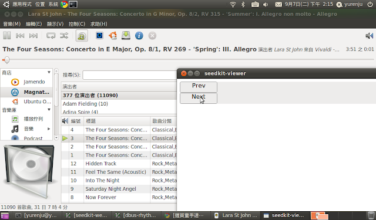

繼上次 COSCUP 講了 Javascript in linux desktop 後，最近又在看之前 penk 跟我介紹的 seedkit，還有會後 sleepnova 跟我提到一些 java 上有些 javascript implementation 的實做，去慶功宴的時候阿修又提了好幾個 javascript 寫 desktop application 的 framework，才知道這個部份已經蠻多人在做了。  
  
不過這次會議也有另外一個感想，就是 web developer 還是比較希望維持原有的開發模式，而不僅只是使用 javascript 語言來撰寫程式。翻開 seed/gjs 寫的 javascript 源碼，開發的思維其實跟 python 差不多，幾乎都可以從 python 無痛轉換了。  
  
而 seedkit 就是打算維持原本 web application 的開發模式而設計的工具。在 seedkit-viewer 的 example 裡面提供了一些有趣的範例。比如說 dbus-rhythmbox  這個範例，他透過 dbus 的方式控制歌曲的上、下首切換。  
  
[](http://4.bp.blogspot.com/_iOO0fC4NKLE/TIXZkQXlvbI/AAAAAAAAI4I/0CMSwat9XlU/s1600/Screenshot+(1).png)  
  
右邊的 seedkit-viewer 視窗裡面的 next/previous 可以操作 rhythmbox 上、下首。這個程式與 rhythmbox 是兩個獨立的程式，而不是 rhythmbox 的外掛。  
  
這個功能可以在各種語言用 dbus 實做出來。不過在 Seedkit 的實做方式則是比較近乎 web application 的開發方式。首先我們看源碼中的 ui.html （沒錯是 HTML 檔案）。  
  
```
<html>
    <head>
    <link rel="stylesheet" href="./ui.css" type="text/css" media="all" />
    <script src="http://ajax.googleapis.com/ajax/libs/jquery/1.4.2/jquery.min.js"></script>
    <script src="./ui.js"></script>

    </head>
    <body>
    <div class="demo">
        </img>
        <div id="prev-button" class="button">Prev</div>
        <div id="next-button" class="button">Next</div>
        <div id="file-uri"></div>
    </div>
</body>
</html>

```  
基本上就是使用 jquery 函式庫，並引入了 ui.js 這個 javascript。接下來是 ui.js。  
```
Seed.include("./dbus-rhythmbox.js");

$(document).ready(function(){

var shell = new RhythmboxShell();
var player = new RhythmboxPlayer();

//playeplayer.getVolumeRemote(function (volume) {print("oi")});

$("#next-button").click(function(){
 player.nextRemote();
});

$("#prev-button").click(function(){
 player.previousRemote();
});


player.connect("playingUriChanged", 
        function(emitter, uri){
  //var song = shell.getSongPropertiesRemoteSync(uri);
  //print(song); 
        });

player.connect("playingSongPropertyChanged", 
        function(emitter, title, property\_name, old\_value, new\_value){
  if (property\_name == "rb:coverArt-uri")
   $("#cover-art").attr('src', new\_value);
});

});

```  
這段也相當簡單，就是按下 next 或 previous 之後去呼叫 player.nextRemote/previousRemote，並且使用了 jquery 的語法。至於 player 則定義於 [dbus-rhythmbox.js](http://gitorious.org/~scaroo/seedkit/seedkit-viewer/blobs/master/examples/dbus/rhythmbox/dbus-rhythmbox.js) 裡面。  
  
另外，這個範例為了方便的操作 dbus，所以做了一個 wrapper 在 [dbus-local.js](http://gitorious.org/~scaroo/seedkit/seedkit-viewer/blobs/master/examples/dbus/rhythmbox/lang-local.js)，有興趣的話可以翻一下，特別是把 next mapping 到 nextRemote 可以翻一下 proxifyPrototype 這個函式。  
  
基本上 seedkit 讓開發桌面程式的方式盡可能的接近網頁應用程式，並且還是可以使用系統的 API 去作檔案 IO、網路存取、dbus、notification 之類的系統 API，感覺起來是 GTK 裡面比較完整的解決方案。  
  
而更棒的是 seedkit 也可以當作一個 Gtk Widget，你可以將這些程式片段嵌入在 UI 的一部分，這也保持了開發彈性，開發者還是可以選用其他的 UI 函式庫如 Clutter 或是 GTK，而不是只能使用 Web Application 的 View。