九月七日那天，不知道是那根筋不對勁，我突然覺得秋天到了，該是爬山的時候。所以就開了奇萊南峰/南華山的登山活動。經歷了規劃行程、找挑夫、租賃帳篷、申請入山証、搞定交通問題等等大大小小問題，又經歷了數位朋友很可惜的沒辦法參與，一個月後的十月十五日，這個活動終於開成了。  
  
活動的開頭就是一個臨時的變動，我們把集合地點改到關渡站了。那一個禮拜五晚上我提早下班回家沖澡後，全副武裝的坐捷運到關渡站會合，等著我跟 Chialin 的是好久不見的 Payton 還有 Grissom。拐過一個街角之後，這次提供交通工具的 Jerry 大哥就在那邊等我們。  
  
介紹一下成員，這次成員依然很複雜，不過基本上就是同事跟各時期同學的混和團隊。從左到右、由上至下是 Shawn, Jerry, Rex, Payton, Yuren, Chialin, Merck 跟最右下角的 Grissom。  
  
[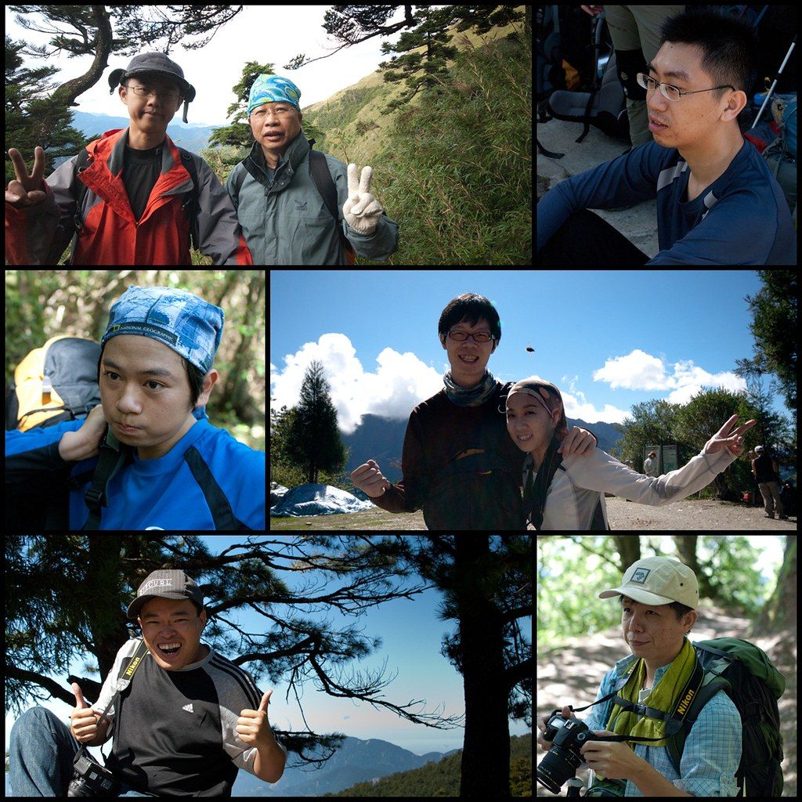](http://www.flickr.com/photos/yurenju/5092290527/ "Flickr 上 yurenju 的 能高越嶺成員")  
  
  
  
到等我們開車到達第一天的露宿地點仁愛國小時，從新竹出發的 Merck, Shawn, Rex 已經到達一陣子了。因為發現 Shawn 似乎帶了很多奇怪的東西，所以特別 review 一下他的配備... 有汽化爐！他沒拿來我還真的不知道汽化爐長怎樣。簡單的整理後我們就準備就寢了。這次有些打電話給仁愛國小商借司令台露宿，是這次做的比較周延的地方。  
  
[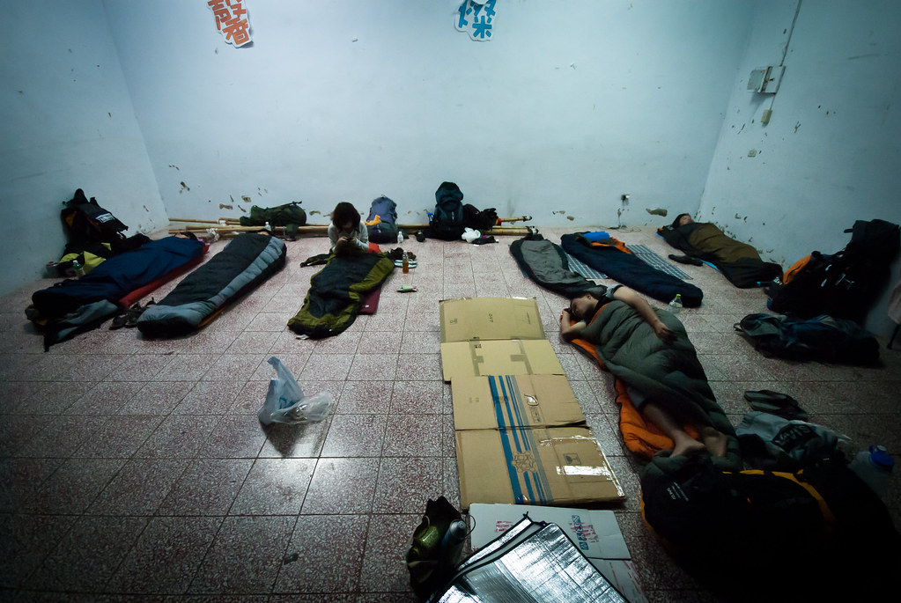](http://www.flickr.com/photos/yurenju/5092310613/ "Flickr 上 yurenju 的 仁愛國小司令台露宿")  
  
這個夜晚並不是很安靜。晚上跟凌晨分別來一次火災假警報，早上又有阿桑用收音機放音樂跳舞。所以我們早早就起床了。很慶幸仁愛國小旁邊就有一間 7-11，大家用完早餐後就直接上屯原登山口準備出發。這邊又出了沒調查清楚的地方，就是路況還蠻爛的，低底盤的車子要很注意。  
  
登山口的地方有個小陡上，心裡一驚想說會不會跟加羅湖一樣是個可怕的開端，還好陡上只有小小一段。既然剛開始的行程不艱苦，我們就到處拍照了。  
  
[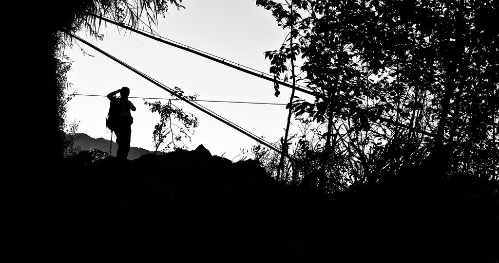](http://www.flickr.com/photos/yurenju/5092331051/ "Flickr 上 yurenju 的 背影")  
  
接下來到雲海保線所都是蠻輕鬆的路線，然而這只是三分之一的路程。這個時候 Merck 跟 Rex 都在這個可以收到手機信號的點上 Facebook，果然到了山上還是沒拔掉網路插頭阿 XD  
  
因為時間太早了，原本預定要在雲海保線所吃飯就改到中間的休息點再吃。不過接下來的路程就不是那麼輕鬆了，過了雲海保線所之後，一路都是緩坡向上。不過這個緩坡向上就一路持續了好幾公里。  
  
[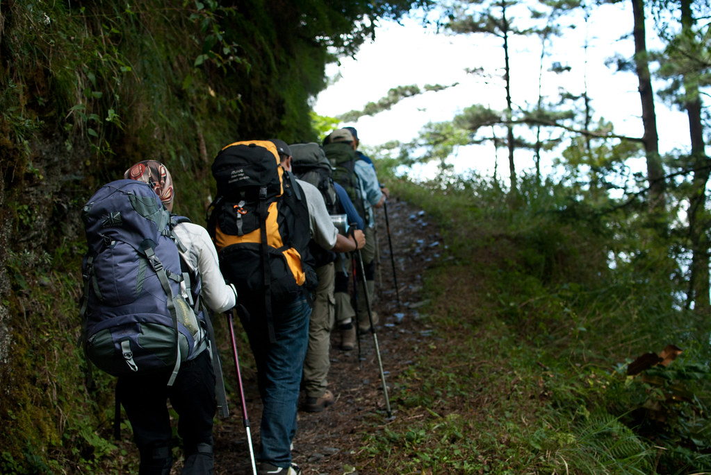](http://www.flickr.com/photos/yurenju/5092335147/ "Flickr 上 yurenju 的 排排走")  
  
另外中間也有一個蠻危險的大崩壁。雖然已經看過非常多文章提及大崩壁，不過自己走的時候還是覺得相當危險。  
  
[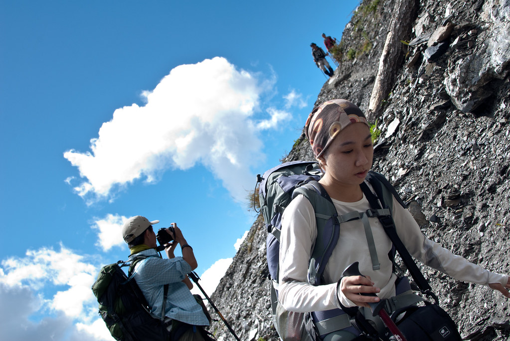](http://www.flickr.com/photos/yurenju/5092931970/ "Flickr 上 yurenju 的 非常危險的大崩壁 - 會讓人腳軟")  
  
不知道走了幾個小時後，我們終於抵達天池山莊。不過因為時間即將到夕陽時間，為了趕上看夕陽的時間我們小作休息後，就輕裝前往光披八表。一路上我們鮮少停止的不停向前邁進，到了光披八表的時候雖然沒有看到日落，不過還是看到令人震撼的美景。  
  
[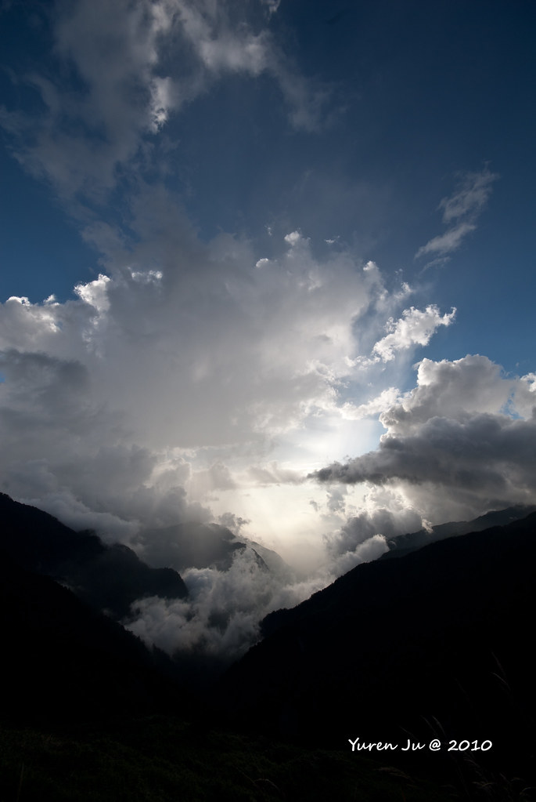](http://www.flickr.com/photos/yurenju/5092935556/ "Flickr 上 yurenju 的 光被八表的壯闊景色")  
  
[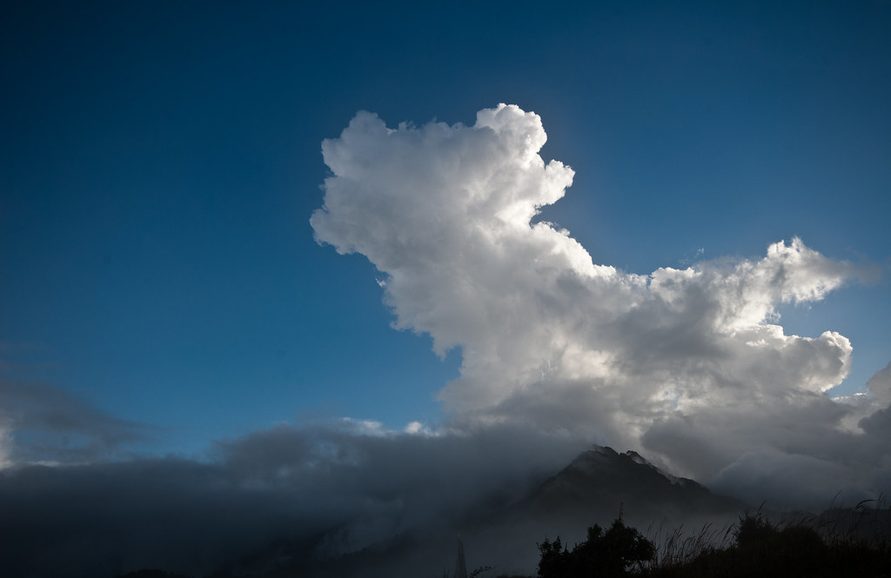](http://www.flickr.com/photos/yurenju/5092936298/ "Flickr 上 yurenju 的 雲霧之間的山頭")  
  
[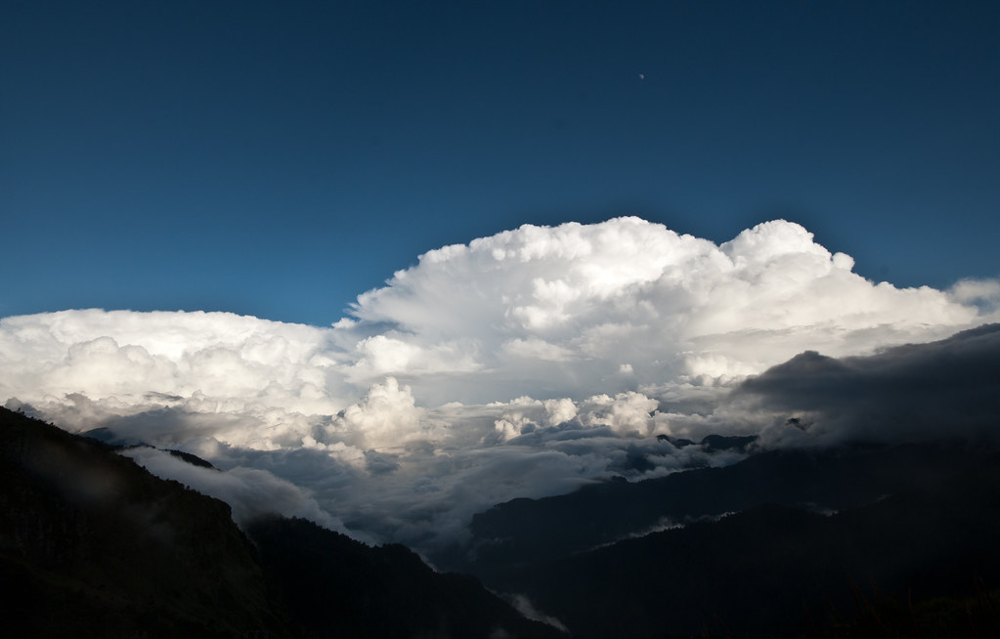](http://www.flickr.com/photos/yurenju/5092936992/ "Flickr 上 yurenju 的 像蘑菇一樣的白雲籠罩著花蓮方向")  
  
[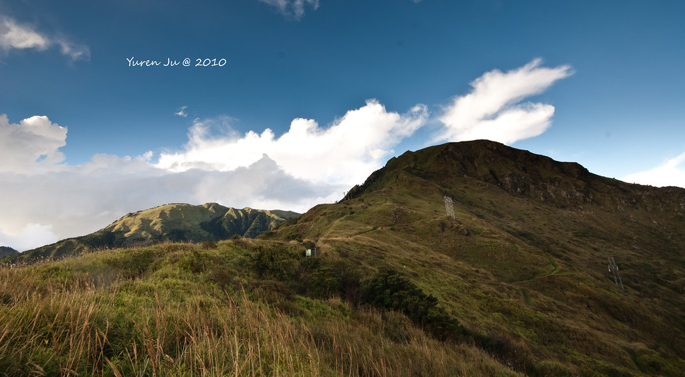](http://www.flickr.com/photos/yurenju/5092340281/ "Flickr 上 yurenju 的 南華山")  
  
就跟在 Facebook 上講的一樣，高山攝影的真諦就是 -- 所見非所得～意思是不管照片怎麼好看，都沒親身體驗棒！喜歡大自然的朋友真的要到高山上走走。  
  
大夥在光披八表留下紀念照片後，就離開冷風颳很大的光披八表。  
  
[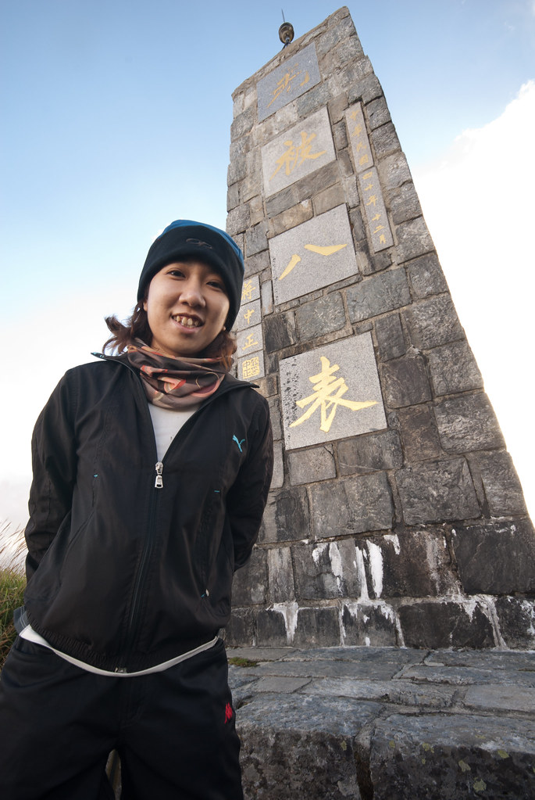](http://www.flickr.com/photos/yurenju/5092938844/ "Flickr 上 yurenju 的 Chialin 與光被八表碑")  
  
往回走的時候，夕陽正巧淹沒在一片雲霧當中。  
  
[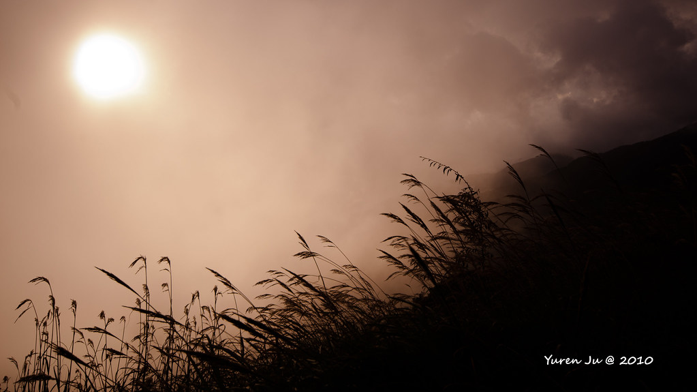](http://www.flickr.com/photos/yurenju/5092341667/ "Flickr 上 yurenju 的 雲霧中的夕陽")  
  
回到天池山莊後，因為這邊有人提供搭伙與帳篷租賃的服務，我們吃著他們準備的晚餐（真是好吃到讓人感動！），早早就寢睡覺了。而這個夜晚依然是不平靜的晚上，天池山莊這邊下了整夜的雨，讓我們很擔心回程的路況，特別是大崩壁那邊。也因為下大雨的關係，我們取消了兩點起床要去奇萊南峰看日出的行程，改到天亮後吃飯，再決定接下來的行程。  
  
天亮之後，雨勢已經緩和，Payton 則建議我們前往距離天池山莊一個小時即可到達的天池走走，我們就出發囉。  
  
[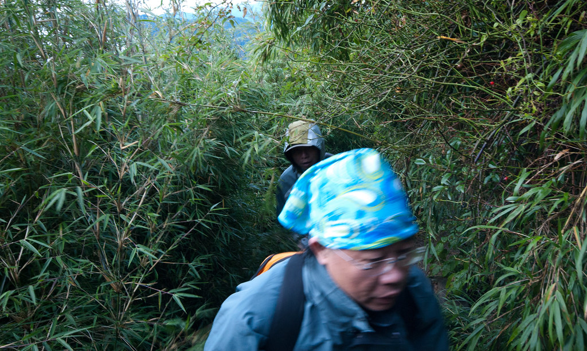](http://www.flickr.com/photos/yurenju/5092940352/ "Flickr 上 yurenju 的 竹林中移動")  
  
中途發生了很常發生的插曲，就是 Payton 又說了『快到了』，還好我們已經習以為常這個現象。  
  
[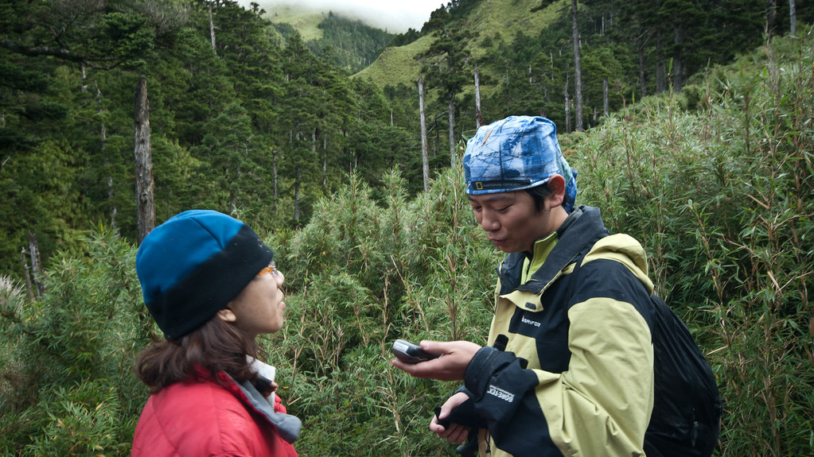](http://www.flickr.com/photos/yurenju/5092343523/ "Flickr 上 yurenju 的 Payton 又騙人了～")  
  
到了天池後，那片景象也是美到讓人很感動。  
  
[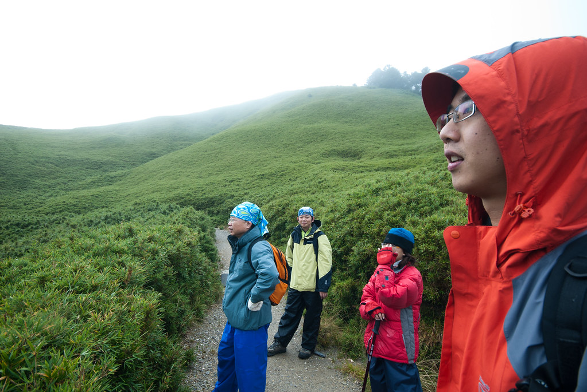](http://www.flickr.com/photos/yurenju/5092942020/ "Flickr 上 yurenju 的 天池的景色美呆了")  
  
雖然天池本身只有小小一池，不過周圍平坦的高山草原非常的美麗。  
  
[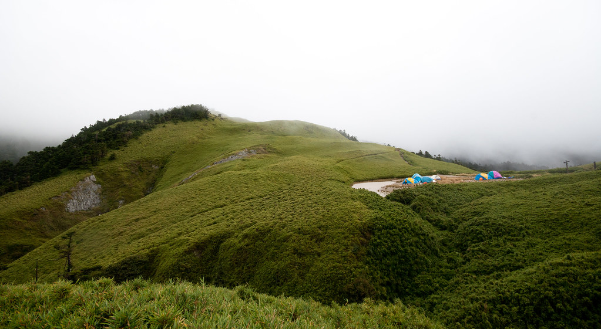](http://www.flickr.com/photos/yurenju/5092942724/ "Flickr 上 yurenju 的 有人在天池露營")  
  
這個時候我們看到疑似 21 人團隊往南華山走，回家之後看[新聞](http://tw.news.yahoo.com/article/url/d/a/101017/5/2f4mp.html)發現有個 21 人團隊失蹤的消息，還好搜救隊很快就跟他們取得聯繫。  
  
回到天池山莊後，剛好遇到天池山莊正要拆了。  
  
[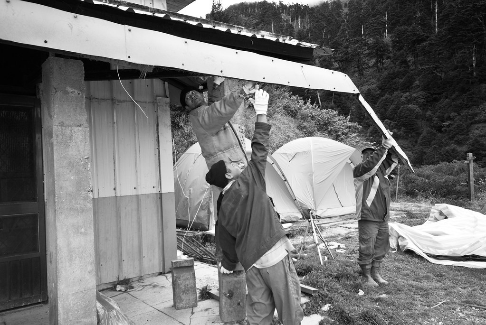](http://www.flickr.com/photos/yurenju/5092345911/ "Flickr 上 yurenju 的 回到天池山莊後，這邊已經要拆除了")  
  
我們正好見證天池山莊改頭換面的最後一刻，希望下次來的時候，天池山莊已經煥然一新！  
  
[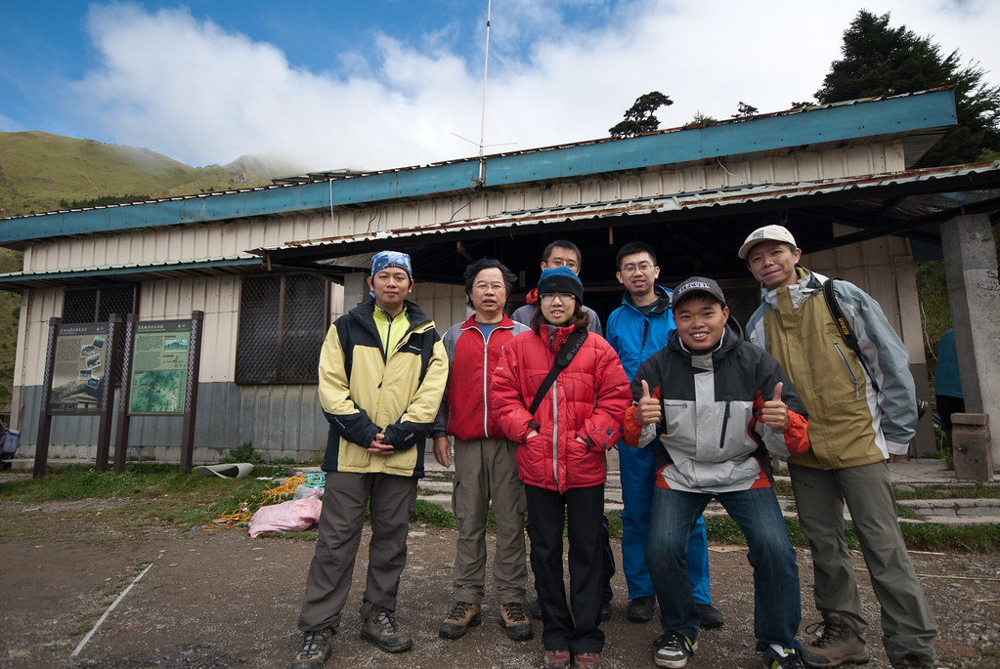](http://www.flickr.com/photos/yurenju/5092346863/ "Flickr 上 yurenju 的 天池山莊拆掉前的合照")  
  
最後整裝完畢後，我們就離開天池山莊，準備回到平地。  
  
[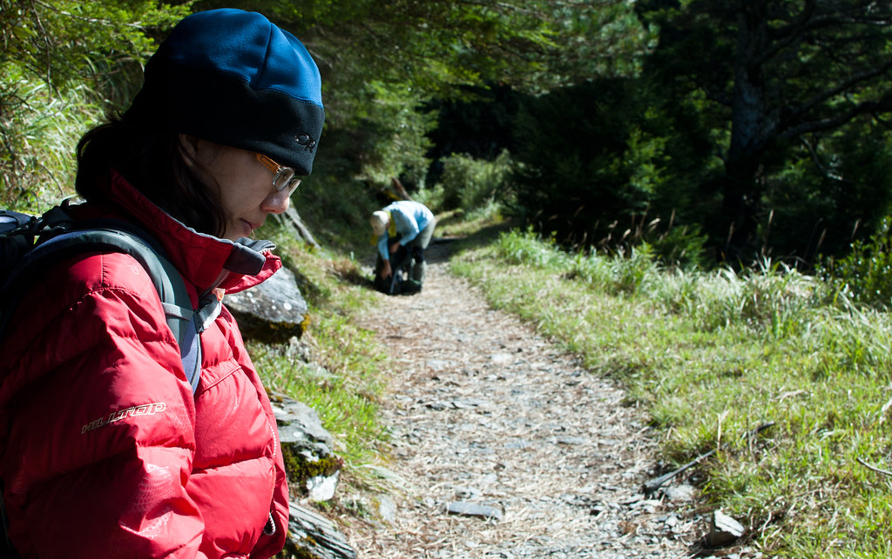](http://www.flickr.com/photos/yurenju/5092945732/ "Flickr 上 yurenju 的 回程")  
  
沒想到竟然還有人騎單車登能高越嶺古道！不過聽說他們在大崩壁扛單車過去的時候掉下去了五公尺就是了，太恐怖了。  
  
[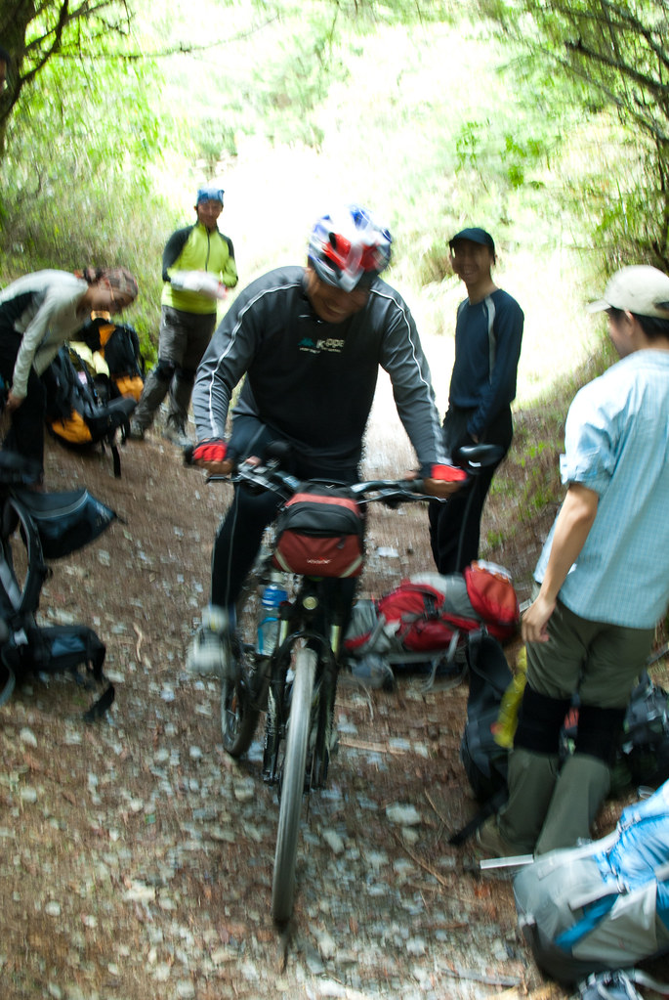](http://www.flickr.com/photos/yurenju/5092947452/ "Flickr 上 yurenju 的 有人騎單車上能高越嶺！")  
  
最後我們也通過讓人腳軟的大崩壁。  
  
[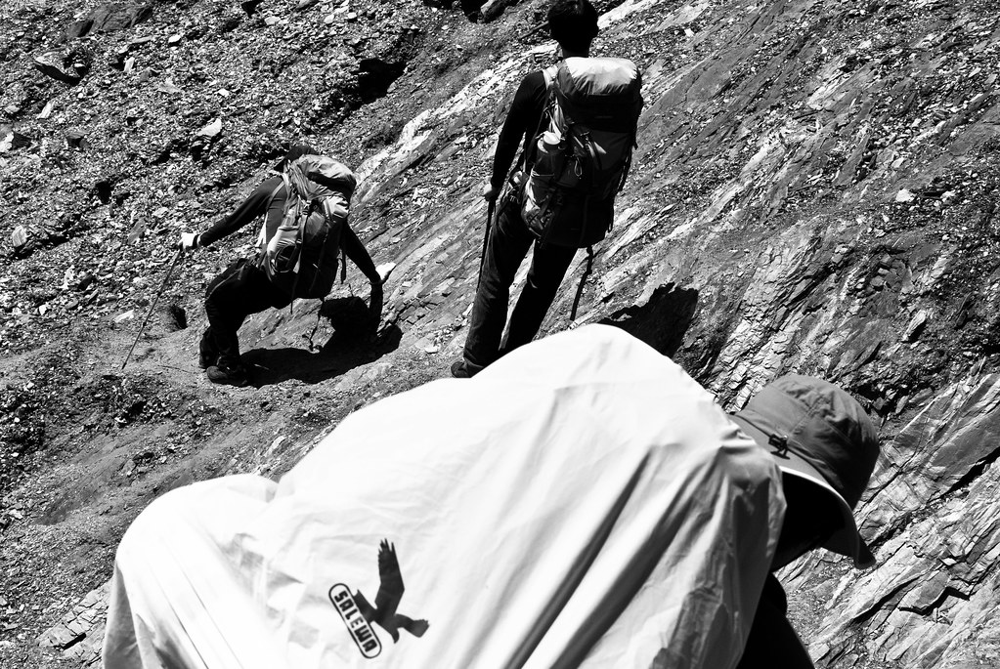](http://www.flickr.com/photos/yurenju/5092948478/ "Flickr 上 yurenju 的 非常危險的大崩壁")  
  
最後搭上 Jerry 的車，經過了漫長的車程後就回到台北市囉！捷運上的人應該都非常傻眼吧 XD  
  
[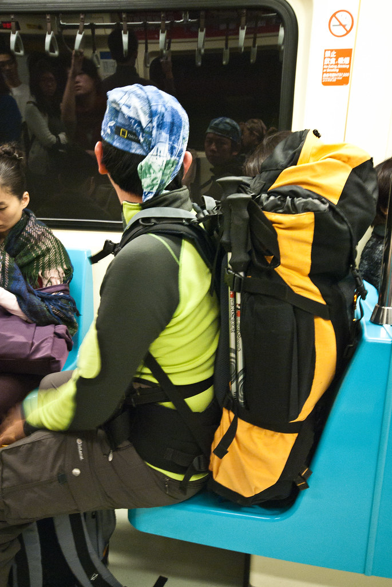](http://www.flickr.com/photos/yurenju/5092352293/ "Flickr 上 yurenju 的 回程的捷運")  
  
我們的能高越嶺之旅就這樣結束了，雖然這次沒有完成兩座百岳南華山與奇萊南峰，不過這次的美景也夠讓我們放在新裡好好的發酵，一直到下次再前往高山旅行囉！  
  
後記，其實在第一天結束的時候，Rex 看起來體力超過負荷，關節炎似乎也有點復發的傾向，而 Chialin 有些微頭痛、喉嚨痛的症狀（看起來像是感冒.. 或是輕微高山反應），不過嗑了綜合感冒藥後就沒事了。我覺得登山活動真的要密切關心每個隊員的狀況。