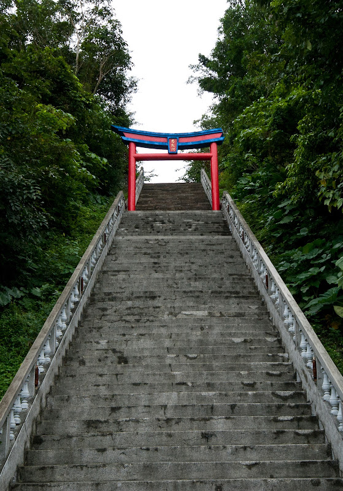
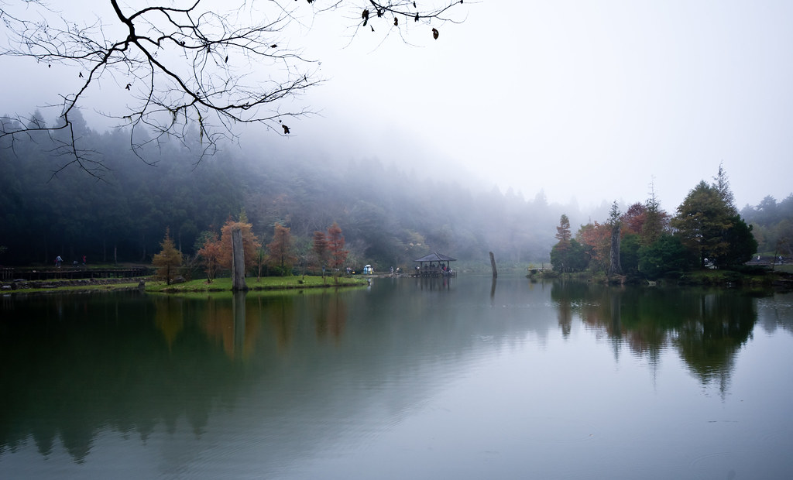
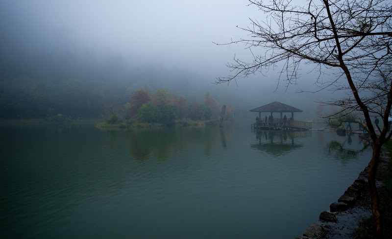
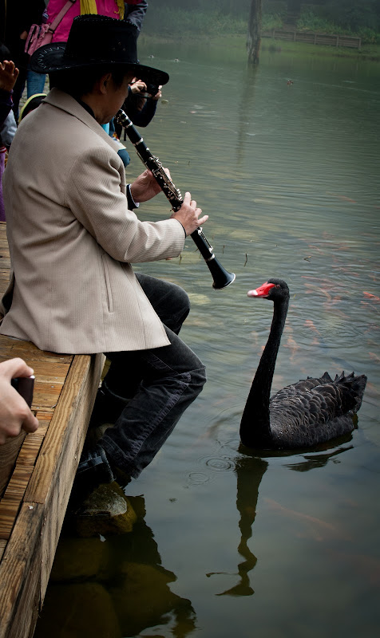
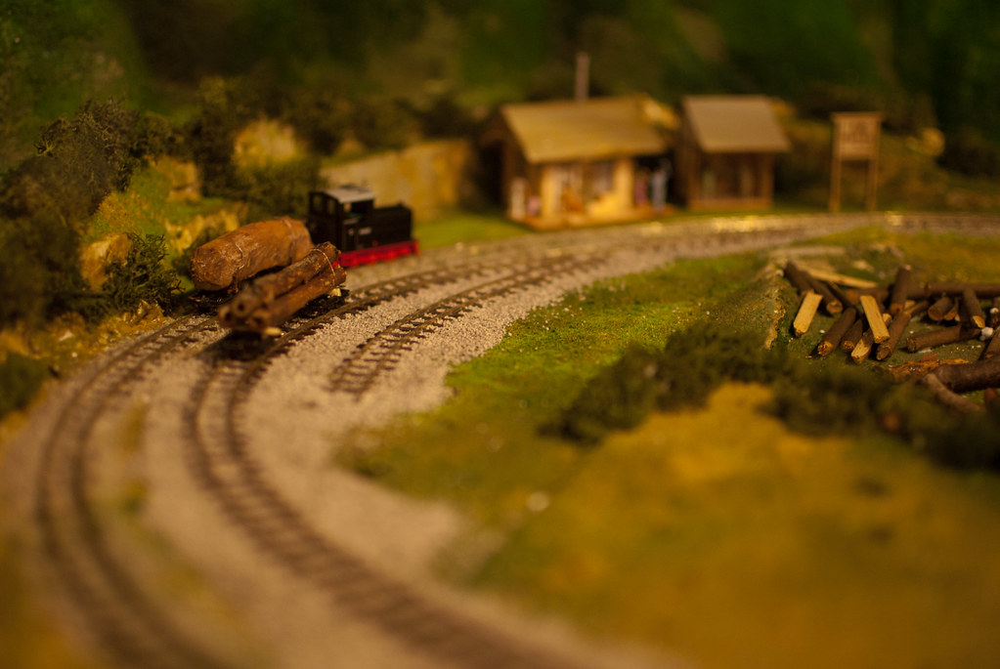
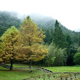

禮拜六 Chialin 他們公司旅遊，我就跟著她跑到宜蘭玩囉。  
  
五點半起床。我完全覺得身體不是自己的，而且也還沒醒過來。拖著身體漱洗完畢後，我們就騎機車到他們公司集合。一上遊覽車坐下之後～我馬上就睡死了。  
  
『上車睡覺，下車尿尿』。醒來之後我們就到了宜蘭員山的忠烈祠。神奇的是我們停在這裡，完全只是因為到下個景點前中間就沒有可以上廁所的地方，導遊還特地請我們每個人都一定要下去上廁所 XD  
  
不過還是補了幾張照片。  
  
  
  
等全體上完廁所之後也拖延了不少時間，接下來我們就直上明池了。今天太早起的我，一上車又馬上陣亡了。醒來沒多久就到明池囉。  
  
明池這個地方跟還沒來的印象不太一樣。它並不大，繞著明池散步大概二、三十分鐘就可以繞完了。不過明池上的數個小島，幾棵染紅的楓樹卻讓它變成一個很美的地方。  
  
  
  
  
  
小島旁邊有個涼亭，我們經過的時候正好飄來一陣霧，小島跟涼亭變得迷濛。  
  
  
  
繞回入口時，黑天鵝正看著吹奏樂器的樂手。  
  
  
  
總之是個很適合放空的地方，如果可以在這邊待一整天一定超棒的。回去的時候看到這邊有一整排住宿的地方，或許可以找個機會到這邊來發呆。  
  
中午我們就下山吃飯了，這次的中餐也準備的太豐盛了！是我來過的員工旅遊吃最好的一次。午餐後宜蘭下著大雨，不過我們還是照原定計畫到羅東林業文化園區。不過下著大雨實在是也沒什麼好逛的，無聊的拍了一張像移軸鏡的照片。  
  
  
  
參觀了他們的一些展示。  
  
  
  
後來我們就回家啦。可惜了下午天氣不好，不過還好早上的明池很漂亮，也沒受到下雨影響 :)  
  
  
剩下的照片放在 picasa 有興趣的點下面吧。  
  

[明池](http://picasaweb.google.com/yurenju/jRaHIK?feat=embedwebsite)