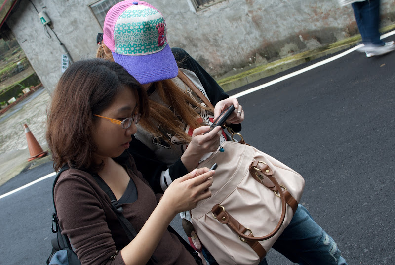
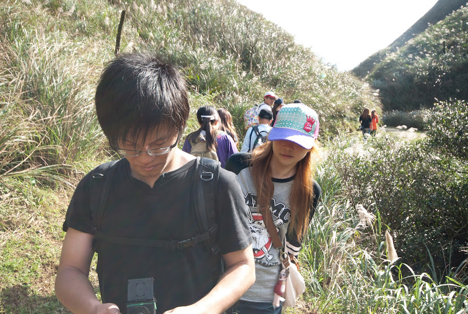
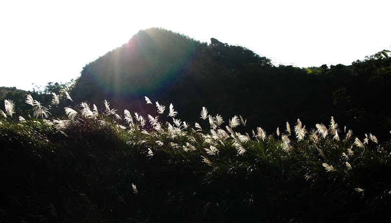
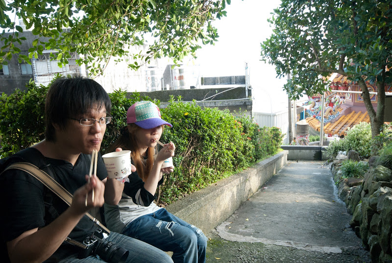
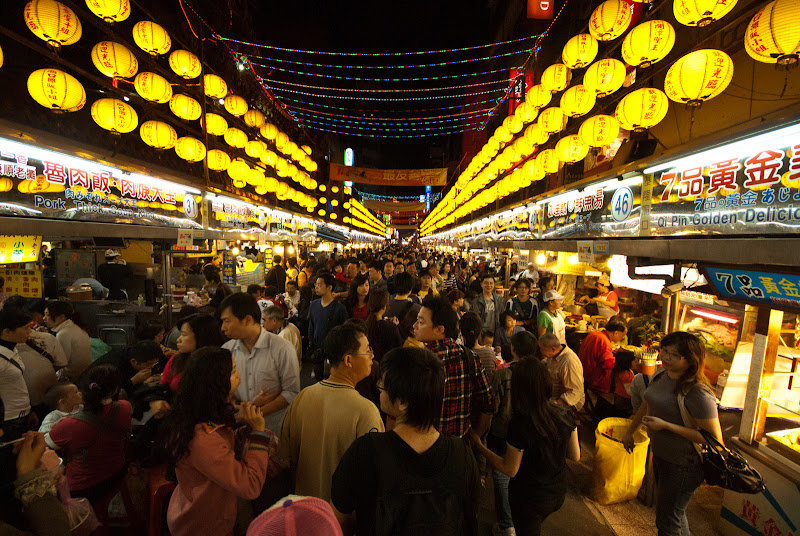

因為上週末下雨取消草嶺古道健行，就移到這週日去，就變成了兩天去兩個地方。  
  
一早我們就在火車站集合，坐莒光號到福隆吃便當。話說這 55 元的便當還蠻划算的，我已經很久沒看到便當有一整顆滷蛋了（平常都是半顆）。吃完便當就到遊客中心前面搭 20 元的接駁車到草嶺古道的登山口，開始健行囉～  
  
然後路上還是很宅，兩位一路上在研究海綿的快門聲為什麼超級大聲的。  
  
  
  
  
  
這次 Znikang 買了大人的科學，自己組裝的相機，這次很開心的帶著他還有 FM2 來趟底片之旅。  
  
  
  
接著我們就一路走到啞口了，其實草嶺古道前段實在是沒什麼。沿著溪流旁邊的小路不停的往前走，路上沒什麼景色，但其實走起來應該是蠻舒服的，只是今天人太多了，完全沒有愜意的感覺。  
  
還好走到啞口，我們終於看到一絲絲的芒草啦～  
  
  
  
但是還開的不夠多，都是未熟的芒草阿。  
  
  
  
不過眺望龜山島還是很美，這種也是現場才有辦法感受的阿。  
  
  
  
待了蠻久的時間，最後就朝着往大里的方向下山了。揪甘心的是大里的廟宇竟然還提供了平安粥讓下山的人吃呢。很累的時候來一碗熱粥感覺真得超棒的。  
  
  
  
我們坐了接駁巴士從大里再回到福隆，稍作休息後又坐了火車到基隆打算要去吃夜市小吃。其實這個時候我已經有點累了，還想說真的還要去基隆吃夜市小吃嗎 XD  
  
最終還是去了～吃了不少東西，奶油螃蟹、滷肉飯、四神湯、豆花等等。  
  
  
  
超餓的在等奶油螃蟹。  
  
  
  
然後草嶺古道 + 基隆夜市就這樣結束啦！這周實在太忙了，星期六、日分別去了兩個地方，感覺假日比上班還忙阿 XD