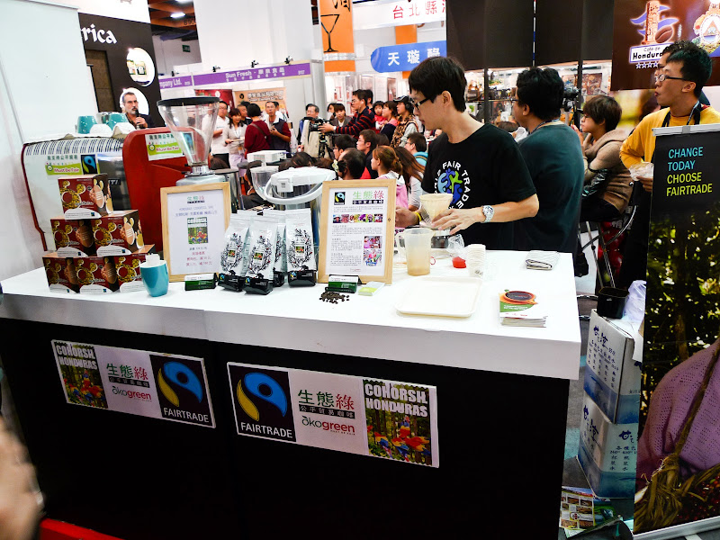
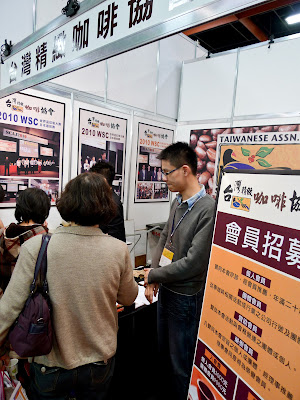
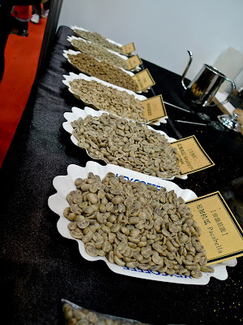
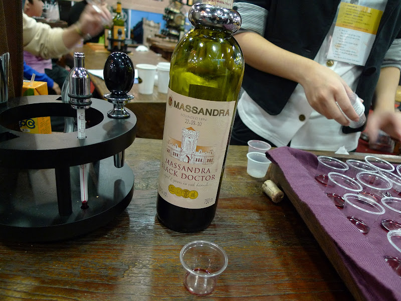
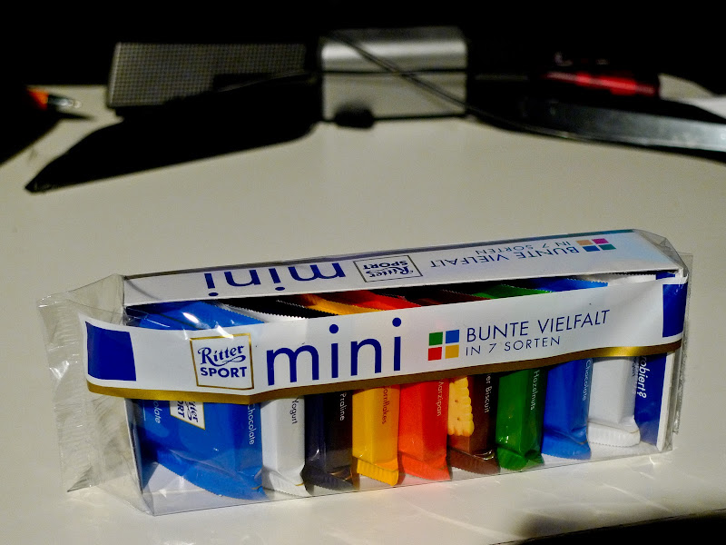

上週無意間知道這週末有咖啡展，所以禮拜日就跑去世貿一館去看展覽。  
  
咖啡展比想像的還要多人阿。感覺起來有非常多廠商來展示器具、豆子跟周邊產品。我們這種進來瞎逛的其實有些太高檔的攤位也不知道要怎麼進去 XD  
  
首先在誠品的攤位看到 Greenfield 的茶包。這個茶包前幾天剛好在餐廳喝過，還蠻不錯的。不過我們沒有下手就是了。接下來～我們就不停的喝咖啡，哈。因為有太多廠商都有提供咖啡試喝，我們除了三合一以外，還有詢問後只說這是『黑咖啡』的廠商跳過，其他幾乎有遇到的全喝了。不過為了避免喝到太亢奮，所以我跟 Chialin 通常都兩個人喝一小杯，這樣才可以幾乎每攤都喝到 :D  
  
不過說實在的大多數的咖啡都不行。我們喝過大半的攤位後其實沒有什麼令人驚訝的咖啡。不過我可以體諒，畢竟已經沖了兩天的咖啡了，沖手應該也都很疲憊了。但是接下來的咖啡，著實讓我醒了。  
  
  
  
  
  
生態綠！短暫的跟老闆打過招呼後，喝他們的咖啡 -- 果然是真材實料阿，我整個人都 high 起來了！然後老闆推薦我們一定要喝過一輪對面的台灣精緻咖啡協會，聽說他們準備了七支豆子輪番上陣。  
  
  
  
喝了他們第一支耶加雪夫～真是驚為天人阿。以上這兩間大概就是咖啡展裡面我喝到比較有水準的兩間。不過咖啡協會要進去還要入會費，還是要考慮一下。聽說接下來有要到我們公司辦活動耶，到時候再過去看看。  
  
逛完咖啡區後，因為這是個跟茶、食物器具還有酒類的聯展（只是多數的人都在咖啡區）所以也我們也到別區晃晃。然後喝到了這間葡萄酒 - Massandra wine。我終於知道為什麼會有人這麼愛葡萄酒了。Massandra Black Doctor 這支真是好喝到想罵髒話阿。問了一下價格這支要價 2,800 元台票，真的很有衝動要買回家。不過我們平常都很少喝葡萄酒，一次喝這麼好的好像太奢侈，就作罷了。  
  
  
  
最後我們又繞去食品區買了德國的 Ritter Sport 的巧克力，希望它好吃。  
  
  
  
然後吃了嵐拉麵，去看了 Macbook Air 11" 就結束了一個禮拜日囉。