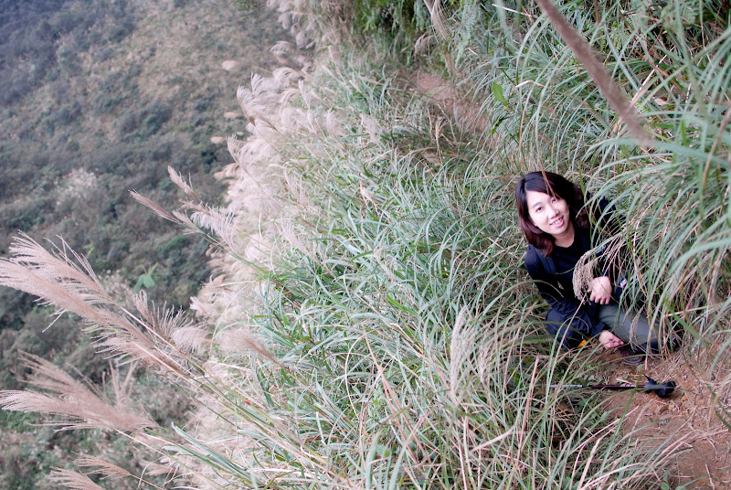

自從十月中跟 Jerry 提到一直想去桶後越嶺古道之後，我們終於在十月底開下『踏破鐵鞋到宜蘭』從台北烏來步行到宜蘭礁溪，並且於十二月四日完成了這個行程！  
  
這次的成員依然很複雜，有我、Rex, Grissom, Znikang, Chialin, Hychen, Chunminy, Jarvis, 海綿大仙, Ike, Shawn Lin, Jerry 以及 Jerry 的十一位親朋好友，所以說這是一個高達二十三個人的旅行，都可以辦旅行社了！  
  
這次的行程計畫是：  
  

*   7:15 新店捷運站集合
*   7:30 搭乘出租車出發
*   抵達烏玉檢查哨繳交健行清冊
*   抵達林務局檢查哨繳交車輛通行證
*   抵達桶後吊橋，開始健行
*   中午找個水源地吃飯（一路上都有水源），休息後再繼續走
*   抵達小礁溪土雞城
*   叫計程車下山到湯圍溝溫泉集合
*   到春和泡溫泉
*   吃飯、買土產、搭客運回台北！

由於前後都需要交通工具，安排起來特別麻煩，所以走過這次桶後越嶺之後大概很難有機會再來走了。  
  
一大早五點多起床，真的完全還沒醒來，昨天整理行李弄太久了。到烏來的時候遇到了很兵荒馬亂的狀況，有一個人來不及過來，兩個人遲到，然後急急忙忙上車後，又發現 Rex 還沒上車 (Rex 我對不起你 XD)

  
  
  
  
  
其中一台車回去載 Rex 後我們終於順利的經過烏玉檢查哨、林務局檢查哨到桶後吊橋了！  
  
這條從烏來往礁溪的越嶺步道的兩大特色就是芒草與一路綿延的溪流了。  
  
  
  
這條路非常的舒服，一路上都是淙淙的流水聲，我們就邊聊天邊拍照，慢慢的往宜蘭邁進。  
  
  
  
一路上搞笑是一定要的 XD  
  
  
  
差不多十一點多的時候，我們遇到前面的隊伍，就看到 Ike 拿著一盒棗子跟我們招手。  
  
  
  
然後大家就開始各自拿出自己的午餐了。不過經過這次後大家應該知道在山上吃泡麵是一件很爽快的事情了吧 XD 走到累了吃碗泡麵真的很爽。然後發現 Jarvis 的杯子看起來很高級，看來下次真的要到 Y 拍上找找有沒有什麼好貨。  
  
  
  
這邊我做了一件白痴的事情，幫 Shawn 燒開水，倒水的時候不小心燙到手了。然後我還是冷靜的繼續把水倒完 XD  
還好隔天看了一下沒什麼問題。  
  
  
  
這次 Znikang, 小楊跟海綿大仙都有參加。  
  
吃飽飯休息夠了我們就繼續往前走了。  
  
  
  
  
當然沿路拍照也是一定要的。  
  
走到差不多中間點的時候，芒草開始多了起來。在蜿蜒的山頂小道上，芒草遍佈著道路兩旁。  
  
  
  
芒草隨風搖曳傳來微弱的沙沙聲讓人感到平靜與感動。  
  
  
  
然後一到有信號的地方，一群阿宅就開始想辦法連結網路 XD  
  
  
  
Rex 剛開始開始還說：『你們這群阿宅竟然都在上網！』靜默了幾秒鐘後，又說：『耶！我也可以看到地圖了耶！(iPhone)』。果然是一群阿宅 XD  
  
最後大家走到了小礁溪土雞城，分別乘坐上計程車後，我們在春和洗完溫泉後，就跟 Jerry 與 Jerry 的親朋好友 Say Goodbye 分開去吃飯囉（不然 23 個人要找間餐廳吃飯也挺難解決的 XD）  
  
最後我們到礁溪的海鮮吃完晚餐、喝了 Rex 大推的番茄汁之後，我們就搭乘首都客運回台北囉！（車上睡的不省人事阿）  
  
  
  
這大概是今年最後一個大型活動了，謝謝大家的參與，也謝謝氣象局這一個禮拜每天預估禮拜六的天氣都不一樣 -- 但是最後是晴天！  
  
  
照片放在 Picasa 請享用！  

[踏破鐵鞋到宜蘭](http://picasaweb.google.com/yurenju/DozHOF?feat=embedwebsite)