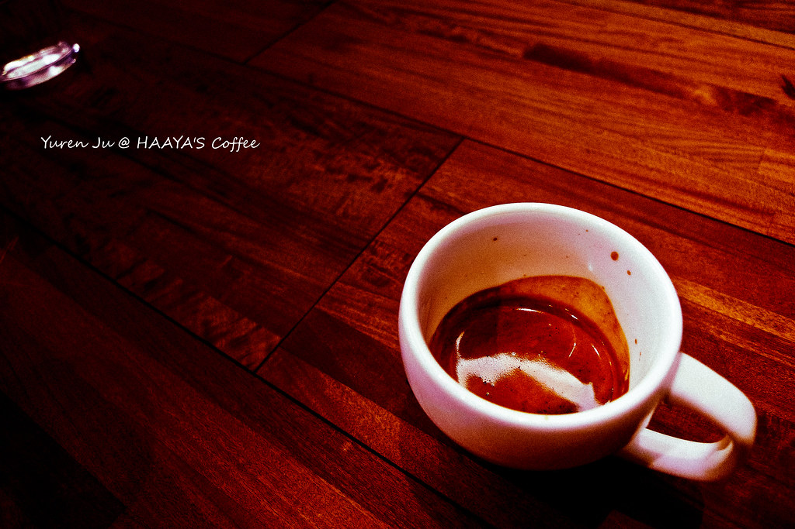

因為 2010 年回顧的時候十二月還沒結束漏掉幾個活動。  
  
十二月中的某個上班日，跑到哈亞原本要買咖啡豆，結果就買了[四周年的咖啡綜合包](http://yurenju.blogspot.com/2010/12/blog-post_20.html)。順便得知咖啡大會亞軍的分享會，喝了兩小杯咖啡。  
  

  
  
  
  
同周，康姐到台北考試，到我們家住了兩晚。然後隔天又跑去 Chialin 同學美賢家玩 Xbox + Kinect (這就是敗家的開始阿)，吃了豐盛的薑母鴨火鍋，超級滿足啊。(不過居然沒留下任何照片～)  
  
同周，阿憲跟紅中到台北找我們吃飯，我們又去了捷運中山站的小居酒屋。後來跑去北投溫泉博物館，最後由去了爐鍋咖啡。  
  

  
冬至的時候正好是華碩聖誕晚會，去聽了當天有點拘謹的小旺福，隔天去了哈亞的咖啡分享會，亞軍先生為我們講解並且沖煮了 Espresso, Cappuccino 跟 Signature Coffee。  
  
  
  
 然後隔天又去看了色遇，隔天又去看李立群─「17年之癢」！所以這周從禮拜三開始每個晚上都有行程 Orz  
  
原本要休息的十二月就這樣過了～還好都是都市活動。接下來，過年要去太平山！讓我們迎接 2011 年吧！