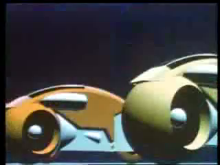
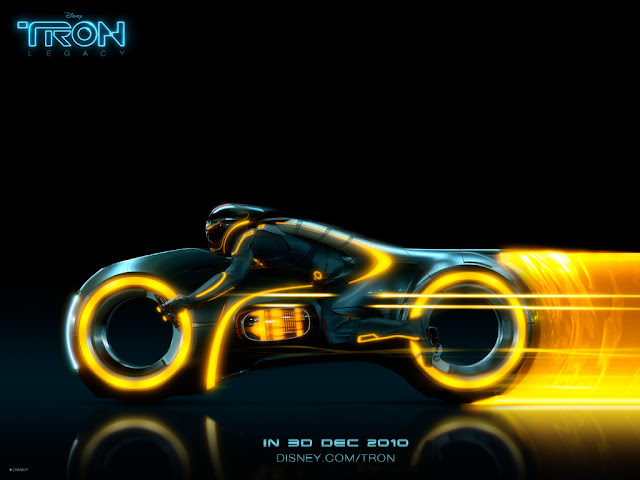
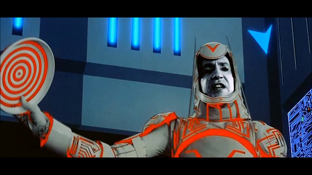
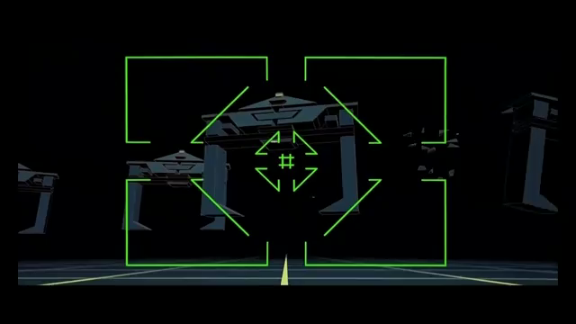
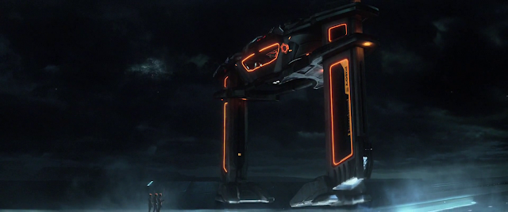
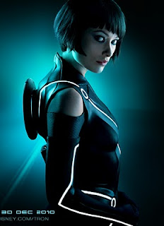
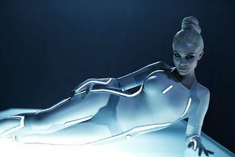
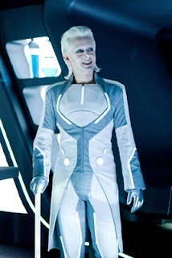

今天跟一群朋友去看了創：光速戰記。這部電影最好是看過 1982 年的 TRON，對整體的設定會比較有概念，而且對三十年後科技的進步感到很激動。  
  
摩托車從  
  

  
變成  
  

  

  
  
  
Disc 從  
  

  
變成  
  

  
  
Gate 從簡單的線條  
  

  
變成科技感十足。  
  

  
十年的差距還是很大的。  
  
而且回家找資料的時候才發現光速戰記的服裝/化妝幾乎讓演員看不出來原本的樣子。  
  
比如說飾演 Quorra 的 Olivia Wilde, 其實臉有點方，不過在 Tron 裡面用髮型掩蓋了這個突兀的地方  
[.jpg/516px-Olivia_Wilde_in_2010_Independent_Spirit_Awards_(cropped).jpg)](images/6.jpg)  
  
  
  
  
Beau Garrett 飾演的 Gem 也差挺多的。  
  
  
  
  
  
  
然後我覺得 Michael Sheen 飾演的 Castor/Zuse 這個角色感覺就是強尼戴普會演的角色！  
  
  
  
  
  
至於好不好看嘛，我自己五顆星是給三星半，如果要看光速戰記的人應該要先去看 1982 年的 Tron (當時翻譯電子爭霸戰) 會比較可以進入狀況。