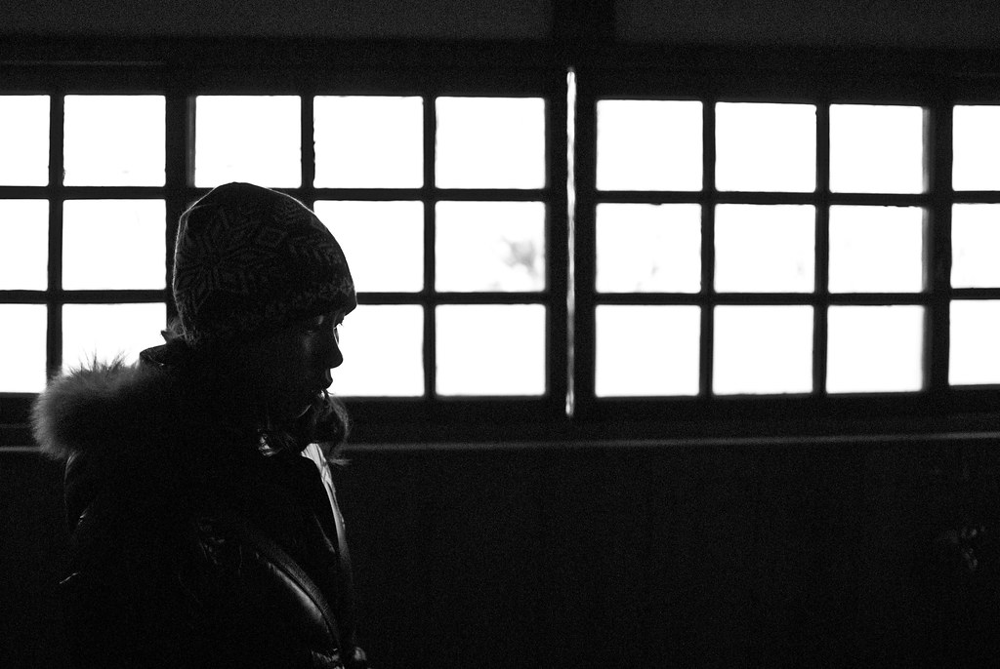
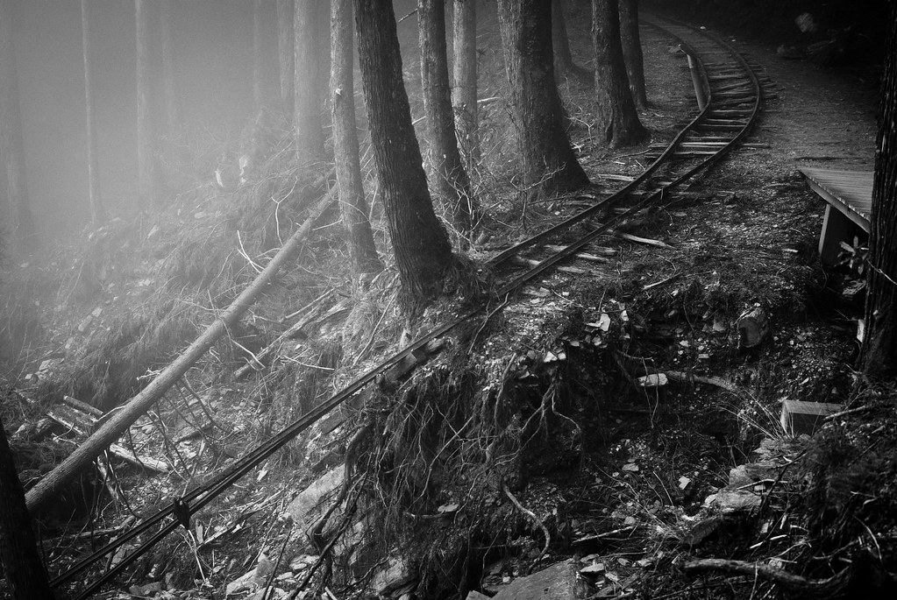
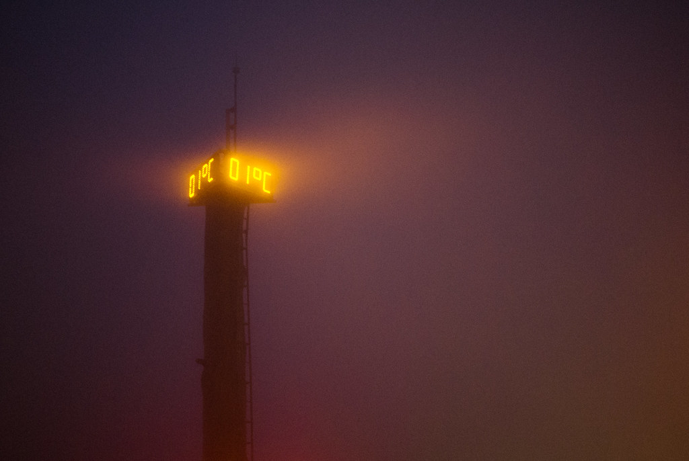

2011 年的第一天，Znikang 開了團到太平山走走。大家就殺上去了，還好不是看日出，不然一定冷到吱吱叫。而且這次小杜也有跟著來唷，非常罕見的跟我們的團出遊 :-)  
  
  
  
  
  
  
  
上山一下車就感到事情不妙 -- 超～冷的。而且大霧瀰漫，能見度頗低。而且大熊跟小羊還是平地裝扮，感覺就是一整個會出現凍死骨。  
  
  
  
  
訂了小火車的票後，我們就在附近隨便繞繞，不過實在太冷了，活動力大大降低。  
  
  
  
  
  
  
  
後來我們坐小火車到上面的森林逛逛，上面的低溫更是爆表，手完全凍僵了。  
  
  
  
  
上面主要是舊的伐木鐵路。我們沿著其中一段走還遇到了些斷崖殘壁。  
  
  
  
到下山之後，看到塔上的溫度才恍然大悟為什麼會感到這麼冷...  
  
  
原來只有一度阿，難怪我冷的要命 = =