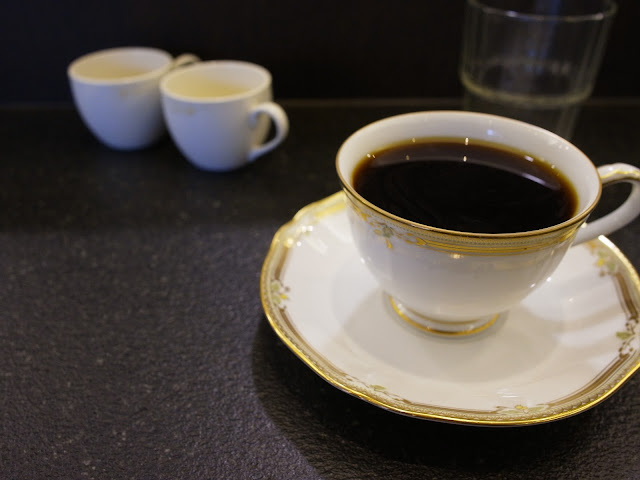
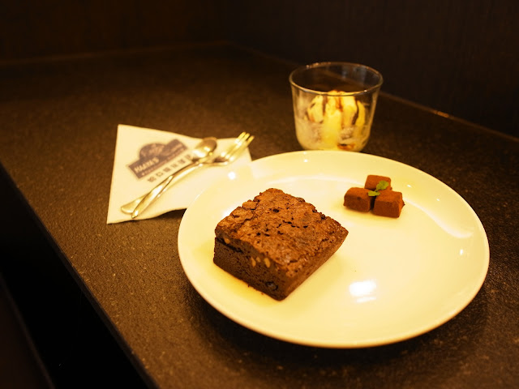

Chialin 出差了，假日好無聊。所以我又跑到哈亞咖啡了。趁着還沒忘記把咖啡心得記下來…。今天很好運的品嘗了五種不同的咖啡：  

*   秘魯 - 山福組織
*   巴拿馬 - 唐.裘里安
*   多明尼加 - 佩佩
*   瓜地馬拉 安提瓜 - 聖塔卡塔麗娜莊園
*   肯亞 - 深烘培

  

  
  

  

第一個喝的是佩佩。大概是上次磨豆的味道太震撼了，當時喝下去覺得並沒有那麼愛。不過這次重新再喝感覺就好得多，適度的香氣加上些微酸味，很不錯。安提瓜的感覺就沒那麼愛了，安提瓜其實味道比較強烈，不過有種味道讓我沒那麼愛... 說不上來。

  

山福組織。喝了一口，發現我愈來愈挑嘴了。想到我第一次喝這款咖啡的時候多喜歡啊…。已經成為過往雲煙了嗎 XD

  

唐.裘里安：聞了味道就覺得這款咖啡實在太厲害了，光是靠香氣大概就可以吸引到不少人的喜愛。喝了之後跟聞到的香氣是一樣的感想：太厲害了... 只能說是今天喝到的咖啡最棒的，不愧是巴拿馬競賽豆第三名。

  

肯亞深培：我沒想過肯亞可以做深烘培。如果沒跟我說是深烘培我也完全不會發現。基本上是很典型的肯亞風味 -- 強烈的酸味。至於深烘培的部分我倒是沒什麼感想，我還分辨不出來這款跟淺烘培的肯亞的差距。

  

今天的咖啡知識充電：

1.  原來肯亞也可以作深培
2.  巴拿馬競標豆的排名是評審決定，但是價格卻是買家決定，所以排名跟價格不一定是照順序
3.  原來[咖啡莊園還可以指定某個區域的豆子](http://www.haaya.com.tw/index3.php?url=gccc.php&id=70)！不過聽說是合作了好幾年的莊園才有這種訂製服務
4.  哈亞咖啡在認識客人點菜單上面會標註姓氏（剛剛偷瞄到的 :P）

  

今天甜點是有冰淇淋的布朗尼，每次吃都還是覺得很好吃 :D

  

