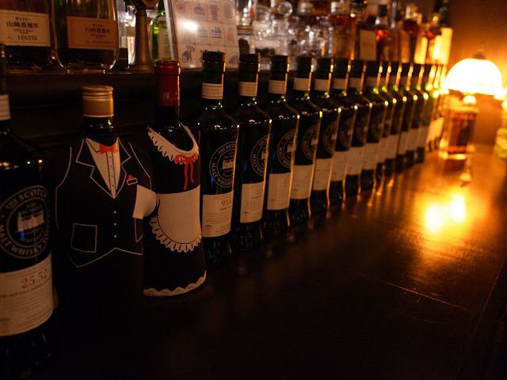
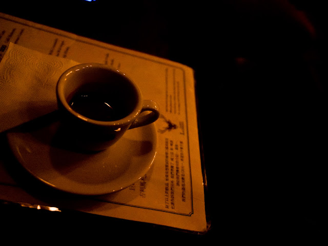
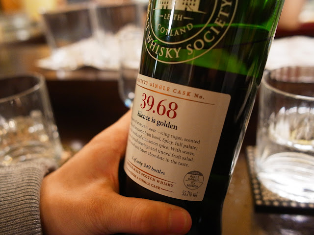
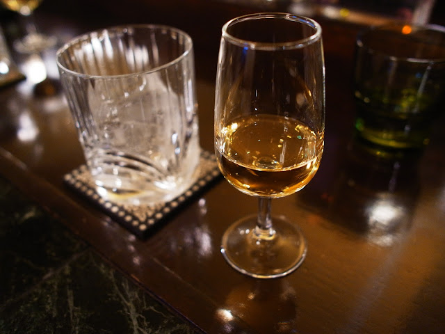
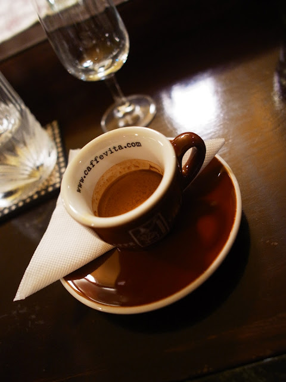

在三味食堂很滿足的吃飽後，跟同伴們 Say bye bye，我就一個人坐公車到咖啡小自由去。在坐公車的時候，Roger 說有空可以過來。  
  
雖然說萬華距離咖啡小自由還有點距離，不過基本上對我來說都已經是中台北了，否則要來小自由的機會實在很少，所以還是坐公車過來。這是我第二次來，這間咖啡館是很有名的義式咖啡專家小高開的。之前在黑潮咖啡就喝過他的咖啡，真的非常的不錯。  
  
咖啡小自由是一間非常有特色的咖啡館，小小的咖啡館裡面可以切成三個部分。剛開始近來的地方是比較像是一般咖啡館的區域，戶內、戶外的空間配上幾張桌子，再加吧台的座位。而往裡面走進來之後燈光變成非常的昏暗，裡面看起來就像是一個迷你的酒吧，整排的威士忌配上慵懶的沙發座。很適合幾個朋友在裡面喝酒聊天。今天剛開始坐在後面的沙發區。  
  
最後一個區域是小自由的甜點部門『雷斯理』。基本上是一個小小的空間，只擺了一張桌子。但是這邊的甜點超好吃的！上次吃了蘋果塔，裡面可是每塊都有 1/4 的醃漬蘋果阿~ 好好吃。  
  

  
  
  
  
總之，從萬華坐 235 公車到師大後，再走到咖啡小自由去，其實也是一下子就到了。然後當然是先來杯 espresso。  
  

  
這杯 espresso 雖然餘韻無窮，不過還是差了一點點阿 XD 但是這完全是個人口味的問題，基本上已經很不錯了。後來 Roger 來我們就跑到前面的吧台區坐。接下來就是喝酒時間，因為我對威士忌實在沒什麼研究，後來 Roger 跟老闆就挑了這款酒。  
  

  
不過我對威士忌實在沒有研究，只知道 39.68 前面的數字代表的是酒廠，後面的是第幾桶酒。為什麼用數字代表呢？基本上是蘇格蘭威士忌為了想讓會員們能夠更持平而論的喝酒，所以他們出產的酒並不用產區或者酒廠標示，而改用數字的方式表達。這樣大家才不會對產區或國家有先入為主的概念。然後這瓶 39.68 好像是小自由最後的一瓶 39.68 了。剛開始在酒吧裡面的時候，老闆也推薦了這瓶酒給另外一對客人。  
  

  
  
不過喝酒目前我還沒建立什麼品味，不過這款純飲是還不錯。然後我們聊到一半的時候，馬克炮竟然出現了！真的很巧，不過馬克炮不是住新竹嗎，怎麼好像常常來小自由 XD  
  
接下來跟 Roger 天南地北的聊著工作還有音樂的東西，聊著聊著酒也喝完了。因為今天太開心，然後小自由的 espresso 價格又很 sweet （續杯還八折），所以我又點了一杯 espresso~ 不過這杯我請老闆再幫我調整『再酸一點』的 espresso。  
  

  
這杯真的超棒的阿 XD  
  
這才是我期待的小自由 espresso~ 雖然增加了酸度，不過整體來說 body 比較濃厚喝起來反而比較順口。還好有點第二杯 espresso，否則就有點可惜了。  
  
  
話說小自由真的是一個好地方，不過酒跟甜點是有些小貴了。但是氣氛無價阿！