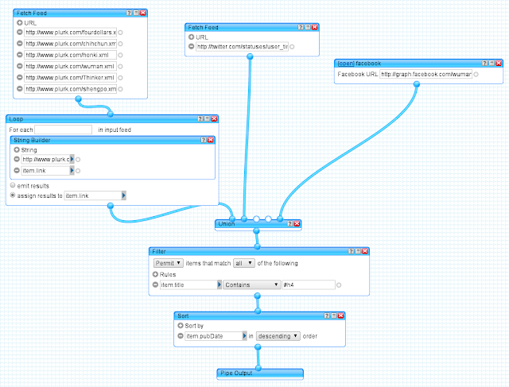
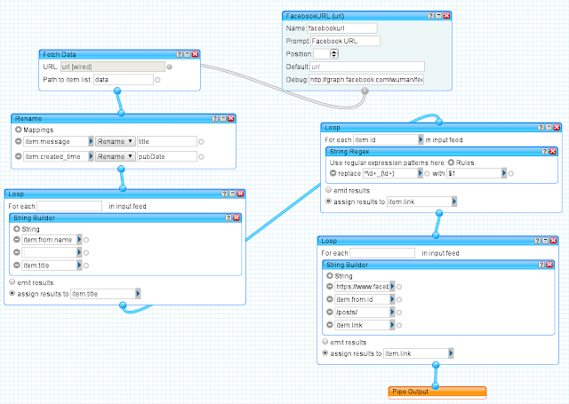

上次聚會的時候, Rex 講了一個小問題。通常我們在聚會之前，其實就會有一些覺得有趣的主題想要帶到 Hacking Thursday 討論。所以希望有一個地方可以搜集這些主題。不過大家都有各自用的服務如 plurk, twitter 或是 facebook，通常有不太想要只是因為要搜集主題就需要額外使用一個 service (如 friendfeed)。  
  
於是大家就討論想要寫一個 web app 來解決這個問題。基本上的概念就是希望在發言的時候如果加了 #h4 時，就會把這個發言丟到 web app 上，條件是至少要在 twitter 與 plurk 都可以使用 (Facebook 會比較麻煩，所以就先跳過了)。然後我們就在 David 的筆電上蓋看到 addicted 這個字，所以這個專案就叫做 h4addicted 啦。  
  
今天我研究了一下，發現這個服務很容易就可以使用 Yahoo Pipes 兜出來！基於懶惰的原則，我就沒有自己去寫程式了 :P  
  
Yahoo Pipe 基本上是一個可以從網路上撈資料進行後處理的 web app。所以我們要做的就是搜集大家的 feed，對各個 service 做一些後處理後產生新的 RSS/JSON 就完成了。你可以到下面這個網址：  
  
[http://pipes.yahoo.com/yurenju/h4addicted](http://pipes.yahoo.com/yurenju/h4addicted)  
  
功能其實是非常簡易的，原本製作也很簡單，只要把大家的 RSS feed 拉進來就結束了。不過事情沒有這麼簡單！我們把 twitter, plurk, facebook (對，後來 David 又透過 JSON 撈到了 Facebook 的資料，但是前提是你的 post 是公開的。)都弄出來之後發現有幾個問題要解決：  
  

1.  Plurk 的 RSS link 欄位填寫的是相對網址，需要對字串作後處理
2.  Facebook 也有相同的問題，因為是從 JSON 轉過來的，所以也沒有 link 欄位。
3.  Facebook 因為根本沒有與 link 對應的欄位，所以要從 post id 那邊分析後取得 post id，然後再跟 user id 合併後產生 link 欄位
4.  Facebook 的 message 欄位沒有 author，所以要額外把 name 加入 message 欄位

所以比想象中的複雜一點，不過還是搞定了 XD

  

首先看概觀

  

  

Plurk 的部分其實就是把 link 拿出來加上 http://www.plurk.com/ 的前綴後再塞回去就完成了。右邊的 facebook 我則是把它獨立成另外一個模組處理。

  

  

1.  Rename 模組負責把 JSON 的格式改成與 RSS 類似，讓訊息可以正確的的解譯出來。
2.  Loop - String Builder 的部分是為了作讓 user name 加在 message 前面，才知道是誰的發言。
3.  Loop - String Regex 的部分則是用來把 item.id 裡面類似 724235041\_10150262195320042 的結構取出後者（也就是 post-id）並且儲存
4.  取出 post-id 後再利用一次 String Builder 把 facebook 前綴、 user-id 與 post-id 連接在一起，就完成了。

  

Yahoo Pipes 真是非常方便的工具，利用它其實可以做到非常多事情了 :)

  

也歡迎 clone 拿去使用。