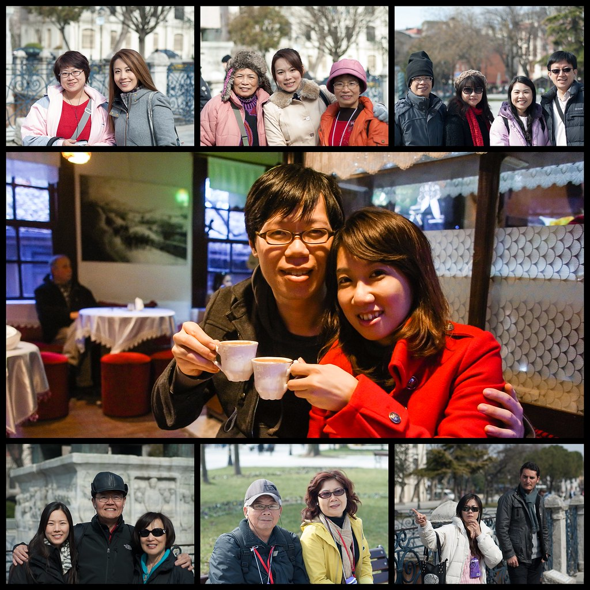
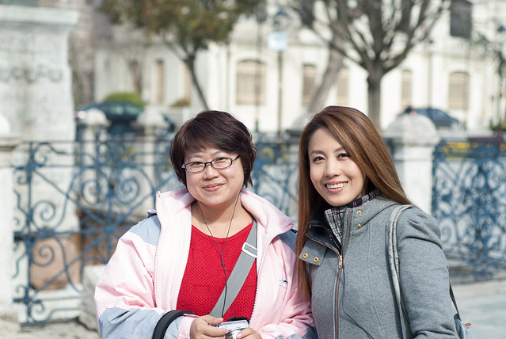
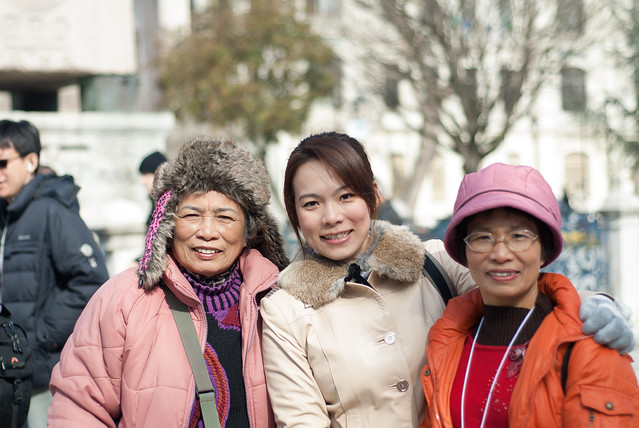
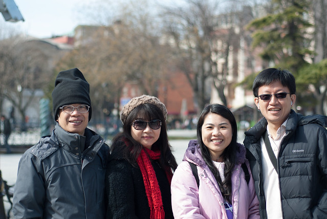
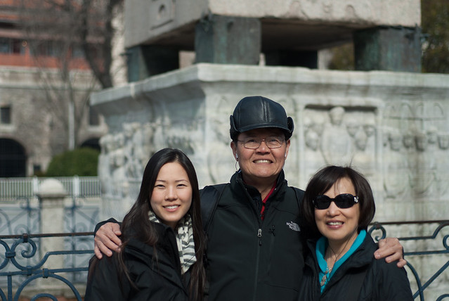
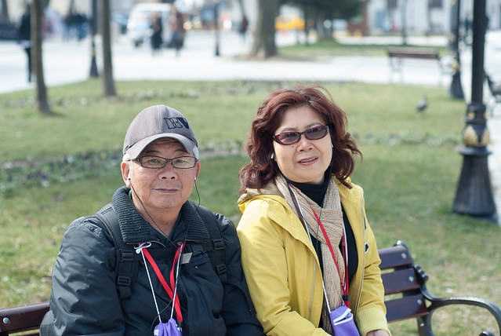
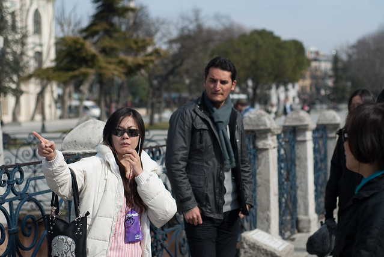

在工作忙碌穿插婚事接連不斷的事情，蜜月這件事情也因為 Chialin 的婚假要在登記的三個月內請的關係，也隨即馬上要決定去哪。  
  
在這個北半球冬季的日子，其實去歐洲不是太好的選擇（但我們還是決定要去）。翻開地圖，我們找了三個南歐的國家，後來因為想去個平常自助旅行不太容易去的國家 -- 土耳其，雖然事後證明這是個很適合自助旅行的國家。  
  
又，因為諸事繁忙的關係，我們第一次參加旅遊團，開始這趟土耳其之旅。  
  
  
  
幸運的，這次團員都非常的好相處。左上角的 Mickey Chu, 大米是旅行常客，尤其是大米這次來土耳其旅行已經是第十個國家了。中間的是 Lisa 一家人，Lisa 是房屋仲介，非常孝順的帶了媽媽跟奶奶到土耳其旅行，而 Lisa 媽媽是個超級健談的人，Lisa 奶奶則是已經高齡七十五歲了，依然很健壯。  
  
   
  
接著是陳醫生與仙如姊姊、以及子凡兄夫婦。陳醫生跟仙如姊姊很喜歡到處拍照，尤其是陳醫生我常常看他到處錄影一些旅行的片段，而且他們超級準時的！子凡兄夫婦則是公務員夫婦。  
  
  
  
左下角是 Emily 一家人，他們是美國來，在機場跟我們會合。Emily 爸爸 (Colin) 會唱聲樂，在參觀古羅馬劇院的時候還請他獻唱了幾首，非常驚人。中間是帥哥阿伯跟美女阿姨，兩個非常會鬥嘴的夫婦，非常搞笑與甜蜜。  
  
   
  
最後是我們的領隊冠君以及土耳其導遊 Hakan。有了他們的帶領，我們在土耳其的這幾天才會玩的那麼盡興，太謝謝他們了。  
  
  
而且 Hakan 很帥，戴上墨鏡、穿上皮衣，有種又像駭客任務的角色，又像李麥克的一個角色。  
  
伊斯坦堡、蕃紅花城、安卡拉，Cappadocia，我們來了！