『我們來自遙遠的國度』。  
  
[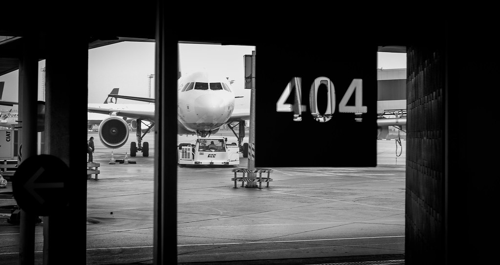](http://www.flickr.com/photos/yurenju/6962021227/ "Flickr 上 yurenju 的 Gate 404")  
  
面對土耳其這個與台灣相差六小時的古老國家，我們從桃園機場起飛，在香港轉機飛往伊斯坦堡，再轉土耳其國內航班到安卡拉 (Ankara)，最後走陸路，搭著巴士數個小時後到達番紅花城 (Safranbolu)。  
  

[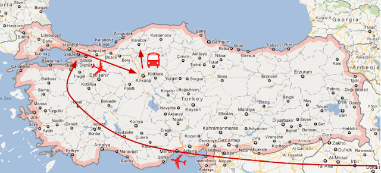](http://2.bp.blogspot.com/-sAz5_4KEelQ/T1eOJXMCUEI/AAAAAAAANUo/u7HH4rBVwgY/s1600/Turkey-day1.png)

  
二十四小時。  
  
我們花了整整一天的時間終於準備開始參觀番紅花城。不過中間停靠休息站的時候因為在高原的關係已經下了雪，好久沒看到雪的我當然也是給雪景犒賞了一番。  
  
[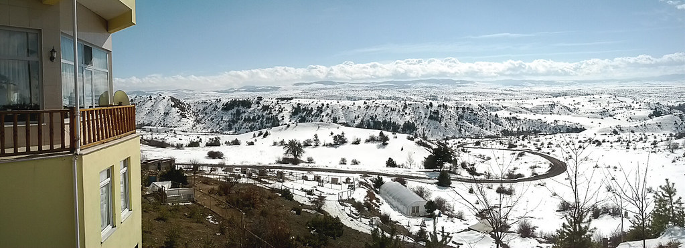](http://www.flickr.com/photos/yurenju/6962265071/ "Flickr 上 yurenju 的 休息站外的雪景")  
  
吃完中餐之後，就開始參觀番紅花城了。導遊 Hakan 帶我們到了城鎮的高處，今天天氣非常棒，站在番紅花城的高處俯視城鎮的感覺很好。  
  
[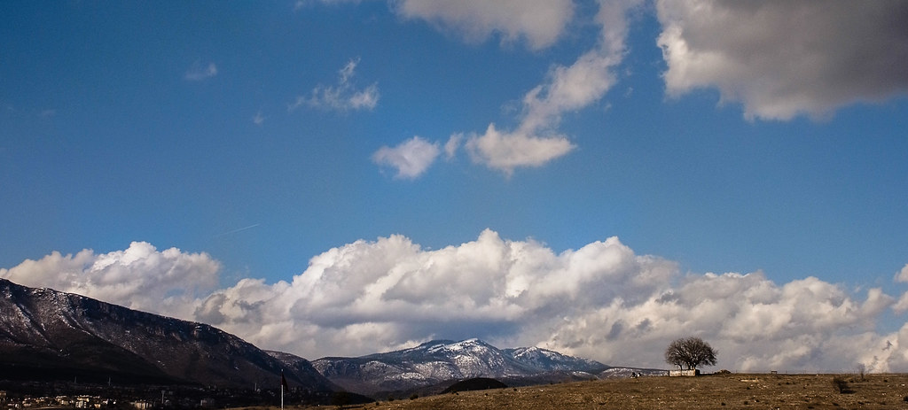](http://www.flickr.com/photos/yurenju/6816119940/ "Flickr 上 yurenju 的 雲淡風輕阿。")  
  
這邊是一個已經列入聯合國世界遺產的小城鎮。城鎮中保存了大量鄂圖曼時期的建築，包括鄂圖曼時期的市長官邸、駱駝驛站等等都還保存至今。  
  
[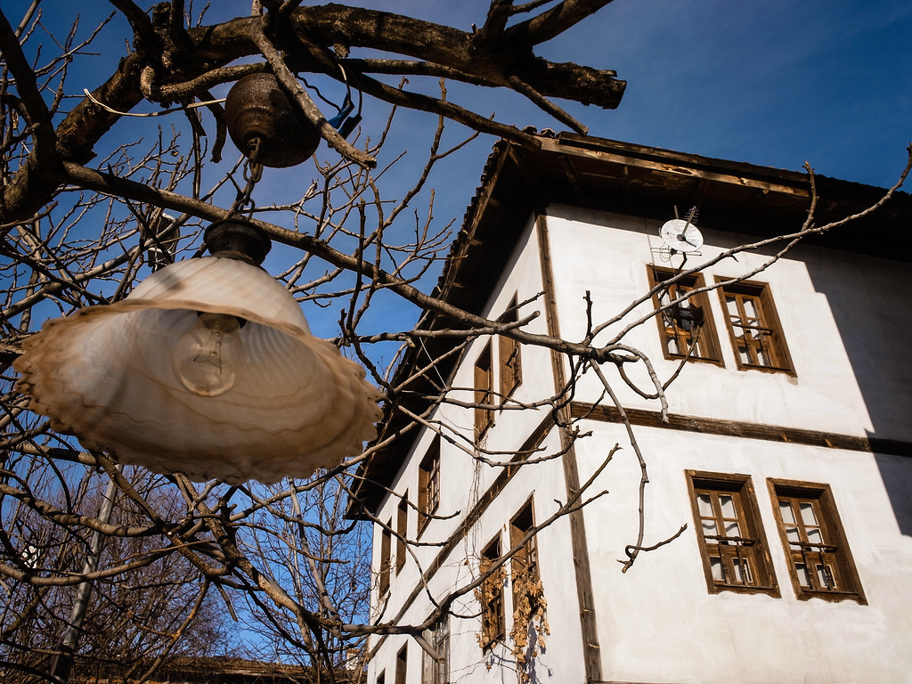](http://www.flickr.com/photos/yurenju/6816129162/ "Flickr 上 yurenju 的 鄂圖曼式建築")  
  
另外在講解的時候山丘上的番紅花茶館來問要不要喝一杯，難得來就點了，不過挺貴的就是了。導遊 Hakan 手上那杯就是番紅花茶  
  
[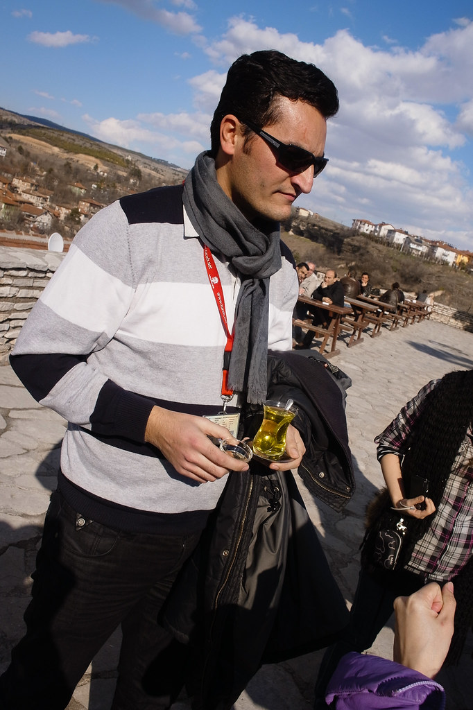](http://www.flickr.com/photos/yurenju/6962240567/ "Flickr 上 yurenju 的 Hakan 手上拿的是番紅花茶")  
  
導遊及領隊介紹番紅花城的地理、歷史結束後，我們就到飯店 checkin，再逛官邸跟旅館後就自由活動囉。  
  
這時候我們跟路上碰到的 Mickey, 大米就去了導遊介紹的傳統土耳其咖啡館喝咖啡。  
  
[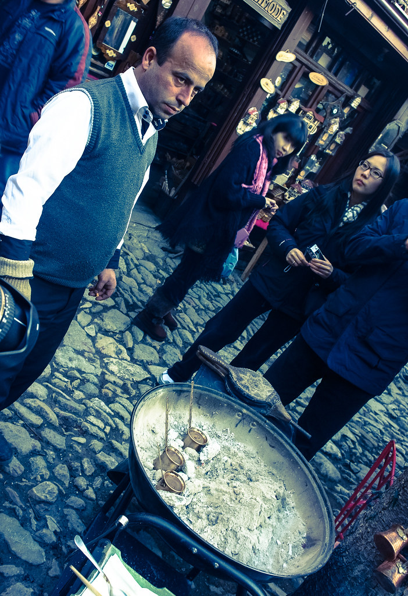](http://www.flickr.com/photos/yurenju/6816136208/ "Flickr 上 yurenju 的 土耳其咖啡")  
  
身為一個咖啡迷，到土耳其一定要喝土耳其咖啡的。我也誠心建議每個愛咖啡的人都要來喝看看，就算他的味道真的很詭異 XD  
  
傳統土耳其咖啡的做法，是將咖啡粉與冷水放在土耳其咖啡壺裡面，放在炭火裡面慢慢讓他沸騰 (接近)，並且在烹煮的同時就加入方糖調味，最後倒入咖啡杯中。在傳統的土耳其咖啡並沒有濾紙，自然在杯底會充滿了咖啡渣。  
  
[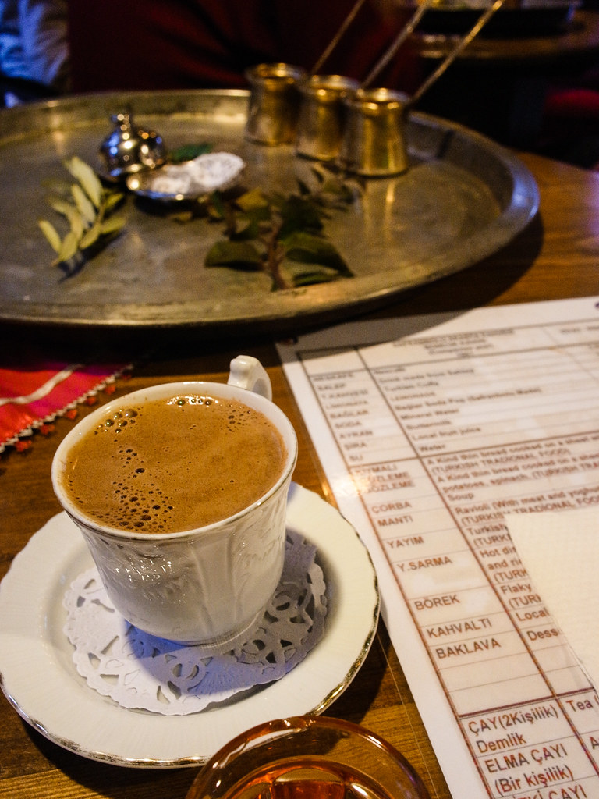](http://www.flickr.com/photos/yurenju/6962292845/ "Flickr 上 yurenju 的 土耳其咖啡")  
  
重要的來了~ 土耳其咖啡喝起來像什麼呢？基本上就像一灘經過調味的泥巴 XD  
  
但我想就算他喝起來像泥巴，咖啡迷到了土耳其還是不能錯過這味就是了。  
  
最後喝完後杯底會剩下一堆咖啡渣。這個時候等咖啡渣稍涼後，就可以用盤子抵住杯子口，翻過來後靜待一分鐘，打開來之後就可以進行土耳其咖啡占卜了。不過當然我們只是好玩沒特地去看要怎麼看占卜結果，就是自行隨便亂解釋一番就是了。  
  

[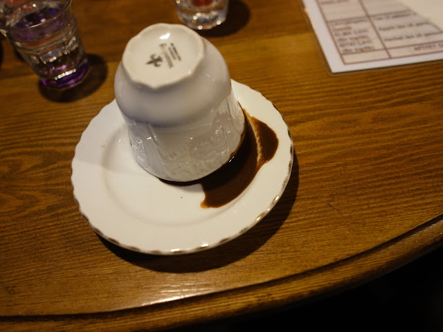](http://1.bp.blogspot.com/-jqlnAT0R01g/T1etT6e6_FI/AAAAAAAANUw/2XgN3aPi9J8/s1600/R1054376.jpg)

  
  
我的咖啡渣形狀裡面有一個外星人，難道是最近我會遇到外星人嗎？哈。  
  

[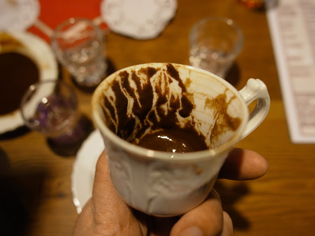](http://2.bp.blogspot.com/-0YUnzzfhGS4/T1eteNl-DVI/AAAAAAAANU4/zqjrlpz_zdI/s1600/R1054379.jpg)

你看到外星人了嗎 :P

  
大米的很妙，上面有個中文的『火』字，旁邊還有一隻馬 (我沒拍到)，我想他最近工作應該會很旺吧 XDD  
  

[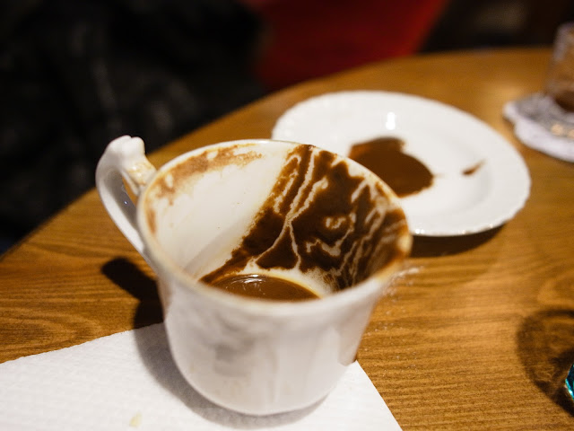](http://3.bp.blogspot.com/-gj02gWIpmBM/T1etsEUDwNI/AAAAAAAANVA/BjLwC6hNcOY/s1600/R1054384.jpg)

  
  
在這期間我們還逛到了一間很妙的番紅花店鋪，外面擺了一堆中文看板，聽說是之前的台灣遊客幫忙寫的。他聽到我們來自台灣，就比了比旁邊的韓國牌子，聳聳肩然後把它收起來。真是個瞭解台灣人的老闆 XD  
  
[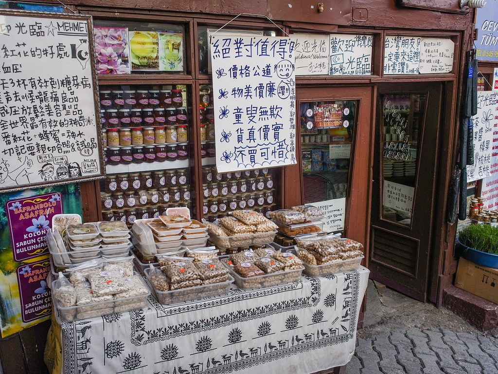](http://www.flickr.com/photos/yurenju/6962258927/ "Flickr 上 yurenju 的 翻紅花店鋪")  
  
喝完土耳其咖啡後，我們在小小的番紅花城迷了路，但終於是回到的旅館，今天行程大概就到這邊，晚安囉番紅花城。  
  
[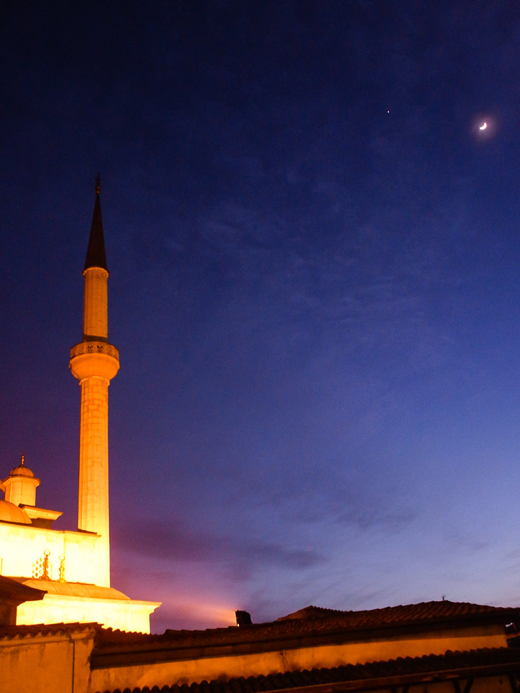](http://www.flickr.com/photos/yurenju/6962264441/ "Flickr 上 yurenju 的 清真寺")