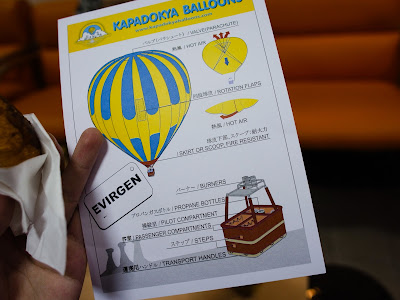
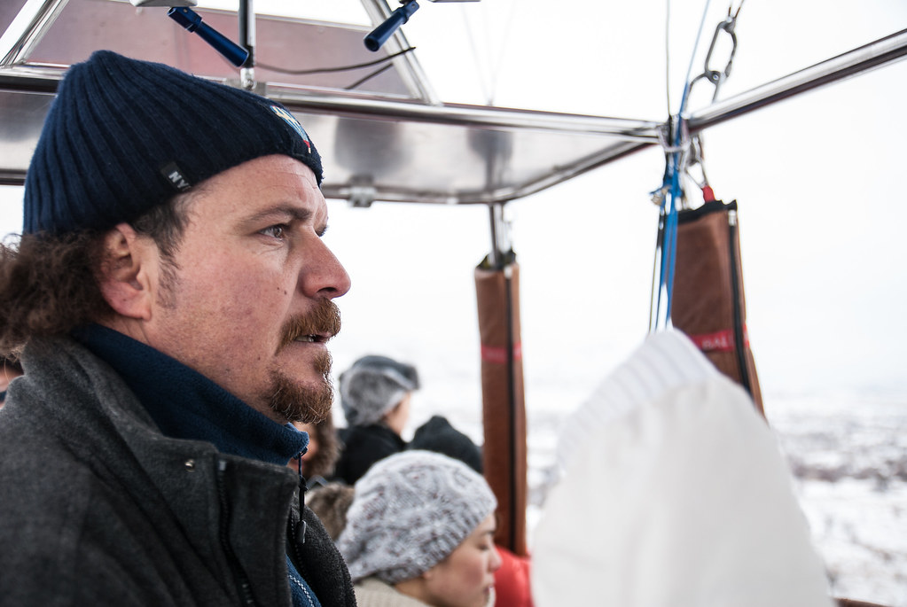
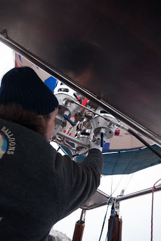
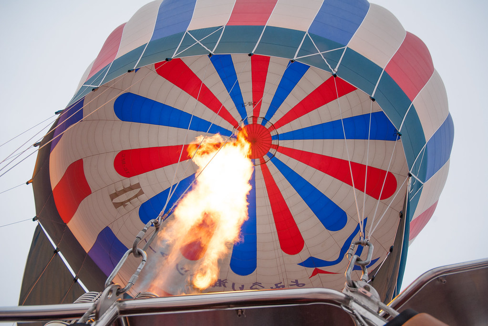
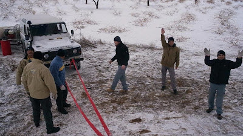
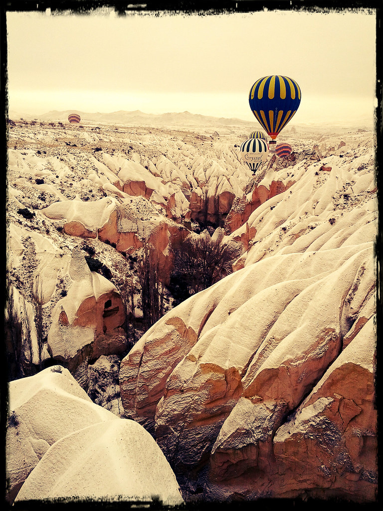
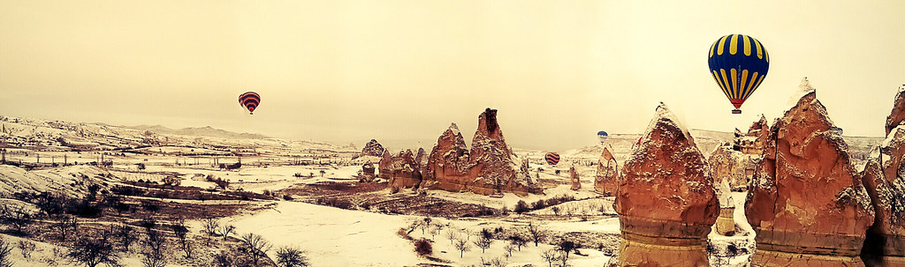
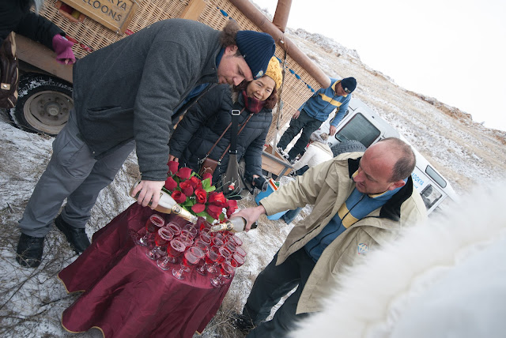
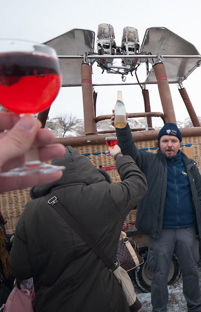

在凌晨半夢半醒之間，房間的電話響起了。  
  
『六點準備去搭熱氣球！』短暫的對話掛斷後，我們才從迷糊慢慢轉變成要去搭熱氣球的興奮。  
  
小作整理、搭上熱汽球的接駁車後我們在熱氣球公司裡面吃了簡單的早餐。然後收到了這張注意事項~  
  
  
  
終於可以飛啦！  
  
再度搭上接駁車緩緩的往起飛地前進後，踏著熱汽球旁邊的踏板，我們搭上了熱汽球。這是我們的飛行員  
  
  
  
飛行員開啟開關  
  
  
  
噴火啦！  
  
  
  
地勤幫忙鬆開繩索後，接著就緩緩的升空囉！掰掰地面  
  
  
  
至於熱氣球上的風景，我只能說美呆了~ 有機會來的一定要坐熱氣球  
  
  
  
幾顆熱汽球飄在山谷間的感覺非常的美妙  
  
  
  
再多幾顆更是壯觀，我想再過個幾年，我還是可以好好回味在熱汽球上的感受。  
  
  
  
在熱汽球上面的一個小時感覺非常的快，好像才剛坐一下下就要下來了。在飛行員數度尋找降落地點後，我們終於是降到地面了。地勤人員開著拖車跟接駁車一路跟著我們，最後再度栓上繩索後，我們降落了。  
  
  
  
這麼大的熱氣球要怎麼洩氣呢？答案在熱汽球上面有一個控制閥，把他打開熱氣就會逸散了。  
  
  
  
最後，熱氣球公司非常貼心的準備香檳來慶祝我們這次美好的體驗。  
  
  
  
乾杯！就算天氣很冷，一喝到香檳的感覺還是非常爽快。  
  
  
  
各位鄉親阿，如果有機會坐熱氣球千萬別錯過了。那種感覺實在太棒了！