清晨，我們從番紅花城的鄂圖曼式民宿起床。  
  
[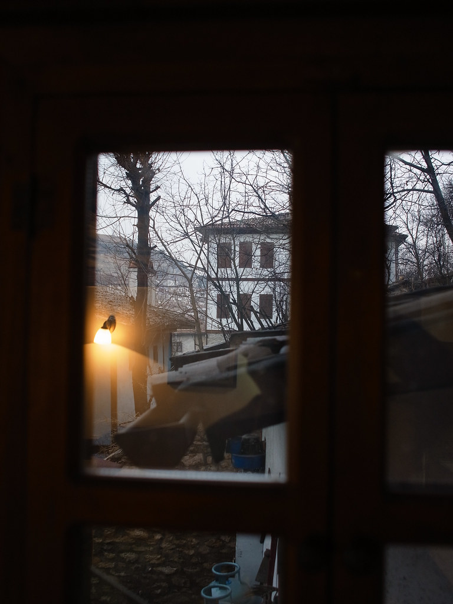](http://www.flickr.com/photos/yurenju/6818434332/ "Flickr 上 yurenju 的 鄂圖曼式民宿早晨的窗外")  
  
今天要去的地方是 Cappadocia，路程會經過首都安卡拉，經過鹽湖最後到達目的地。  
  

[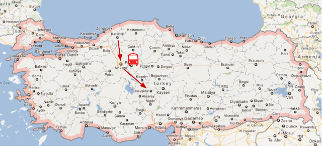](http://1.bp.blogspot.com/-vrKuiwr_Mbo/T1hf04QOqnI/AAAAAAAANVI/xidcM-Q4O8U/s1600/Turkey-day2.png)

  
早上一起來就看到窗邊有幾隻貓在屋頂上面散步，一打開窗戶馬上就靠了過來，想必是房間比較溫暖吧。  
  
[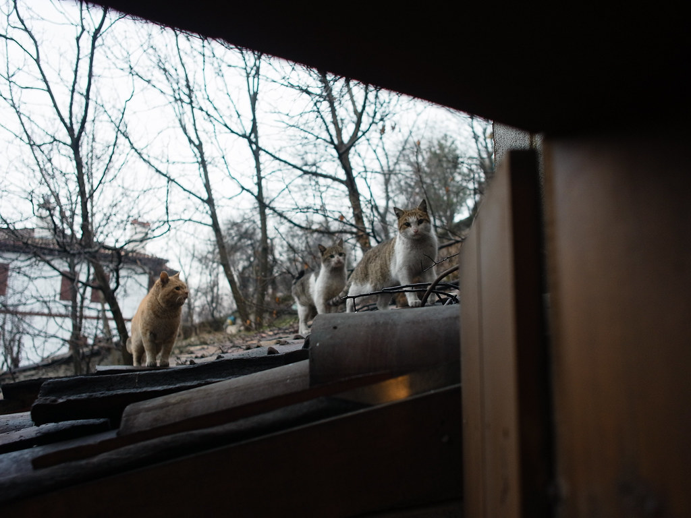](http://www.flickr.com/photos/yurenju/6818457544/ "Flickr 上 yurenju 的 貓群想要跳進房間來")  
  
在旅途中，我們經過了安納托利亞文明博物館以及凱莫爾紀念館。前者放了不少古文明的文物，後者則是為了紀念土耳其民主化的國父 - 凱莫爾所設置的紀念館。  
  
[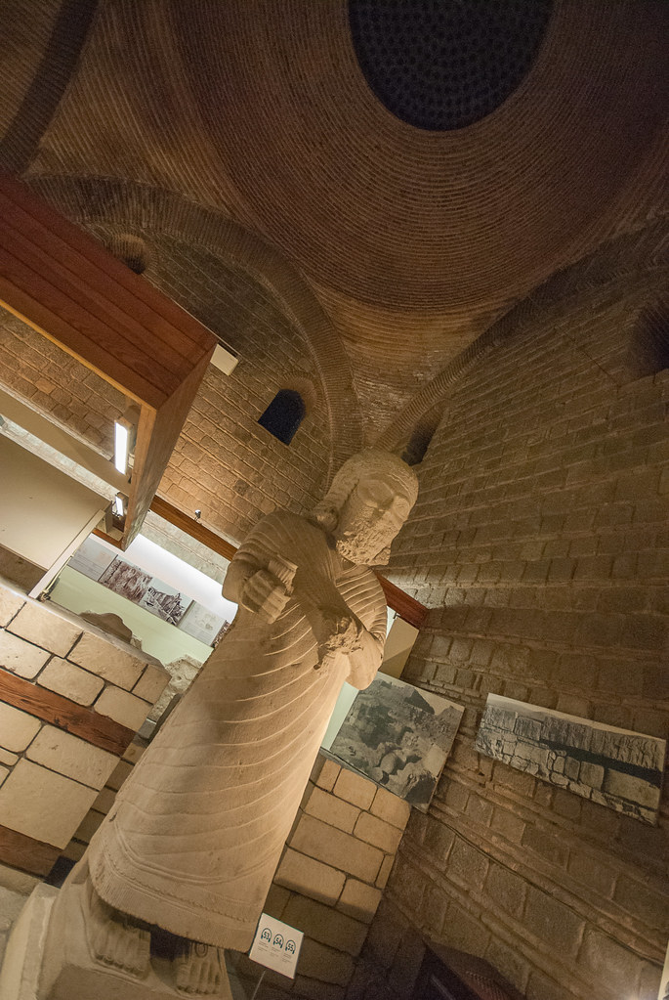](http://www.flickr.com/photos/yurenju/6964577435/ "Flickr 上 yurenju 的 安納托利亞文明博物館")  
  
話說紀念館的安檢真的很搞笑，全車的人帶著隨身行李下車進行安檢，接著再上巴士繼續開進去。那這樣把危險物品放在巴士上不就好了。  
  

[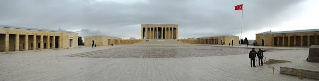](http://2.bp.blogspot.com/-Pd2fN0ywaAY/T1joC_J97oI/AAAAAAAANYs/QnqywyhQ8tY/s1600/PANO_20120227_134900.jpg)

凱莫爾紀念館

  
要離開的時候遇到賣 Simit 的人，頂在頭上走路挺厲害的。  
  
[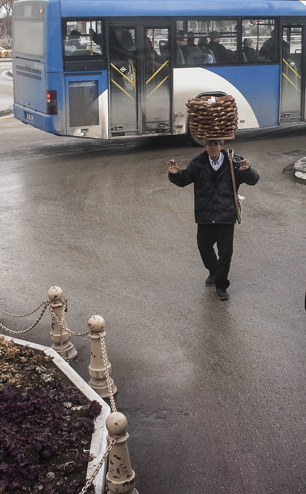](http://www.flickr.com/photos/yurenju/6818457110/ "Flickr 上 yurenju 的 Simit 小販")  
  
用完中餐後我們就繼續往 Cappadocia 前進，中間經過鹽湖，最後終於在晚餐時間到達目的地了。今天跟明天我們要依天氣狀況決定哪天要飛熱汽球，就只能祈禱天氣狀況 OK 了。  
  
[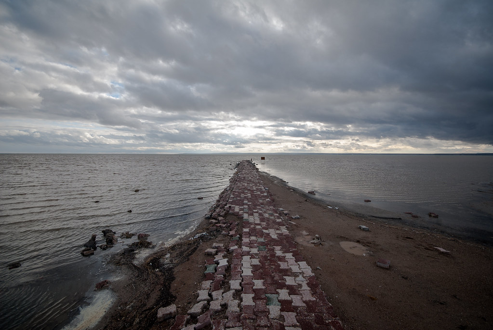](http://www.flickr.com/photos/yurenju/6818455812/ "Flickr 上 yurenju 的 鹽湖")  
  
經過一夜之後  (今天風太大沒辦法搭熱氣球)。外面下了點雪，配上 Cappadocia 洞穴旅館的奇特外型真是美到掉渣！  
  
[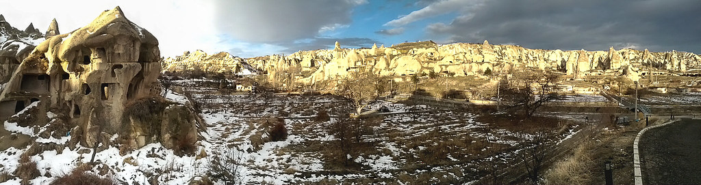](http://www.flickr.com/photos/yurenju/6818455290/ "Flickr 上 yurenju 的 Cappadocia 洞穴飯店外的景色")  
  
在外面走走看看、吃完早餐後，我們去了凱馬克利 (Kaymaklı) 地下城參觀。地下城的興建者不詳，但在羅馬帝國時期遭受迫害的基督徒有在這邊待過很長的時間。在這邊是很難施展手腳的，很多地方都需要蹲著走，高個子來這邊會很痛苦...  
  

[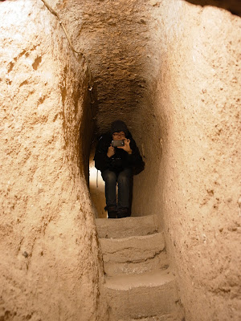](http://2.bp.blogspot.com/-9vlA8xTT3vU/T1jlTNcKleI/AAAAAAAANYc/SltwsQIvYUU/s1600/R1054507.jpg)

  
不過真不敢相信以前有人長期居住在這邊，雖然還堪稱涼爽，不過如果連牲畜、廚房都在裡面，再多塞點人味道應該很可怕。最後幾天的時候去藍色清真寺要拖鞋入內，味道就連冬天都很可怕阿。  
  
出來的時候 Mickey 帶了超多土產 / 紀念品上車的 XD  
  

[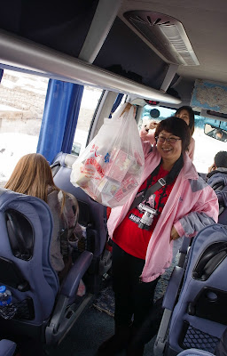](http://1.bp.blogspot.com/-YmswWubOqyA/T1jlvlTrrBI/AAAAAAAANYk/rZdxDcB7YiQ/s1600/R1054521.jpg)

  
用完午餐後我們到各個拍照景點去拍照還有去果里美露天博物館 (Göreme Open Air Museum) 與地毯工廠，不過下午下了些雨跟雪，就不是那麼好拍照了。尤其是雪因為氣溫不夠低的關係，碰到外套上就變成水了。  
  
[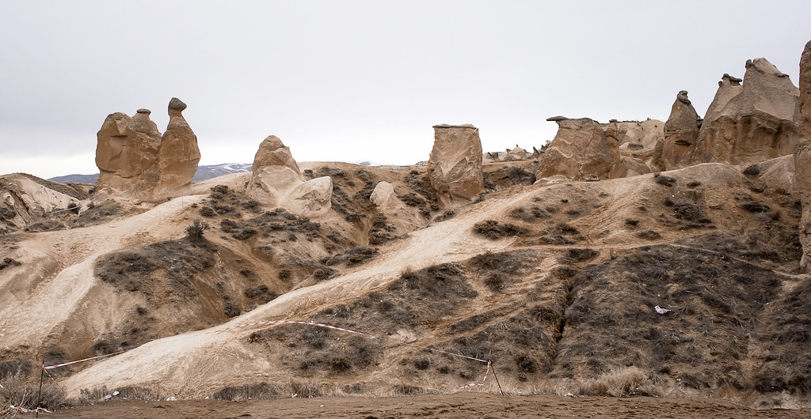](http://www.flickr.com/photos/yurenju/6818455116/ "Flickr 上 yurenju 的 駱駝岩") [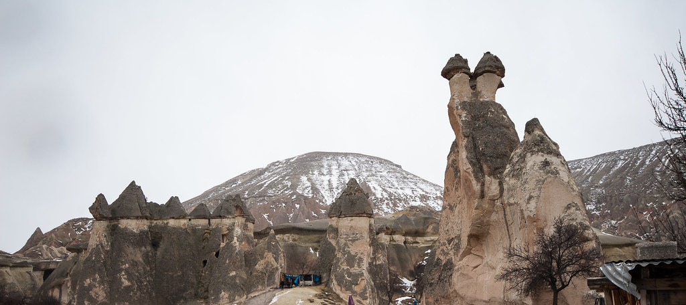](http://www.flickr.com/photos/yurenju/6818454028/ "Flickr 上 yurenju 的 蘑菇岩")  
  
在晚餐之前正好有些空閒，看到旅館下面還有一些小店家我們就走下去逛逛了。遇到了間小咖啡館就走進去喝杯茶跟咖啡了。說真的土耳其人大多都蠻親切的。只是土耳其男生很熱情又愛吃女生豆腐就是了，合照的時候要注意一下。  
  

[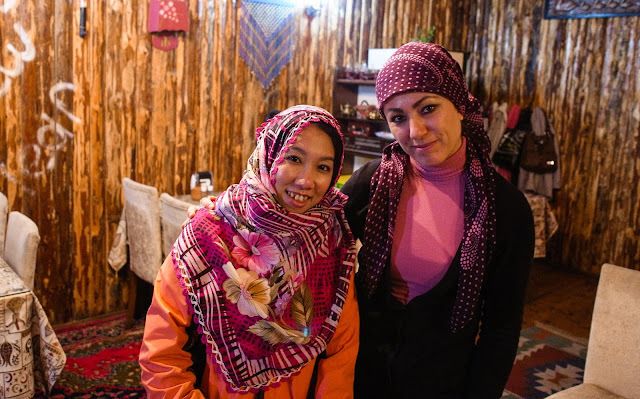](http://4.bp.blogspot.com/-9IJSOPA34WU/T1jkjfE7qhI/AAAAAAAANYU/uNsNlHsg69c/s1600/R1054577.jpg)

包了頭巾有點像阿桑耶~

  
晚上則是土耳其之夜。除了豐盛的土耳其饗宴以外，當然還有土耳其傳統舞蹈。其中的蘇菲舞其實是一種祈禱儀式，在真的祈禱的場合是禁止攝影的。不過結束後他們還會出來跳一下，讓大家拍照。  
  
[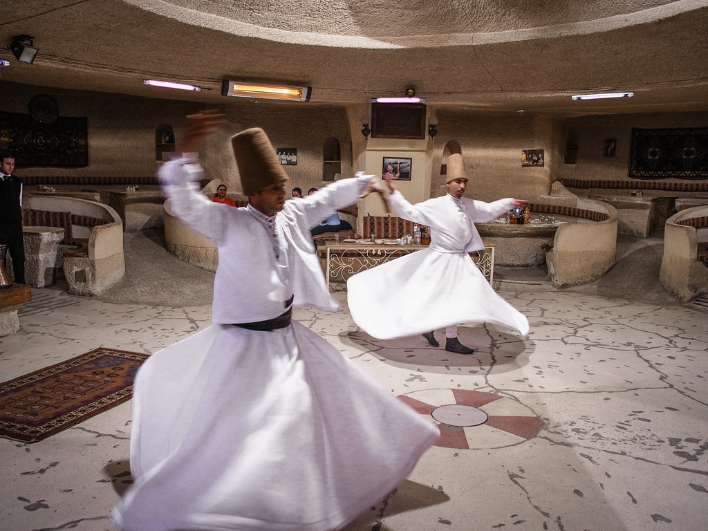](http://www.flickr.com/photos/yurenju/6964573617/ "Flickr 上 yurenju 的 蘇菲舞")  
  
中間跳了很多各地的民族舞蹈，最後面則是壓軸的肚皮舞囉。不過對我而言最有趣的還是拉觀眾上去跳肚皮舞。剪輯一些片段讓大家看看 :)  
  
  
  
最後就是祈禱明天的熱氣球可以順利的成行了。