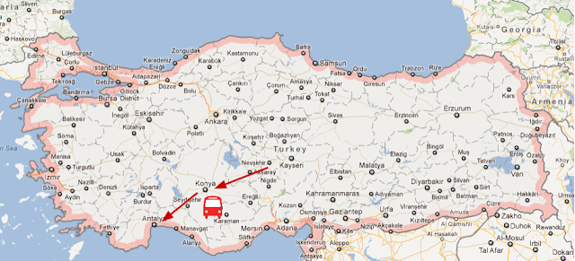
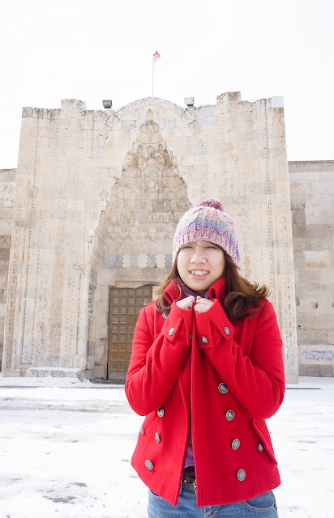
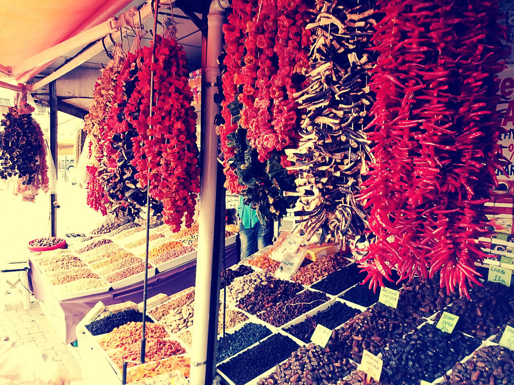
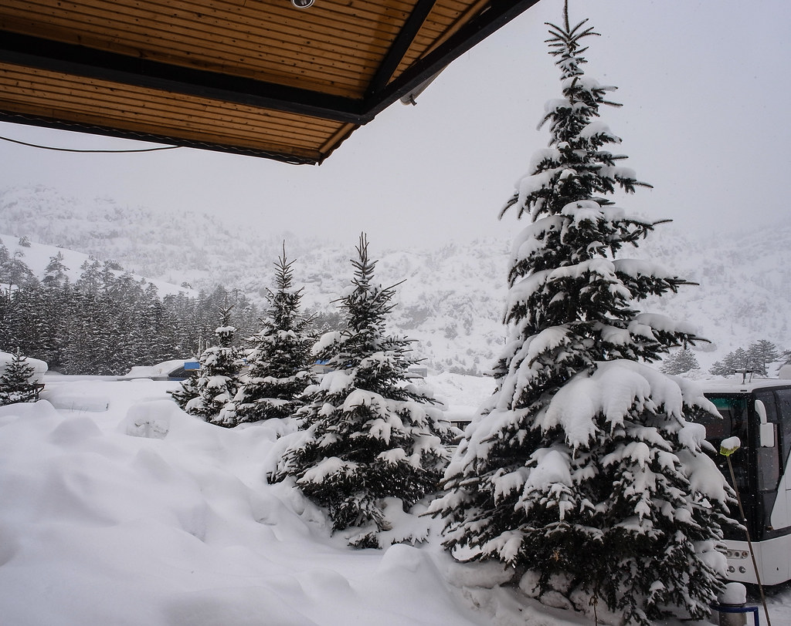
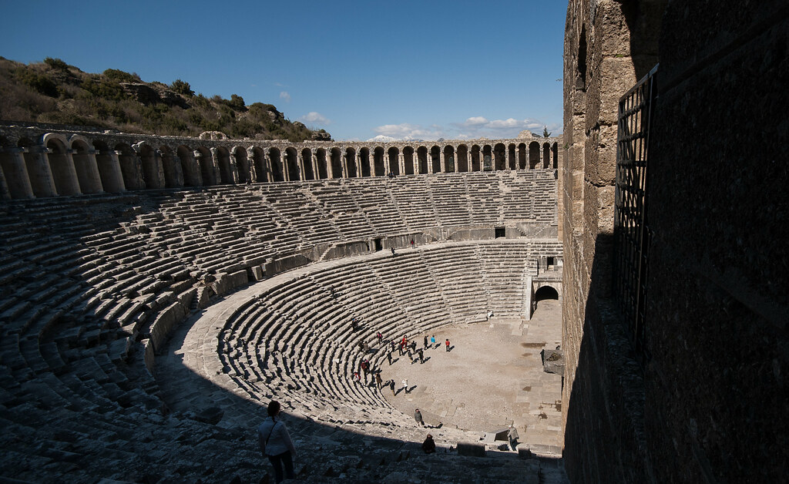
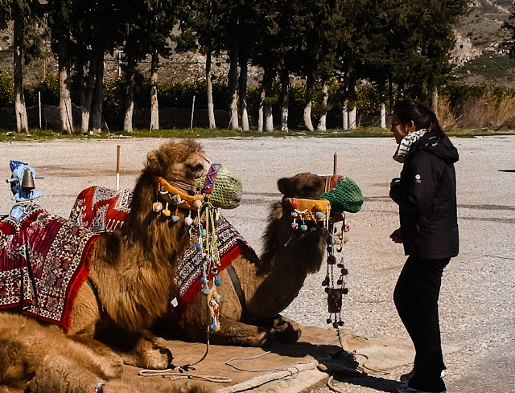
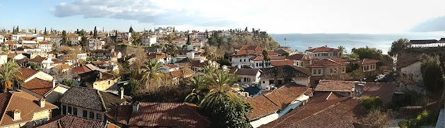
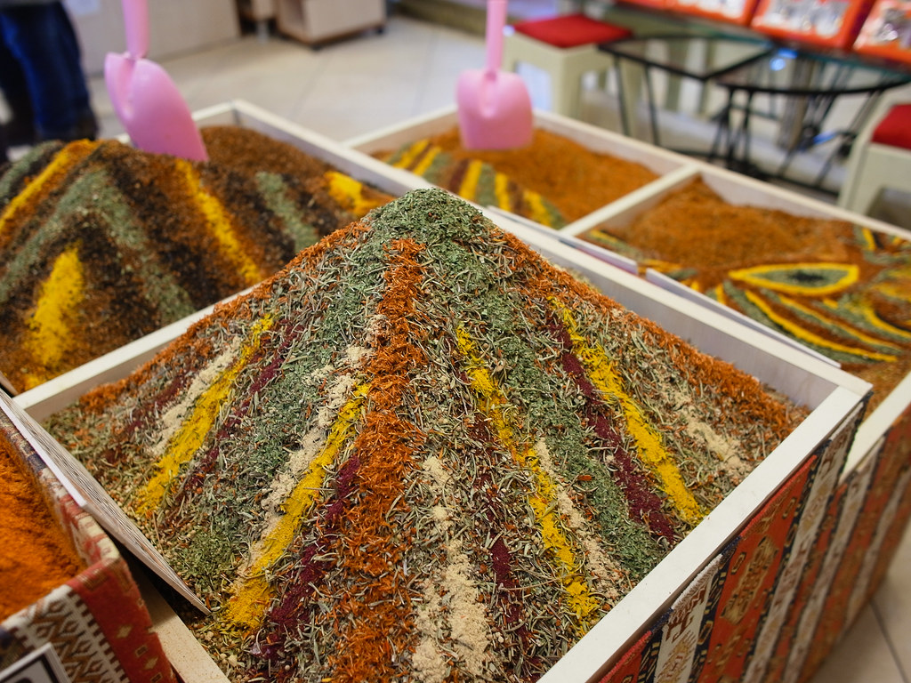
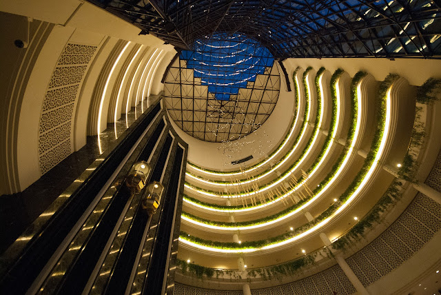

在很興奮的熱氣球之旅後我們在孔亞 (Konya) 下榻，並且在隔日到了安塔利亞 (Antalya)。  
  

  
進入孔亞之前，我們到了一個古老驛站改建的餐廳吃飯。  
  
  
  
孔亞是個工業城市，所以基本上沒什麼好逛的。不過在參觀一些景點的空檔我們還是跑到清真寺附近的小店鋪逛一下。  
  
  
  
在往 Antalya 的路上路上的雪很多。  
  
  
  
中間經過了一個羅馬時期的歌劇院 / 競技場。  
  
  
  
這個時候 Emily 爸爸 Colin 因為之前學過聲樂，導遊講解到這個部份的時候還特別請他高歌一曲，真的非常厲害。  
  
  
  
出來的時候外面還有人牽著駱駝讓人拍照 (當然是要付費的)，我們團有幾個人都去拍照了，下面這張是 Emily 去跟駱駝合拍的情況  
  
  
  
到了依偎著地中海的 Antalya。舊城區依靠著地中海，配上靠近地中海後溫暖的天氣，終於是擺脫土耳其冷颼颼的天氣了。  
  
  
  
小逛了一下，軟糖店裡面的香料擺設還蠻有趣的 :)  
  
  
  
  
今天結束後，我們就到 Antalya 的飯店休息囉。  
  

